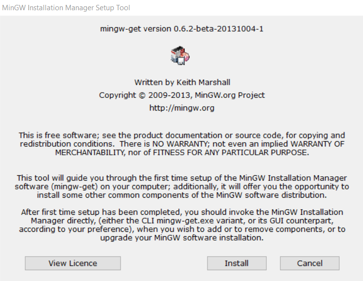
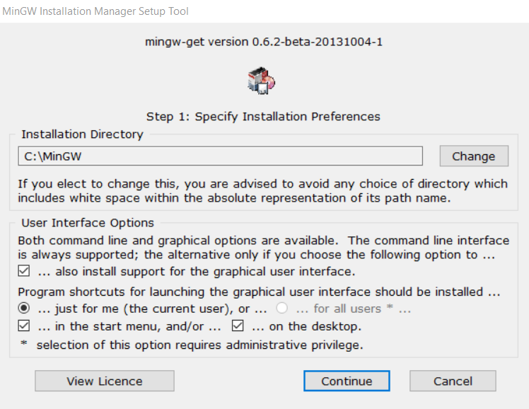
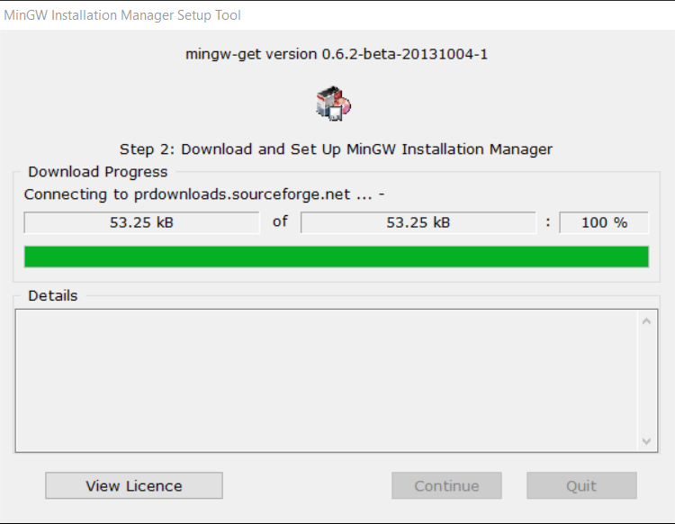
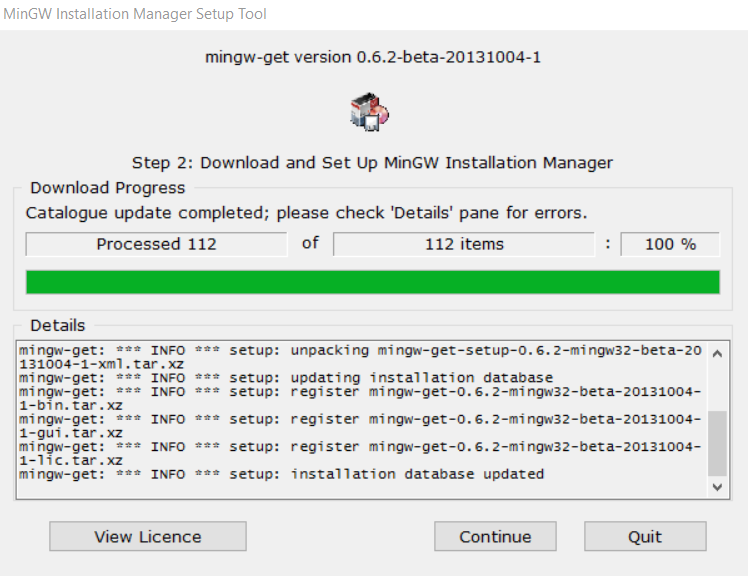
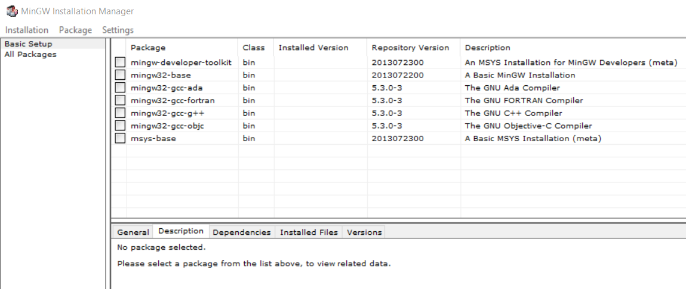
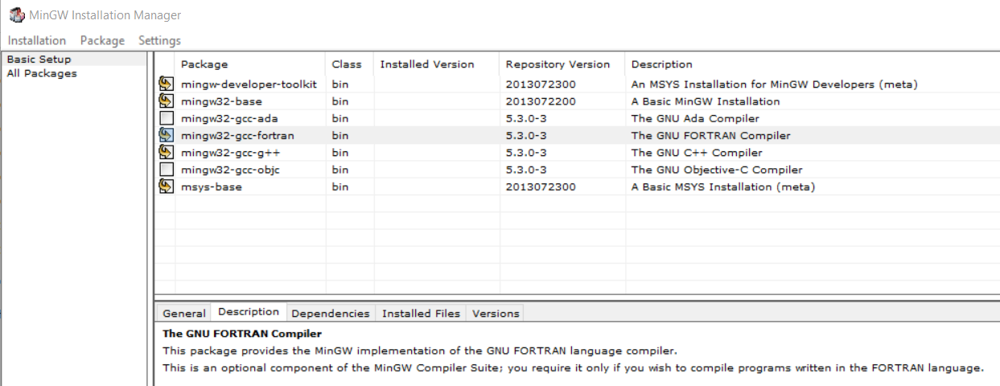
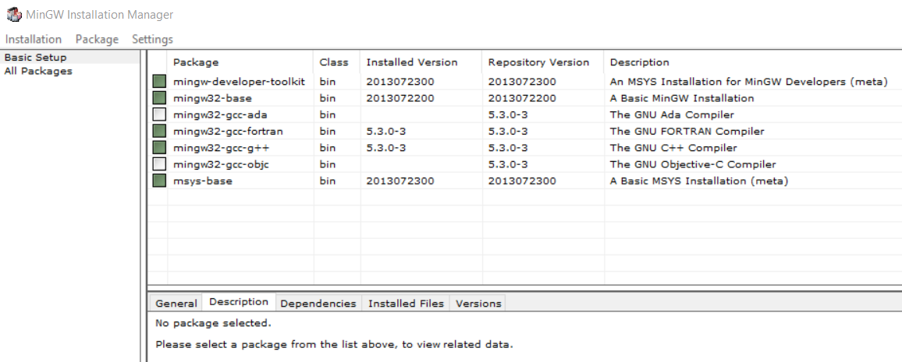

# Development Environment / Machine (32 bit)#

**This documentation is for older MinGW 32-bit `gfortran` installation.**

The computer and operating system used for development control how other software components are installed.
The target environment is Windows 7/64 and Linux, with initial focus being Windows given the
needs of the State of Colorado and its contractors.

StateMod code is Fortran and there is a desire to use the free and open source recent `gfortran` compiler,
rather than the previous Lahey 95 compiler.
This requires some thought to select a machine/operating system to use for development.
32-bit executables have traditionally been created and this is the current requirement.
Creating 64-bit executables will require understanding impacts on the code logic and binary output files,
coupled with sufficient testing to ensure that software behavior is as intended.
Care must be taken to use a development environment that produces 32-bit static executables...until there is time to evaluate 64-bit.

**The initial approach for StateMod is to use a MinGW environment within Windows,
given that this approach has been implemented with success previously.
When more time is available, Cygwin and Linux development environments will also be tested and documented,
to allow more flexibility for developers that prefer or require those environments.**

See the following resources:

* [Binaries available for gfortran](https://gcc.gnu.org/wiki/GFortranBinaries) - access to various `gfortran` distributions
* [mingw-w64](http://mingw-w64.org/doku.php) - newer MinGW for Windows 64-bit, can also compile 32-bit executables

The following sections are included in this documentation.
**The choice of development environment by the software developer will drive many other configuration steps.
AGAIN, MinGW IS THE INITIAL FOCUS.**

*  [Linux](#linux)
*  [Windows](#windows)
	+ [Install MinGW - Native Windows 32-bit](#install-mingw-native-windows-32-bit) - for 32-bit StateMod executables
	+  [Install Cygwin](#install-cygwin) - seems to be more current than above Native Windows build

-------------------

##  Linux ##

This section will be completed when resources are available for Linux development and testing.

##  Windows ##

The use of `gfortran` somewhat constrains the development environment, especially on Windows,
requiring that either MinGW or Cygwin are used for development,
each of which mimic Linux functionality but will result in Windows-compatible binary StateMod executable.
Using Eclipse/Photran IDE provides some isolation from the command line environment,
but developers will be more effective if they understand command line programs
and some developers may choose to use text editor and command line tools.

MinGW or Cygwin are the recommended compiler environments.
MinGW is the focus as it has been previously used to compile StateMod.

### Install MinGW - Native Windows 32-bit ###

This documentation needs to be updated to use newer versions of MINGW.
There seem to be newer versions of gcc/gfortran available but the MinGW documentation is somewhat old, 2013?.
Installing the MinGW as shown below seems to install recent compilers.

The Minimalist GNU for Windows (MinGW) environment provides a minimal Linux implementation on Windows.
MinGW provides an environment in which the `gcc` and `gfortran` compilers will run.

Note that various software tools are shipped to run inside a MinGW environment, including Git for Windows,
separate from the MinGW implementation that is used to compile code.
It is OK to have multiple MinGW environments installed, as long as the software developer understands why each was installed
and does not get confused.  For example, if a Bash shell is used, the title bar usually indicates what environment is being used.
See the following installation instructions:

* [MinGW Getting Started](http://www.mingw.org/wiki/Getting_Started)

If MinGW has previously been installed, it does not need to be reinstalled.
Look for a `C:\MinGW` folder.  If it exists, then MinGW was previously installed and can be used for StateMod development.

If MinGW needs to be installed, then as recommended in the MinGW Getting Started documentation, use the Graphical User Interface Installer.
First retrieve the [`mingw-get-setup.exe`](https://sourceforge.net/projects/mingw/files/latest/download) program (click on the link),
which will save to the `Downloads` folder.

Run the downloaded `mingw-get-setup.exe` program and follow the steps below.



Press ***Install***



The installation documentation recommends installing only for the single user (not all users).
And, because MinGW has not been updated in several years, there is little reason to change the install folder from the default.
Therefore, accept the defaults shown above by pressing ***Continue***.  Progress will be indicated as shown below:





At this point MinGW has been installed but the compilers have not been installed.
The following window is displayed to allow selection of additional software to install:



StateMod requires Fortran, and also select C and C++ because they may be needed for various CDSS tools.
Click on the box next to the component and select ***Mark for Installation***.



Then use the ***Installation / Apply Changes*** menu, which will display the following:


Press ***Apply*** to commit the selections.  The following progress dialogs will be shown.


Press ***Close***.  The successfully installed packages will be indicated as shown below.
The following indicates that `gcc` and `gfortran` version 5.3.0-3 were installed.
See below for confirmation of the version.



**This documentation needs to be updated to describe the implications of 32-bit and 64-bit.
StateCU has traditionally been compiled as a 32-bit application,
which seems consistent with the MinGW install, but need to understand how 64-bit MinGW can
be used and whether both 32-bit and 64-bit can be installed on the same computer.**

The MinGW files should have been installed in `C:\MinGW` and can be confirmed by inspection.

#### Configure MSys ####

As per the installation instructions, confirm that the file `C:\MinGW\msys\1.0\etc\fstab` correctly indicates where MinGW is installed.
The following is the default and appears to be correct.

```text
# /etc/fstab -- mount table configuration for MSYS.
# Please refer to /etc/fstab.sample for explanatory annotation.

# MSYS-Portable needs this "magic" comment:
# MSYSROOT=C:/MinGW/msys/1.0

# Win32_Path                            Mount_Point
#-------------------------------------  -----------
C:/MinGW                                /mingw

```

#### Configure `PATH` ####

As per the installation instructions, in order for the operating system to find the programs,
the `PATH` environment variable needs to be updated.
The installation instructions recommend setting with a script.
Therefore, create a script `setup-mingw-env.bat`, with contents similar to the following:

```bat
rem Setup the MinGW environment variables
rem See:  http://www.mingw.org/wiki/Getting_Started

rem Update PATH to find the MinGW bin folder and also the MSYS folders (Unix utilities).
set PATH=C:\MinGW\bin;C:\MinGW\MSYS\1.0\local\bin;C:\MinGW\MSYS\1.0\bin;%PATH%
```
This script is included in the repository in a `build-util` folder for use by developers.
It is also called by the `run-eclipse-statemod-mingw.bat` batch file to facilitate running Eclipse with the correct environment.

#### Confirm Compiler Version ####

Once the `PATH` has been configured as described in the previous section (by running the `setup-mingw-env.bat` batch file),
the compiler versions can be confirmed, as follows,
from a Windows command shell.  Or, alternatively, start a Windows command shell and then run `bash` to start a Linux Bash shell.
Both will allow running the following commands.

```com
> gcc --version
gcc (GCC) 5.3.0
Copyright (C) 2015 Free Software Foundation, Inc.
This is free software; see the source for copying conditions.  There is NO
warranty; not even for MERCHANTABILITY or FITNESS FOR A PARTICULAR PURPOSE.

> gfortran --version
GNU Fortran (GCC) 5.3.0
Copyright (C) 2015 Free Software Foundation, Inc.

GNU Fortran comes with NO WARRANTY, to the extent permitted by law.
You may redistribute copies of GNU Fortran
under the terms of the GNU General Public License.
For more information about these matters, see the file named COPYING
```

###  Install Cygwin ###

This section can be completed if necessary.  The Native Windows MinGW development environment is currently the focus.
Cygwin can be useful in cases where software is not available in Git Bash or Windows.
