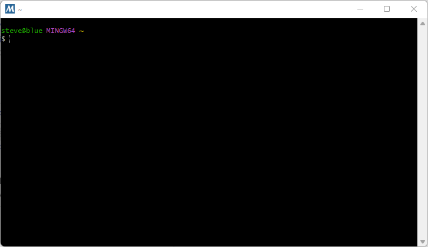

# Development Environment / Machine #

This documentation describes the latest tested development environments.
See also:

* older [MinGW 32-bit installation instructions](machine-32bit.md),
used for initial transition to `gfortran` but not used for current development

The computer and operating system used for development control how other software components are installed.
The target environment is Windows 10 and Linux, with initial focus being Windows given the
needs of the State of Colorado and its contractors.

StateMod code is Fortran and there is a desire to use the free and open source recent `gfortran` compiler,
rather than the previous Lahey 95 compiler.
The 32-bit MinGW `gfortran` development environment was previously implemented to create 32-bit StateMod executables.
Lahey and `gfortran` executables have been created during transition to `gfortran`.
This documentation describes how to install the 64-bit MSYS2 MinGW development environment,
which is used to create 64-bit StateMod executables.

**The initial approach for StateMod is to use a MinGW environment within Windows,
given that this approach has previously been implemented with success.
When more time is available, Cygwin and Linux development environments will also be tested and documented,
to allow more flexibility for developers that prefer or require those environments.**

See the following resources:

* [Binaries available for gfortran](https://gcc.gnu.org/wiki/GFortranBinaries) - access to various `gfortran` distributions
* [mingw-w64](http://mingw-w64.org/doku.php) - MinGW for Windows 64-bit, can also compile 32-bit executables
* [GFortran release notes](https://gcc.gnu.org/wiki/GFortran/News)

The following sections are included in this documentation for various operating systems.
**The choice of development environment by the software developer will drive many other configuration steps.
Again, Windows MinGW is the initial focus.**

*  [Linux](#linux)
*  [Windows](#windows)
	+ [Install MSys2 64-bit Software](#install-msys2-64-bit-software) - focus of this documentation
		+ [Install 64-bit MinGW Software](#install-64-bit-mingw-software) - needed to create 64-bit executables
		+ [Install 32-bit MinGW Software](#install-32-bit-mingw-software) - needed to create 32-bit executables
	+  [Install Cygwin](#install-cygwin) - alternative to MinGW environment (not tested)

-------------------

##  Linux ##

This section will be completed when resources are available for Linux development and testing.

##  Windows ##

The use of `gfortran` constrains the development environment, especially on Windows,
requiring that either MinGW or Cygwin are used for development,
each of which mimic Linux functionality but will result in Windows-compatible binary StateMod executable.
Using Eclipse/Photran IDE provides some isolation from the command line environment,
but developers will be more effective if they understand command line programs
and some developers may choose to use text editor and command line tools rather than Eclipse/Photran.
The Eclipse/Photran IDE is currently not the focus of development
and consequently **this documentation focuses on command line compiling with `make` command.**

MinGW or Cygwin are the recommended compiler environments.
MinGW is the focus as it has been previously used to compile StateMod
and is straightforward to install.

### Install MSys2 64-bit Software ###

**The following documentation was created on 2021-03-09 (`gfortran` 10.2)
and updated on 2021-05-20 (`gfortran` 10.3)
using the MSys2 installer available at the time.
The process may be different if run at a different time, but will hopefully be similar.
MSys2 developers change the configuration over time.**
The following illustrates the ***Start*** menu for different versions of MSys2.
It is important to use the correct menu when following the instructions below.

| **MSys2 Start Menu** | **Comments** |
| -- | -- |
|  | Used with installer containing `gfortran` 10.3. |
|  | Used with installer containing `gfortran` 10.2. |

The Minimalist GNU for Windows (MinGW) environment provides a minimal Linux implementation on Windows.
MinGW provides an environment in which the `gcc` and `gfortran` compilers will run.

Various software tools are shipped to run inside a MinGW environment, including Git for Windows,
separate from the MinGW implementation that is used to compile code.
It is OK to install multiple MinGW environments,
as long as the software developer understands why each was installed and does not get confused.
For example, if a Bash shell is used, the title bar usually indicates what environment is being used.

**<p style="text-align: center;">
Title Bar for MinGW Shells
</p>**

| **Window Title Bar Image**&nbsp;&nbsp;&nbsp;&nbsp;&nbsp;&nbsp;&nbsp;&nbsp;&nbsp;&nbsp;&nbsp;&nbsp;&nbsp;&nbsp;&nbsp;&nbsp;&nbsp;&nbsp;&nbsp;&nbsp;&nbsp;&nbsp;&nbsp;&nbsp;&nbsp;&nbsp;&nbsp;&nbsp;&nbsp;&nbsp;&nbsp;&nbsp;&nbsp;&nbsp;&nbsp;&nbsp;&nbsp;&nbsp;&nbsp;&nbsp; | **Description** |
| -- | -- |
|  | Git Bash window title (after installing Git for Windows), does not typically include `gfortran`. |
| <br> | MinGW window title (see installation instructions below), does include `gfortran` if the following instructions are completed.  The title may vary depending on terminal window and MinGW version.  The first example shown displays the current folder in the title and `~` indicates the user's home folder. |

See the following for MinGW installation instructions (however, **see below for more specific instructions that have been tested**):

* [mingw-w64](http://mingw-w64.org/doku.php) - current MinGW tools
* note that the original `mingw.org` website that was used with initial StateMod `gfortran` work
is not maintained and should be avoided

The documentation below recommends using MSYS2 environment, which includes MinGW 64-bit and 32-bit compilers.
If MSYS2 has previously been installed, it does not need to be reinstalled.
Look for a `C:\msys64` folder.
If it exists, then MSYS2 was previously installed and can continue to be used for StateMod development.
The software also can be reinstalled to use the latest version, if necessary.

If MSYS2/MinGW needs to be installed, download from the [mingw-w64 Downloads page](http://mingw-w64.org/doku.php/download), as shown below.
This page provides multiple installers for different target environments.

**<p style="text-align: center;">

</p>**

**<p style="text-align: center;">
Download Page for MinGW Packages (<a href="../machine-images/install-msys2-1.png">see full-size image</a>)
</p>**

The ***Msys2*** for Windows installer includes C, C++, and Fortran and is used for development below.
Although other installers are available, Msys2 includes more recent compiler versions than other installers.
Do not use links in the above table.
Instead, retrieve the installation program from the [msys2.org](https://www.msys2.org/) download page:

**<p style="text-align: center;">

</p>**

**<p style="text-align: center;">
Installation Instructions for MSys2 (<a href="../machine-images/install-msys2-2.png">see full-size image</a>)
</p>**

Download the installer program, which will save to the `Downloads` folder.

The checksum can optionally be verified using Git Bash `sha256sum` program (if Git for Windows is installed)
to ensure that the download file is valid.
Copy the checksum string from the download page into a file named `sum1.txt`.
Then verify the download using the following in Git Bash,
substituting the current installer file:

```
sha256sum msys2-x86_64-20210419.exe | cut -d ' ' -f 1 > sum2.txt
diff sum1.txt sum2.txt
```

Run the downloaded installer program, for example using ***Windows Explorer***,
and follow the instructions on the above web page.
**This does not require running as administrator.**

**<p style="text-align: center;">

</p>**

**<p style="text-align: center;">
Initial Setup Step for MSys2 (<a href="../machine-images/install-msys2-3.png">see full-size image</a>)
</p>**

Press ***Next*** to start the installation process.

**<p style="text-align: center;">

</p>**

**<p style="text-align: center;">
Select Installation Folder for MSys2 (<a href="../machine-images/install-msys2-4.png">see full-size image</a>)
</p>**

Press ***Next*** to accept the default installation folder.

**<p style="text-align: center;">

</p>**

**<p style="text-align: center;">
Select Start Menu Folder for MSys2 (<a href="../machine-images/install-msys2-5.png">see full-size image</a>)
</p>**

Press ***Next*** to accept the default ***Start Menu*** shortcuts and start the installation process,
which will show a progress indicator as shown below.

**<p style="text-align: center;">

</p>**

**<p style="text-align: center;">
MSys2 Installation Progress (<a href="../machine-images/install-msys2-6.png">see full-size image</a>)
</p>**

The following will be shown when the installation is complete.

**<p style="text-align: center;">

</p>**

**<p style="text-align: center;">
MSys2 Installation Complete (<a href="../machine-images/install-msys2-7.png">see full-size image</a>)
</p>**

The `C:\msys64` folder will include the MSys2 files, including `C:\msys64\mingw32` and `C:\msys64\mingw64` folders.

Press ***Finish*** to open an MSys2 terminal window, as shown below,
which will be used to install the MinGW 64-bit and 32-bit environments.

**<p style="text-align: center;">

</p>**

**<p style="text-align: center;">
MSys2 Terminal Window (<a href="../machine-images/install-msys2-8.png">see full-size image</a>)
</p>**

In the terminal window, as per the MSys2 installation instructions,
run the following to update the package repository database that
allows the `pacman` package installer to retrieve the latest software.
See also the [`pacman`](https://archlinux.org/pacman/pacman.8.html) documentation to explain command line usage.

Accept defaults when installing.  Completing the last step will close the terminal window.

```
$ pacman -Syu
:: Synchronizing package databases...
 mingw32              1165.5 KiB   908 KiB/s 00:01 [#####################] 100%
 mingw32.sig           566.0   B  0.00   B/s 00:00 [#####################] 100%
 mingw64              1170.9 KiB  2033 KiB/s 00:01 [#####################] 100%
 mingw64.sig           566.0   B  0.00   B/s 00:00 [#####################] 100%
 ucrt64               1392.7 KiB  1864 KiB/s 00:01 [#####################] 100%
 ucrt64.sig            566.0   B  0.00   B/s 00:00 [#####################] 100%
 msys                  353.7 KiB  1183 KiB/s 00:00 [#####################] 100%
 msys.sig              566.0   B  0.00   B/s 00:00 [#####################] 100%
:: Starting core system upgrade...
warning: terminate other MSYS2 programs before proceeding
resolving dependencies...
looking for conflicting packages...

Packages (6) bash-5.1.008-1  filesystem-2021.04-4  mintty-1~3.5.0-1
             msys2-runtime-3.2.0-6  pacman-5.2.2-23  pacman-mirrors-20210423-2

Total Download Size:   11.54 MiB
Total Installed Size:  55.34 MiB
Net Upgrade Size:       0.00 MiB

:: Proceed with installation? [Y/n]
:: Retrieving packages...
 bash-5.1.008-1-x...     2.2 MiB  1372 KiB/s 00:02 [#####################] 100%
 filesystem-2021....    86.3 KiB  14.0 MiB/s 00:00 [#####################] 100%
 mintty-1~3.5.0-1...   790.1 KiB  1737 KiB/s 00:00 [#####################] 100%
 msys2-runtime-3....     3.1 MiB  1529 KiB/s 00:02 [#####################] 100%
 pacman-mirrors-2...     3.7 KiB  0.00   B/s 00:00 [#####################] 100%
 pacman-5.2.2-23-...     5.4 MiB   633 KiB/s 00:09 [#####################] 100%
(6/6) checking keys in keyring                     [#####################] 100%
(6/6) checking package integrity                   [#####################] 100%
(6/6) loading package files                        [#####################] 100%
(6/6) checking for file conflicts                  [#####################] 100%
(6/6) checking available disk space                [#####################] 100%
:: Processing package changes...
(1/6) upgrading bash                               [#####################] 100%
(2/6) upgrading filesystem                         [#####################] 100%
(3/6) upgrading mintty                             [#####################] 100%
(4/6) upgrading msys2-runtime                      [#####################] 100%
(5/6) upgrading pacman-mirrors                     [#####################] 100%
warning: /etc/pacman.d/mirrorlist.mingw64 installed as /etc/pacman.d/mirrorlist.mingw64.pacnew
warning: /etc/pacman.d/mirrorlist.ucrt64 installed as /etc/pacman.d/mirrorlist.ucrt64.pacnew
(6/6) upgrading pacman                             [#####################] 100%
:: To complete this update all MSYS2 processes including this terminal will be closed. Confirm to proceed [Y/n]
```

Open a new MSys2 terminal using ***Start*** menu ***MSYS2 64bit / MSYS2 MSYS***.  Then run:

```
$ pacman -Su

:: Starting core system upgrade...
 there is nothing to do
:: Starting full system upgrade...
 there is nothing to do
```

**If the above results in errors**, follow the instructions to run additional commands.
For example, the second step may need to be run if `pacman -Su` results in errors:

```
$ pacman -Su
warning: database file for 'clang64' does not exist (use '-Sy' to download)
:: Starting core system upgrade...
 there is nothing to do
:: Starting full system upgrade...
error: failed to prepare transaction (could not find database)

$ pacman -Sy
:: Synchronizing package databases...
 mingw32 is up to date
 mingw64 is up to date
 ucrt64 is up to date
 clang64                      961.3 KiB   808 KiB/s 00:01 [#######] 100%
 clang64.sig                  566.0   B  0.00   B/s 00:00 [#######] 100%
 msys is up to date

$ pacman -Sy
...output follows...
```

#### Install 64-bit MinGW Software ####

The environment is now ready to install 64-bit compiler software including GCC (`gcc`) and Fortran (`gfortran`).
If not already open, open a new MSys2 terminal using ***Start*** menu ***MSYS2 64bit / MSYS2 MSYS***.
Run the following command.  The `x86_64` indicates 64-bit installer.
This will install many packages requiring several minutes.
Full output is shown below.
Running 64-bit compiler tools after completing the following installation step requires
opening a 64-bit ***MSYS2 64bit / MinGW 64-bit*** terminal.

```
$ pacman -S --needed base-devel mingw-w64-x86_64-toolchain
warning: file-5.40-2 is up to date -- skipping
warning: gawk-5.1.0-1 is up to date -- skipping
warning: gettext-0.19.8.1-1 is up to date -- skipping
warning: grep-3.0-2 is up to date -- skipping
warning: pacman-5.2.2-23 is up to date -- skipping
warning: perl-5.32.1-1 is up to date -- skipping
warning: sed-4.8-1 is up to date -- skipping
warning: wget-1.21.1-2 is up to date -- skipping
:: There are 48 members in group base-devel:
:: Repository msys
   1) asciidoc  2) autoconf  3) autoconf2.13  4) autogen  5) automake-wrapper  6) automake1.10  7) automake1.11  8) automake1.12  9) automake1.13  10) automake1.14  11) automake1.15
   12) automake1.16  13) automake1.6  14) automake1.7  15) automake1.8  16) automake1.9  17) bison  18) btyacc  19) diffstat  20) diffutils  21) dos2unix  22) flex  23) gdb
   24) gettext-devel  25) gperf  26) groff  27) help2man  28) intltool  29) libtool  30) libunrar  31) libunrar-devel  32) m4  33) make  34) man-db  35) pactoys-git  36) patch
   37) patchutils  38) pkgconf  39) pkgfile  40) quilt  41) reflex  42) scons  43) swig  44) texinfo  45) texinfo-tex  46) ttyrec  47) unrar  48) xmlto

Enter a selection (default=all):
:: There are 19 members in group mingw-w64-x86_64-toolchain:
:: Repository mingw64
   1) mingw-w64-x86_64-binutils  2) mingw-w64-x86_64-crt-git  3) mingw-w64-x86_64-gcc  4) mingw-w64-x86_64-gcc-ada  5) mingw-w64-x86_64-gcc-fortran  6) mingw-w64-x86_64-gcc-libgfortran
   7) mingw-w64-x86_64-gcc-libs  8) mingw-w64-x86_64-gcc-objc  9) mingw-w64-x86_64-gdb  10) mingw-w64-x86_64-gdb-multiarch  11) mingw-w64-x86_64-headers-git  12) mingw-w64-x86_64-libgccjit
   13) mingw-w64-x86_64-libmangle-git  14) mingw-w64-x86_64-libwinpthread-git  15) mingw-w64-x86_64-make  16) mingw-w64-x86_64-pkgconf  17) mingw-w64-x86_64-tools-git
   18) mingw-w64-x86_64-winpthreads-git  19) mingw-w64-x86_64-winstorecompat-git

Enter a selection (default=all):
resolving dependencies...
looking for conflicting packages...

Packages (125) docbook-xml-4.5-2  docbook-xsl-1.79.2-1  expat-2.3.0-1  libarchive-3.5.1-1  libatomic_ops-7.6.10-1  libgc-8.0.4-1  libguile-2.2.7-1  libiconv-devel-1.16-2  libltdl-2.4.6-11
               libpcre16-8.44-1  libpcre2_16-10.36-1  libpcre2_32-10.36-1  libpcre2posix-10.36-1  libpcre32-8.44-1  libpcrecpp-8.44-1  libpcreposix-8.44-1  libpipeline-1.5.3-2
               libxxhash-0.8.0-1  mingw-w64-x86_64-bzip2-1.0.8-2  mingw-w64-x86_64-ca-certificates-20200601-3  mingw-w64-x86_64-expat-2.2.10-1  mingw-w64-x86_64-gettext-0.19.8.1-10
               mingw-w64-x86_64-gmp-6.2.1-2  mingw-w64-x86_64-isl-0.24-1  mingw-w64-x86_64-libffi-3.3-4  mingw-w64-x86_64-libiconv-1.16-2  mingw-w64-x86_64-libsystre-1.0.1-4
               mingw-w64-x86_64-libtasn1-4.16.0-2  mingw-w64-x86_64-libtre-git-r128.6fb7206-2  mingw-w64-x86_64-mpc-1.2.1-1  mingw-w64-x86_64-mpdecimal-2.5.0-2
               mingw-w64-x86_64-mpfr-4.1.0-3  mingw-w64-x86_64-ncurses-6.2-3  mingw-w64-x86_64-openssl-1.1.1.k-2  mingw-w64-x86_64-p11-kit-0.23.22-1  mingw-w64-x86_64-python-3.8.9-2
               mingw-w64-x86_64-readline-8.0.004-2  mingw-w64-x86_64-sqlite3-3.35.5-1  mingw-w64-x86_64-tcl-8.6.11-3  mingw-w64-x86_64-termcap-1.3.1-6  mingw-w64-x86_64-tk-8.6.11.1-2
               mingw-w64-x86_64-windows-default-manifest-6.4-3  mingw-w64-x86_64-xxhash-0.8.0-1  mingw-w64-x86_64-xz-5.2.5-2  mingw-w64-x86_64-zlib-1.2.11-9  mingw-w64-x86_64-zstd-1.5.0-1
               mpdecimal-2.5.0-1  pcre-8.44-1  pcre2-10.36-1  perl-Locale-Gettext-1.07-7  perl-Module-Build-0.4231-1  perl-Test-Pod-1.52-1  perl-XML-Parser-2.46-3  perl-YAML-Syck-1.34-1
               perl-inc-latest-0.500-1  python-3.9.5-1  tar-1.34-1  xxhash-0.8.0-1  asciidoc-9.1.0-2  autoconf-2.71-1  autoconf2.13-2.13-3  autogen-5.18.16-1  automake-wrapper-11-1
               automake1.10-1.10.3-4  automake1.11-1.11.6-4  automake1.12-1.12.6-4  automake1.13-1.13.4-5  automake1.14-1.14.1-4  automake1.15-1.15.1-2  automake1.16-1.16.3-1
               automake1.6-1.6.3-3  automake1.7-1.7.9-3  automake1.8-1.8.5-4  automake1.9-1.9.6-3  bison-3.7.6-1  btyacc-20210328-1  diffstat-1.64-1  diffutils-3.7-1  dos2unix-7.4.2-1
               flex-2.6.4-1  gdb-10.2-3  gettext-devel-0.19.8.1-1  gperf-3.1-2  groff-1.22.4-1  help2man-1.48.3-1  intltool-0.51.0-2  libtool-2.4.6-11  libunrar-6.0.5-1
               libunrar-devel-6.0.5-1  m4-1.4.18-2  make-4.3-1  man-db-2.9.4-1  mingw-w64-x86_64-binutils-2.36.1-3  mingw-w64-x86_64-crt-git-9.0.0.6200.a528542c8-1
               mingw-w64-x86_64-gcc-10.3.0-2  mingw-w64-x86_64-gcc-ada-10.3.0-2  mingw-w64-x86_64-gcc-fortran-10.3.0-2  mingw-w64-x86_64-gcc-libgfortran-10.3.0-2
               mingw-w64-x86_64-gcc-libs-10.3.0-2  mingw-w64-x86_64-gcc-objc-10.3.0-2  mingw-w64-x86_64-gdb-10.2-1  mingw-w64-x86_64-gdb-multiarch-10.2-1
               mingw-w64-x86_64-headers-git-9.0.0.6200.a528542c8-1  mingw-w64-x86_64-libgccjit-10.3.0-2  mingw-w64-x86_64-libmangle-git-9.0.0.6200.a528542c8-1
               mingw-w64-x86_64-libwinpthread-git-9.0.0.6200.a528542c8-1  mingw-w64-x86_64-make-4.3-1  mingw-w64-x86_64-pkgconf-1.7.4-2  mingw-w64-x86_64-tools-git-9.0.0.6200.a528542c8-1
               mingw-w64-x86_64-winpthreads-git-9.0.0.6200.a528542c8-1  mingw-w64-x86_64-winstorecompat-git-9.0.0.6200.a528542c8-1  pactoys-git-r2.07ca37f-1  patch-2.7.6-1
               patchutils-0.4.2-1  pkgconf-1.7.4-1  pkgfile-21-1  quilt-0.66-2  reflex-20200715-1  scons-3.1.2-6  swig-4.0.2-1  texinfo-6.7-3  texinfo-tex-6.7-3  ttyrec-1.0.8-2
               unrar-6.0.5-1  xmlto-0.0.28-2

Total Download Size:    196.95 MiB
Total Installed Size:  1273.74 MiB

:: Proceed with installation? [Y/n]
:: Retrieving packages...
 mingw-w64-x86_64-libiconv-1.16-2-any                                                 744.5 KiB   720 KiB/s 00:01 [###################################################################] 100%
 mingw-w64-x86_64-zlib-1.2.11-9-any                                                   101.4 KiB  16.5 MiB/s 00:00 [###################################################################] 100%
 mingw-w64-x86_64-binutils-2.36.1-3-any                                                 7.1 MiB   593 KiB/s 00:12 [###################################################################] 100%
 mingw-w64-x86_64-headers-git-9.0.0.6200.a528542c8-1-any                                5.3 MiB   417 KiB/s 00:13 [###################################################################] 100%
 mingw-w64-x86_64-crt-git-9.0.0.6200.a528542c8-1-any                                    3.1 MiB   447 KiB/s 00:07 [###################################################################] 100%
 mingw-w64-x86_64-isl-0.24-1-any                                                      949.7 KiB   346 KiB/s 00:03 [###################################################################] 100%
 mingw-w64-x86_64-gmp-6.2.1-2-any                                                     501.1 KiB   334 KiB/s 00:02 [###################################################################] 100%
 mingw-w64-x86_64-mpfr-4.1.0-3-any                                                    357.1 KiB   404 KiB/s 00:01 [###################################################################] 100%
 mingw-w64-x86_64-mpc-1.2.1-1-any                                                      72.7 KiB   454 KiB/s 00:00 [###################################################################] 100%
 mingw-w64-x86_64-libwinpthread-git-9.0.0.6200.a528542c8-1-any                         28.9 KiB  14.1 MiB/s 00:00 [###################################################################] 100%
 mingw-w64-x86_64-gcc-libs-10.3.0-2-any                                               755.7 KiB   372 KiB/s 00:02 [###################################################################] 100%
 mingw-w64-x86_64-windows-default-manifest-6.4-3-any                                   12.9 KiB  0.00   B/s 00:00 [###################################################################] 100%
 mingw-w64-x86_64-winpthreads-git-9.0.0.6200.a528542c8-1-any                           39.0 KiB   279 KiB/s 00:00 [###################################################################] 100%
 mingw-w64-x86_64-zstd-1.5.0-1-any                                                    529.2 KiB   280 KiB/s 00:02 [###################################################################] 100%
 mingw-w64-x86_64-gcc-10.3.0-2-any                                                     27.1 MiB   332 KiB/s 01:24 [###################################################################] 100%
 mingw-w64-x86_64-gcc-ada-10.3.0-2-any                                                 18.9 MiB   276 KiB/s 01:10 [###################################################################] 100%
 mingw-w64-x86_64-gcc-libgfortran-10.3.0-2-any                                        780.9 KiB   294 KiB/s 00:03 [###################################################################] 100%
 mingw-w64-x86_64-gcc-fortran-10.3.0-2-any                                             10.3 MiB   407 KiB/s 00:26 [###################################################################] 100%
 mingw-w64-x86_64-gcc-objc-10.3.0-2-any                                                11.5 MiB   326 KiB/s 00:36 [###################################################################] 100%
 mingw-w64-x86_64-expat-2.2.10-1-any                                                  140.4 KiB   316 KiB/s 00:00 [###################################################################] 100%
 mingw-w64-x86_64-gettext-0.19.8.1-10-any                                               3.4 MiB   456 KiB/s 00:08 [###################################################################] 100%
 mingw-w64-x86_64-libtre-git-r128.6fb7206-2-any                                        84.2 KiB   585 KiB/s 00:00 [###################################################################] 100%
 mingw-w64-x86_64-libsystre-1.0.1-4-any                                                24.0 KiB  23.4 MiB/s 00:00 [###################################################################] 100%
 mingw-w64-x86_64-ncurses-6.2-3-any                                                  1579.4 KiB   519 KiB/s 00:03 [###################################################################] 100%
 mingw-w64-x86_64-bzip2-1.0.8-2-any                                                    89.1 KiB   487 KiB/s 00:00 [###################################################################] 100%
 mingw-w64-x86_64-libffi-3.3-4-any                                                     40.2 KiB  19.6 MiB/s 00:00 [###################################################################] 100%
 mingw-w64-x86_64-mpdecimal-2.5.0-2-any                                               324.5 KiB   444 KiB/s 00:01 [###################################################################] 100%
 mingw-w64-x86_64-libtasn1-4.16.0-2-any                                               165.2 KiB   562 KiB/s 00:00 [###################################################################] 100%
 mingw-w64-x86_64-p11-kit-0.23.22-1-any                                               352.4 KiB   488 KiB/s 00:01 [###################################################################] 100%
 mingw-w64-x86_64-ca-certificates-20200601-3-any                                      349.6 KiB   498 KiB/s 00:01 [###################################################################] 100%
 mingw-w64-x86_64-openssl-1.1.1.k-2-any                                                 4.8 MiB   420 KiB/s 00:12 [###################################################################] 100%
 mingw-w64-x86_64-termcap-1.3.1-6-any                                                  28.0 KiB  6.84 MiB/s 00:00 [###################################################################] 100%
 mingw-w64-x86_64-readline-8.0.004-2-any                                              378.8 KiB   493 KiB/s 00:01 [###################################################################] 100%
 mingw-w64-x86_64-tcl-8.6.11-3-any                                                      2.6 MiB   408 KiB/s 00:07 [###################################################################] 100%
 mingw-w64-x86_64-sqlite3-3.35.5-1-any                                                  6.7 MiB   301 KiB/s 00:23 [###################################################################] 100%
 mingw-w64-x86_64-tk-8.6.11.1-2-any                                                  1972.9 KiB   566 KiB/s 00:03 [###################################################################] 100%
 mingw-w64-x86_64-xz-5.2.5-2-any                                                      354.3 KiB   839 KiB/s 00:00 [###################################################################] 100%
 mingw-w64-x86_64-python-3.8.9-2-any                                                   17.0 MiB   560 KiB/s 00:31 [###################################################################] 100%
 mingw-w64-x86_64-xxhash-0.8.0-1-any                                                   99.7 KiB  13.9 MiB/s 00:00 [###################################################################] 100%
 mingw-w64-x86_64-gdb-10.2-1-any                                                        4.1 MiB   747 KiB/s 00:06 [###################################################################] 100%
 mingw-w64-x86_64-gdb-multiarch-10.2-1-any                                              6.3 MiB   423 KiB/s 00:15 [###################################################################] 100%
 mingw-w64-x86_64-libgccjit-10.3.0-2-any                                                9.5 MiB   517 KiB/s 00:19 [###################################################################] 100%
 mingw-w64-x86_64-libmangle-git-9.0.0.6200.a528542c8-1-any                             22.6 KiB  22.0 MiB/s 00:00 [###################################################################] 100%
 mingw-w64-x86_64-make-4.3-1-any                                                      151.6 KiB   487 KiB/s 00:00 [###################################################################] 100%
 mingw-w64-x86_64-pkgconf-1.7.4-2-any                                                  79.2 KiB   595 KiB/s 00:00 [###################################################################] 100%
 mingw-w64-x86_64-tools-git-9.0.0.6200.a528542c8-1-any                                302.3 KiB   522 KiB/s 00:01 [###################################################################] 100%
 mingw-w64-x86_64-winstorecompat-git-9.0.0.6200.a528542c8-1-any                        19.9 KiB  19.4 MiB/s 00:00 [###################################################################] 100%
 mpdecimal-2.5.0-1-x86_64                                                             104.8 KiB   557 KiB/s 00:00 [###################################################################] 100%
 python-3.9.5-1-x86_64                                                                 16.0 MiB   417 KiB/s 00:39 [###################################################################] 100%
 docbook-xml-4.5-2-any                                                                 81.4 KiB   536 KiB/s 00:00 [###################################################################] 100%
 docbook-xsl-1.79.2-1-any                                                             740.0 KiB   447 KiB/s 00:02 [###################################################################] 100%
 asciidoc-9.1.0-2-any                                                                 178.7 KiB   392 KiB/s 00:00 [###################################################################] 100%
 m4-1.4.18-2-x86_64                                                                   218.4 KiB   342 KiB/s 00:01 [###################################################################] 100%
 diffutils-3.7-1-x86_64                                                               342.0 KiB   316 KiB/s 00:01 [###################################################################] 100%
 autoconf-2.71-1-any                                                                  643.7 KiB   283 KiB/s 00:02 [###################################################################] 100%
 autoconf2.13-2.13-3-any                                                              137.6 KiB   340 KiB/s 00:00 [###################################################################] 100%
 libatomic_ops-7.6.10-1-any                                                            25.9 KiB  25.3 MiB/s 00:00 [###################################################################] 100%
 libgc-8.0.4-1-x86_64                                                                 188.0 KiB   293 KiB/s 00:01 [###################################################################] 100%
 libltdl-2.4.6-11-x86_64                                                               32.5 KiB   214 KiB/s 00:00 [###################################################################] 100%
 libguile-2.2.7-1-x86_64                                                                4.8 MiB   289 KiB/s 00:17 [###################################################################] 100%
 autogen-5.18.16-1-x86_64                                                             650.0 KiB   348 KiB/s 00:02 [###################################################################] 100%
 automake1.6-1.6.3-3-any                                                              256.3 KiB   429 KiB/s 00:01 [###################################################################] 100%
 automake1.7-1.7.9-3-any                                                              298.6 KiB   347 KiB/s 00:01 [###################################################################] 100%
 automake1.8-1.8.5-4-any                                                              345.0 KiB   338 KiB/s 00:01 [###################################################################] 100%
 automake1.9-1.9.6-3-any                                                              386.8 KiB   388 KiB/s 00:01 [###################################################################] 100%
 automake1.10-1.10.3-4-any                                                            441.6 KiB   386 KiB/s 00:01 [###################################################################] 100%
 automake1.11-1.11.6-4-any                                                            492.2 KiB   367 KiB/s 00:01 [###################################################################] 100%
 automake1.12-1.12.6-4-any                                                            505.3 KiB   350 KiB/s 00:01 [###################################################################] 100%
 automake1.13-1.13.4-5-any                                                            503.6 KiB   358 KiB/s 00:01 [###################################################################] 100%
 automake1.14-1.14.1-4-any                                                            505.3 KiB   326 KiB/s 00:02 [###################################################################] 100%
 automake1.15-1.15.1-2-any                                                            515.6 KiB   312 KiB/s 00:02 [###################################################################] 100%
 automake1.16-1.16.3-1-any                                                            520.6 KiB   267 KiB/s 00:02 [###################################################################] 100%
 automake-wrapper-11-1-any                                                             18.8 KiB  6.13 MiB/s 00:00 [###################################################################] 100%
 bison-3.7.6-1-x86_64                                                                 741.3 KiB   297 KiB/s 00:02 [###################################################################] 100%
 btyacc-20210328-1-x86_64                                                              70.0 KiB   205 KiB/s 00:00 [###################################################################] 100%
 diffstat-1.64-1-x86_64                                                                29.3 KiB   222 KiB/s 00:00 [###################################################################] 100%
 dos2unix-7.4.2-1-x86_64                                                              336.7 KiB   316 KiB/s 00:01 [###################################################################] 100%
 flex-2.6.4-1-x86_64                                                                  294.6 KiB   296 KiB/s 00:01 [###################################################################] 100%
 expat-2.3.0-1-x86_64                                                                  29.1 KiB  14.2 MiB/s 00:00 [###################################################################] 100%
 libxxhash-0.8.0-1-x86_64                                                              22.4 KiB  7.29 MiB/s 00:00 [###################################################################] 100%
 xxhash-0.8.0-1-x86_64                                                                 18.8 KiB  18.3 MiB/s 00:00 [###################################################################] 100%
 gdb-10.2-3-x86_64                                                                      3.9 MiB   257 KiB/s 00:15 [###################################################################] 100%
 libiconv-devel-1.16-2-x86_64                                                         685.8 KiB   261 KiB/s 00:03 [###################################################################] 100%
 gettext-devel-0.19.8.1-1-x86_64                                                     1332.9 KiB   265 KiB/s 00:05 [###################################################################] 100%
 gperf-3.1-2-x86_64                                                                   102.0 KiB   378 KiB/s 00:00 [###################################################################] 100%
 groff-1.22.4-1-x86_64                                                               1938.5 KiB   284 KiB/s 00:07 [###################################################################] 100%
 perl-Locale-Gettext-1.07-7-x86_64                                                     13.8 KiB  4.48 MiB/s 00:00 [###################################################################] 100%
 help2man-1.48.3-1-x86_64                                                             178.5 KiB   338 KiB/s 00:01 [###################################################################] 100%
 perl-XML-Parser-2.46-3-x86_64                                                        160.2 KiB   384 KiB/s 00:00 [###################################################################] 100%
 intltool-0.51.0-2-x86_64                                                              39.4 KiB  12.8 MiB/s 00:00 [###################################################################] 100%
 tar-1.34-1-x86_64                                                                    814.9 KiB   344 KiB/s 00:02 [###################################################################] 100%
 libtool-2.4.6-11-x86_64                                                              389.5 KiB   369 KiB/s 00:01 [###################################################################] 100%
 libunrar-6.0.5-1-x86_64                                                              121.9 KiB   419 KiB/s 00:00 [###################################################################] 100%
 libunrar-devel-6.0.5-1-x86_64                                                        156.4 KiB   347 KiB/s 00:00 [###################################################################] 100%
 make-4.3-1-x86_64                                                                    456.7 KiB   360 KiB/s 00:01 [###################################################################] 100%
 libpipeline-1.5.3-2-x86_64                                                            29.7 KiB  5.81 MiB/s 00:00 [###################################################################] 100%
 man-db-2.9.4-1-x86_64                                                                568.5 KiB   309 KiB/s 00:02 [###################################################################] 100%
 libarchive-3.5.1-1-x86_64                                                           1047.6 KiB   328 KiB/s 00:03 [###################################################################] 100%
 libpcre16-8.44-1-x86_64                                                               96.7 KiB   601 KiB/s 00:00 [###################################################################] 100%
 libpcre32-8.44-1-x86_64                                                               90.8 KiB   578 KiB/s 00:00 [###################################################################] 100%
 libpcrecpp-8.44-1-x86_64                                                              29.5 KiB  14.4 MiB/s 00:00 [###################################################################] 100%
 libpcreposix-8.44-1-x86_64                                                            22.6 KiB  11.1 MiB/s 00:00 [###################################################################] 100%
 pcre-8.44-1-x86_64                                                                   589.4 KiB   405 KiB/s 00:01 [###################################################################] 100%
 pkgfile-21-1-x86_64                                                                   43.0 KiB  21.0 MiB/s 00:00 [###################################################################] 100%
 pactoys-git-r2.07ca37f-1-x86_64                                                       33.1 KiB  10.8 MiB/s 00:00 [###################################################################] 100%
 patch-2.7.6-1-x86_64                                                                 101.6 KiB   660 KiB/s 00:00 [###################################################################] 100%
 libpcre2_16-10.36-1-x86_64                                                           110.6 KiB   709 KiB/s 00:00 [###################################################################] 100%
 libpcre2_32-10.36-1-x86_64                                                           102.6 KiB   529 KiB/s 00:00 [###################################################################] 100%
 libpcre2posix-10.36-1-x86_64                                                           6.7 KiB  0.00   B/s 00:00 [###################################################################] 100%
 pcre2-10.36-1-x86_64                                                                 662.2 KiB   466 KiB/s 00:01 [###################################################################] 100%
 patchutils-0.4.2-1-x86_64                                                             81.7 KiB   534 KiB/s 00:00 [###################################################################] 100%
 pkgconf-1.7.4-1-x86_64                                                                58.0 KiB  18.9 MiB/s 00:00 [###################################################################] 100%
 quilt-0.66-2-any                                                                     545.3 KiB   543 KiB/s 00:01 [###################################################################] 100%
 reflex-20200715-1-x86_64                                                             109.2 KiB   733 KiB/s 00:00 [###################################################################] 100%
 scons-3.1.2-6-any                                                                    824.5 KiB   488 KiB/s 00:02 [###################################################################] 100%
 swig-4.0.2-1-x86_64                                                                 1084.8 KiB   434 KiB/s 00:03 [###################################################################] 100%
 texinfo-6.7-3-x86_64                                                                1168.1 KiB   391 KiB/s 00:03 [###################################################################] 100%
 texinfo-tex-6.7-3-x86_64                                                              27.7 KiB  27.1 MiB/s 00:00 [###################################################################] 100%
 ttyrec-1.0.8-2-x86_64                                                                 25.9 KiB  12.7 MiB/s 00:00 [###################################################################] 100%
 unrar-6.0.5-1-x86_64                                                                 130.1 KiB   491 KiB/s 00:00 [###################################################################] 100%
 perl-YAML-Syck-1.34-1-x86_64                                                          68.3 KiB   499 KiB/s 00:00 [###################################################################] 100%
 perl-inc-latest-0.500-1-any                                                           25.5 KiB  12.4 MiB/s 00:00 [###################################################################] 100%
 perl-Module-Build-0.4231-1-any                                                       193.4 KiB   469 KiB/s 00:00 [###################################################################] 100%
 perl-Test-Pod-1.52-1-any                                                              23.8 KiB  11.6 MiB/s 00:00 [###################################################################] 100%
 xmlto-0.0.28-2-x86_64                                                                 41.0 KiB  20.0 MiB/s 00:00 [###################################################################] 100%
(125/125) checking keys in keyring                                                                                [###################################################################] 100%
(125/125) checking package integrity                                                                              [###################################################################] 100%
(125/125) loading package files                                                                                   [###################################################################] 100%
(125/125) checking for file conflicts                                                                             [###################################################################] 100%
(125/125) checking available disk space                                                                           [###################################################################] 100%
:: Processing package changes...
(  1/125) installing mpdecimal                                                                                    [###################################################################] 100%
(  2/125) installing python                                                                                       [###################################################################] 100%
(  3/125) installing docbook-xml                                                                                  [###################################################################] 100%
(  4/125) installing docbook-xsl                                                                                  [###################################################################] 100%
(  5/125) installing asciidoc                                                                                     [###################################################################] 100%
(  6/125) installing m4                                                                                           [###################################################################] 100%
(  7/125) installing diffutils                                                                                    [###################################################################] 100%
(  8/125) installing autoconf                                                                                     [###################################################################] 100%
(  9/125) installing autoconf2.13                                                                                 [###################################################################] 100%
( 10/125) installing libatomic_ops                                                                                [###################################################################] 100%
( 11/125) installing libgc                                                                                        [###################################################################] 100%
( 12/125) installing libltdl                                                                                      [###################################################################] 100%
( 13/125) installing libguile                                                                                     [###################################################################] 100%
( 14/125) installing autogen                                                                                      [###################################################################] 100%
( 15/125) installing automake1.6                                                                                  [###################################################################] 100%
( 16/125) installing automake1.7                                                                                  [###################################################################] 100%
( 17/125) installing automake1.8                                                                                  [###################################################################] 100%
( 18/125) installing automake1.9                                                                                  [###################################################################] 100%
( 19/125) installing automake1.10                                                                                 [###################################################################] 100%
( 20/125) installing automake1.11                                                                                 [###################################################################] 100%
( 21/125) installing automake1.12                                                                                 [###################################################################] 100%
( 22/125) installing automake1.13                                                                                 [###################################################################] 100%
( 23/125) installing automake1.14                                                                                 [###################################################################] 100%
( 24/125) installing automake1.15                                                                                 [###################################################################] 100%
( 25/125) installing automake1.16                                                                                 [###################################################################] 100%
( 26/125) installing automake-wrapper                                                                             [###################################################################] 100%
( 27/125) installing bison                                                                                        [###################################################################] 100%
( 28/125) installing btyacc                                                                                       [###################################################################] 100%
( 29/125) installing diffstat                                                                                     [###################################################################] 100%
( 30/125) installing dos2unix                                                                                     [###################################################################] 100%
( 31/125) installing flex                                                                                         [###################################################################] 100%
( 32/125) installing expat                                                                                        [###################################################################] 100%
( 33/125) installing libxxhash                                                                                    [###################################################################] 100%
( 34/125) installing xxhash                                                                                       [###################################################################] 100%
( 35/125) installing gdb                                                                                          [###################################################################] 100%
( 36/125) installing libiconv-devel                                                                               [###################################################################] 100%
( 37/125) installing gettext-devel                                                                                [###################################################################] 100%
Optional dependencies for gettext-devel
    cvs: for autopoint tool
( 38/125) installing gperf                                                                                        [###################################################################] 100%
( 39/125) installing groff                                                                                        [###################################################################] 100%
( 40/125) installing perl-Locale-Gettext                                                                          [###################################################################] 100%
( 41/125) installing help2man                                                                                     [###################################################################] 100%
( 42/125) installing perl-XML-Parser                                                                              [###################################################################] 100%
( 43/125) installing intltool                                                                                     [###################################################################] 100%
( 44/125) installing tar                                                                                          [###################################################################] 100%
( 45/125) installing libtool                                                                                      [###################################################################] 100%
( 46/125) installing libunrar                                                                                     [###################################################################] 100%
( 47/125) installing libunrar-devel                                                                               [###################################################################] 100%
( 48/125) installing make                                                                                         [###################################################################] 100%
( 49/125) installing libpipeline                                                                                  [###################################################################] 100%
( 50/125) installing man-db                                                                                       [###################################################################] 100%
it's recommended to create an initial
database running as root:
"/usr/bin/mandb --quiet"
Optional dependencies for man-db
    gzip [installed]
( 51/125) installing libarchive                                                                                   [###################################################################] 100%
( 52/125) installing libpcre16                                                                                    [###################################################################] 100%
( 53/125) installing libpcre32                                                                                    [###################################################################] 100%
( 54/125) installing libpcrecpp                                                                                   [###################################################################] 100%
( 55/125) installing libpcreposix                                                                                 [###################################################################] 100%
( 56/125) installing pcre                                                                                         [###################################################################] 100%
( 57/125) installing pkgfile                                                                                      [###################################################################] 100%
==> Run 'pkgfile --update' to initialize the database
( 58/125) installing pactoys-git                                                                                  [###################################################################] 100%
( 59/125) installing patch                                                                                        [###################################################################] 100%
Optional dependencies for patch
    ed: for patch -e functionality
( 60/125) installing libpcre2_16                                                                                  [###################################################################] 100%
( 61/125) installing libpcre2_32                                                                                  [###################################################################] 100%
( 62/125) installing libpcre2posix                                                                                [###################################################################] 100%
( 63/125) installing pcre2                                                                                        [###################################################################] 100%
( 64/125) installing patchutils                                                                                   [###################################################################] 100%
( 65/125) installing pkgconf                                                                                      [###################################################################] 100%
( 66/125) installing quilt                                                                                        [###################################################################] 100%
( 67/125) installing reflex                                                                                       [###################################################################] 100%
( 68/125) installing scons                                                                                        [###################################################################] 100%
( 69/125) installing swig                                                                                         [###################################################################] 100%
( 70/125) installing texinfo                                                                                      [###################################################################] 100%
( 71/125) installing texinfo-tex                                                                                  [###################################################################] 100%
( 72/125) installing ttyrec                                                                                       [###################################################################] 100%
( 73/125) installing unrar                                                                                        [###################################################################] 100%
( 74/125) installing perl-YAML-Syck                                                                               [###################################################################] 100%
( 75/125) installing perl-inc-latest                                                                              [###################################################################] 100%
( 76/125) installing perl-Module-Build                                                                            [###################################################################] 100%
( 77/125) installing perl-Test-Pod                                                                                [###################################################################] 100%
( 78/125) installing xmlto                                                                                        [###################################################################] 100%
( 79/125) installing mingw-w64-x86_64-libiconv                                                                    [###################################################################] 100%
( 80/125) installing mingw-w64-x86_64-zlib                                                                        [###################################################################] 100%
( 81/125) installing mingw-w64-x86_64-binutils                                                                    [###################################################################] 100%
( 82/125) installing mingw-w64-x86_64-headers-git                                                                 [###################################################################] 100%
( 83/125) installing mingw-w64-x86_64-crt-git                                                                     [###################################################################] 100%
( 84/125) installing mingw-w64-x86_64-isl                                                                         [###################################################################] 100%
( 85/125) installing mingw-w64-x86_64-gmp                                                                         [###################################################################] 100%
( 86/125) installing mingw-w64-x86_64-mpfr                                                                        [###################################################################] 100%
( 87/125) installing mingw-w64-x86_64-mpc                                                                         [###################################################################] 100%
( 88/125) installing mingw-w64-x86_64-libwinpthread-git                                                           [###################################################################] 100%
( 89/125) installing mingw-w64-x86_64-gcc-libs                                                                    [###################################################################] 100%
( 90/125) installing mingw-w64-x86_64-windows-default-manifest                                                    [###################################################################] 100%
( 91/125) installing mingw-w64-x86_64-winpthreads-git                                                             [###################################################################] 100%
( 92/125) installing mingw-w64-x86_64-zstd                                                                        [###################################################################] 100%
( 93/125) installing mingw-w64-x86_64-gcc                                                                         [###################################################################] 100%
( 94/125) installing mingw-w64-x86_64-gcc-ada                                                                     [###################################################################] 100%
( 95/125) installing mingw-w64-x86_64-gcc-libgfortran                                                             [###################################################################] 100%
( 96/125) installing mingw-w64-x86_64-gcc-fortran                                                                 [###################################################################] 100%
( 97/125) installing mingw-w64-x86_64-gcc-objc                                                                    [###################################################################] 100%
( 98/125) installing mingw-w64-x86_64-expat                                                                       [###################################################################] 100%
( 99/125) installing mingw-w64-x86_64-gettext                                                                     [###################################################################] 100%
(100/125) installing mingw-w64-x86_64-libtre-git                                                                  [###################################################################] 100%
(101/125) installing mingw-w64-x86_64-libsystre                                                                   [###################################################################] 100%
(102/125) installing mingw-w64-x86_64-ncurses                                                                     [###################################################################] 100%
(103/125) installing mingw-w64-x86_64-bzip2                                                                       [###################################################################] 100%
(104/125) installing mingw-w64-x86_64-libffi                                                                      [###################################################################] 100%
(105/125) installing mingw-w64-x86_64-mpdecimal                                                                   [###################################################################] 100%
(106/125) installing mingw-w64-x86_64-libtasn1                                                                    [###################################################################] 100%
(107/125) installing mingw-w64-x86_64-p11-kit                                                                     [###################################################################] 100%
(108/125) installing mingw-w64-x86_64-ca-certificates                                                             [###################################################################] 100%
(109/125) installing mingw-w64-x86_64-openssl                                                                     [###################################################################] 100%
(110/125) installing mingw-w64-x86_64-termcap                                                                     [###################################################################] 100%
(111/125) installing mingw-w64-x86_64-readline                                                                    [###################################################################] 100%
(112/125) installing mingw-w64-x86_64-tcl                                                                         [###################################################################] 100%
(113/125) installing mingw-w64-x86_64-sqlite3                                                                     [###################################################################] 100%
(114/125) installing mingw-w64-x86_64-tk                                                                          [###################################################################] 100%
(115/125) installing mingw-w64-x86_64-xz                                                                          [###################################################################] 100%
(116/125) installing mingw-w64-x86_64-python                                                                      [###################################################################] 100%
(117/125) installing mingw-w64-x86_64-xxhash                                                                      [###################################################################] 100%
(118/125) installing mingw-w64-x86_64-gdb                                                                         [###################################################################] 100%
(119/125) installing mingw-w64-x86_64-gdb-multiarch                                                               [###################################################################] 100%
(120/125) installing mingw-w64-x86_64-libgccjit                                                                   [###################################################################] 100%
(121/125) installing mingw-w64-x86_64-libmangle-git                                                               [###################################################################] 100%
(122/125) installing mingw-w64-x86_64-make                                                                        [###################################################################] 100%
(123/125) installing mingw-w64-x86_64-pkgconf                                                                     [###################################################################] 100%
(124/125) installing mingw-w64-x86_64-tools-git                                                                   [###################################################################] 100%
(125/125) installing mingw-w64-x86_64-winstorecompat-git                                                          [###################################################################] 100%
:: Running post-transaction hooks...
(1/1) Updating the info directory file...
```

Use ***MSYS2 64bit / MSYS2 MinGW 64-bit*** to open a terminal window for 64-bit compilers.
The default prompt indicates that the environment is for MINGW64, as shown in the following figure.

**<p style="text-align: center;">

</p>**

**<p style="text-align: center;">
MinGW 64-bit Terminal Window (<a href="../machine-images/install-msys2-9.png">see full-size image</a>)
</p>**

The environment is now configured, including the `PATH`.
The compiler versions can be confirmed, as follows.

```com
$ gcc --version
gcc.exe (Rev2, Built by MSYS2 project) 10.3.0
Copyright (C) 2020 Free Software Foundation, Inc.
This is free software; see the source for copying conditions.  There is NO
warranty; not even for MERCHANTABILITY or FITNESS FOR A PARTICULAR PURPOSE.

$ gfortran --version
GNU Fortran (Rev2, Built by MSYS2 project) 10.3.0
Copyright (C) 2020 Free Software Foundation, Inc.
This is free software; see the source for copying conditions.  There is NO
warranty; not even for MERCHANTABILITY or FITNESS FOR A PARTICULAR PURPOSE.
```

The home folder is `/home/user` and are separate from normal Windows users files.
Similar to Git Bash, the user's Windows files can be accessed using path `/C/Users/user`.
Modify files in `/home/user` to impact the MinGW environment.

#### Install 32-bit MinGW Software ####

The above process installed 64-bit compiler tools.
It may also be useful to install the 32-bit compiler tools.

If not already open, open a new MSys2 terminal using ***Start*** menu ***MSYS2 64bit / MSYS2 MSYS***.
Run the following command to install 32-bit compiler software including GCC (`gcc`) and Fortran (`gfortran`).
See [this Stack Overflow article](https://stackoverflow.com/questions/51724007/msys2-install-gcc-or-toolchain)
for more information.
The `i686` indicates 32-bit installer.
This will install many packages requiring several minutes.
Full output is shown below.
Running 32-bit compiler tools after completing the following installation step requires
opening a 32-bit ***MSYS2 64bit / MinGW 32-bit*** terminal.

```
$ pacman -S --needed base-devel mingw-w64-i686-toolchain
warning: asciidoc-9.1.0-2 is up to date -- skipping
warning: autoconf-2.71-1 is up to date -- skipping
warning: autoconf2.13-2.13-3 is up to date -- skipping
warning: autogen-5.18.16-1 is up to date -- skipping
warning: automake-wrapper-11-1 is up to date -- skipping
warning: automake1.10-1.10.3-4 is up to date -- skipping
warning: automake1.11-1.11.6-4 is up to date -- skipping
warning: automake1.12-1.12.6-4 is up to date -- skipping
warning: automake1.13-1.13.4-5 is up to date -- skipping
warning: automake1.14-1.14.1-4 is up to date -- skipping
warning: automake1.15-1.15.1-2 is up to date -- skipping
warning: automake1.16-1.16.3-1 is up to date -- skipping
warning: automake1.6-1.6.3-3 is up to date -- skipping
warning: automake1.7-1.7.9-3 is up to date -- skipping
warning: automake1.8-1.8.5-4 is up to date -- skipping
warning: automake1.9-1.9.6-3 is up to date -- skipping
warning: bison-3.7.6-1 is up to date -- skipping
warning: btyacc-20210328-1 is up to date -- skipping
warning: diffstat-1.64-1 is up to date -- skipping
warning: diffutils-3.7-1 is up to date -- skipping
warning: dos2unix-7.4.2-1 is up to date -- skipping
warning: file-5.40-2 is up to date -- skipping
warning: flex-2.6.4-1 is up to date -- skipping
warning: gawk-5.1.0-1 is up to date -- skipping
warning: gdb-10.2-3 is up to date -- skipping
warning: gettext-0.19.8.1-1 is up to date -- skipping
warning: gettext-devel-0.19.8.1-1 is up to date -- skipping
warning: gperf-3.1-2 is up to date -- skipping
warning: grep-3.0-2 is up to date -- skipping
warning: groff-1.22.4-1 is up to date -- skipping
warning: help2man-1.48.3-1 is up to date -- skipping
warning: intltool-0.51.0-2 is up to date -- skipping
warning: libtool-2.4.6-11 is up to date -- skipping
warning: libunrar-6.0.5-1 is up to date -- skipping
warning: libunrar-devel-6.0.5-1 is up to date -- skipping
warning: m4-1.4.18-2 is up to date -- skipping
warning: make-4.3-1 is up to date -- skipping
warning: man-db-2.9.4-1 is up to date -- skipping
warning: pacman-5.2.2-23 is up to date -- skipping
warning: pactoys-git-r2.07ca37f-1 is up to date -- skipping
warning: patch-2.7.6-1 is up to date -- skipping
warning: patchutils-0.4.2-1 is up to date -- skipping
warning: perl-5.32.1-1 is up to date -- skipping
warning: pkgconf-1.7.4-1 is up to date -- skipping
warning: pkgfile-21-1 is up to date -- skipping
warning: quilt-0.66-2 is up to date -- skipping
warning: reflex-20200715-1 is up to date -- skipping
warning: scons-3.1.2-6 is up to date -- skipping
warning: sed-4.8-1 is up to date -- skipping
warning: swig-4.0.2-1 is up to date -- skipping
warning: texinfo-6.7-3 is up to date -- skipping
warning: texinfo-tex-6.7-3 is up to date -- skipping
warning: ttyrec-1.0.8-2 is up to date -- skipping
warning: unrar-6.0.5-1 is up to date -- skipping
warning: wget-1.21.1-2 is up to date -- skipping
warning: xmlto-0.0.28-2 is up to date -- skipping
:: There are 19 members in group mingw-w64-i686-toolchain:
:: Repository mingw32
   1) mingw-w64-i686-binutils  2) mingw-w64-i686-crt-git  3) mingw-w64-i686-gcc
   4) mingw-w64-i686-gcc-ada  5) mingw-w64-i686-gcc-fortran
   6) mingw-w64-i686-gcc-libgfortran  7) mingw-w64-i686-gcc-libs
   8) mingw-w64-i686-gcc-objc  9) mingw-w64-i686-gdb
   10) mingw-w64-i686-gdb-multiarch  11) mingw-w64-i686-headers-git
   12) mingw-w64-i686-libgccjit  13) mingw-w64-i686-libmangle-git
   14) mingw-w64-i686-libwinpthread-git  15) mingw-w64-i686-make
   16) mingw-w64-i686-pkgconf  17) mingw-w64-i686-tools-git
   18) mingw-w64-i686-winpthreads-git  19) mingw-w64-i686-winstorecompat-git

Enter a selection (default=all):
resolving dependencies...
looking for conflicting packages...

Packages (47) mingw-w64-i686-bzip2-1.0.8-2
              mingw-w64-i686-ca-certificates-20200601-3
              mingw-w64-i686-expat-2.2.10-1  mingw-w64-i686-gettext-0.19.8.1-10
              mingw-w64-i686-gmp-6.2.1-2  mingw-w64-i686-isl-0.24-1
              mingw-w64-i686-libffi-3.3-4  mingw-w64-i686-libiconv-1.16-2
              mingw-w64-i686-libsystre-1.0.1-4
              mingw-w64-i686-libtasn1-4.16.0-2
              mingw-w64-i686-libtre-git-r128.6fb7206-2
              mingw-w64-i686-mpc-1.2.1-1  mingw-w64-i686-mpdecimal-2.5.0-2
              mingw-w64-i686-mpfr-4.1.0-3  mingw-w64-i686-ncurses-6.2-3
              mingw-w64-i686-openssl-1.1.1.k-2
              mingw-w64-i686-p11-kit-0.23.22-1  mingw-w64-i686-python-3.8.9-2
              mingw-w64-i686-readline-8.0.004-2
              mingw-w64-i686-sqlite3-3.35.5-1  mingw-w64-i686-tcl-8.6.11-3
              mingw-w64-i686-termcap-1.3.1-6  mingw-w64-i686-tk-8.6.11.1-2
              mingw-w64-i686-windows-default-manifest-6.4-3
              mingw-w64-i686-xxhash-0.8.0-1  mingw-w64-i686-xz-5.2.5-2
              mingw-w64-i686-zlib-1.2.11-9  mingw-w64-i686-zstd-1.5.0-1
              mingw-w64-i686-binutils-2.36.1-3
              mingw-w64-i686-crt-git-9.0.0.6200.a528542c8-1
              mingw-w64-i686-gcc-10.3.0-2  mingw-w64-i686-gcc-ada-10.3.0-2
              mingw-w64-i686-gcc-fortran-10.3.0-2
              mingw-w64-i686-gcc-libgfortran-10.3.0-2
              mingw-w64-i686-gcc-libs-10.3.0-2
              mingw-w64-i686-gcc-objc-10.3.0-2  mingw-w64-i686-gdb-10.2-1
              mingw-w64-i686-gdb-multiarch-10.2-1
              mingw-w64-i686-headers-git-9.0.0.6200.a528542c8-1
              mingw-w64-i686-libgccjit-10.3.0-2
              mingw-w64-i686-libmangle-git-9.0.0.6200.a528542c8-1
              mingw-w64-i686-libwinpthread-git-9.0.0.6200.a528542c8-1
              mingw-w64-i686-make-4.3-1  mingw-w64-i686-pkgconf-1.7.4-2
              mingw-w64-i686-tools-git-9.0.0.6200.a528542c8-1
              mingw-w64-i686-winpthreads-git-9.0.0.6200.a528542c8-1
              mingw-w64-i686-winstorecompat-git-9.0.0.6200.a528542c8-1

Total Download Size:   149.57 MiB
Total Installed Size:  987.87 MiB

:: Proceed with installation? [Y/n]
:: Retrieving packages...
 mingw-w64-i686-l...   750.5 KiB   944 KiB/s 00:01 [#####################] 100%
 mingw-w64-i686-z...   105.3 KiB  12.9 MiB/s 00:00 [#####################] 100%
 mingw-w64-i686-b...     6.6 MiB  3.24 MiB/s 00:02 [#####################] 100%
 mingw-w64-i686-h...     5.3 MiB  1990 KiB/s 00:03 [#####################] 100%
 mingw-w64-i686-c...     2.4 MiB  1955 KiB/s 00:01 [#####################] 100%
 mingw-w64-i686-i...   983.5 KiB  2.35 MiB/s 00:00 [#####################] 100%
 mingw-w64-i686-g...   486.9 KiB  1837 KiB/s 00:00 [#####################] 100%
 mingw-w64-i686-m...   339.0 KiB  2.33 MiB/s 00:00 [#####################] 100%
 mingw-w64-i686-m...    73.3 KiB  11.9 MiB/s 00:00 [#####################] 100%
 mingw-w64-i686-l...    32.3 KiB  10.5 MiB/s 00:00 [#####################] 100%
 mingw-w64-i686-g...   848.4 KiB  1486 KiB/s 00:01 [#####################] 100%
 mingw-w64-i686-w...    12.9 KiB  6.29 MiB/s 00:00 [#####################] 100%
 mingw-w64-i686-w...    40.6 KiB  19.8 MiB/s 00:00 [#####################] 100%
 mingw-w64-i686-z...   510.7 KiB  1731 KiB/s 00:00 [#####################] 100%
 mingw-w64-i686-g...    27.8 MiB   947 KiB/s 00:30 [#####################] 100%
 mingw-w64-i686-g...    18.9 MiB   639 KiB/s 00:30 [#####################] 100%
 mingw-w64-i686-g...   683.1 KiB  1160 KiB/s 00:01 [#####################] 100%
 mingw-w64-i686-g...    10.3 MiB   918 KiB/s 00:12 [#####################] 100%
 mingw-w64-i686-g...    11.8 MiB  1118 KiB/s 00:11 [#####################] 100%
 mingw-w64-i686-e...   142.4 KiB  15.5 MiB/s 00:00 [#####################] 100%
 mingw-w64-i686-g...     3.4 MiB  1484 KiB/s 00:02 [#####################] 100%
 mingw-w64-i686-l...    84.1 KiB  8.21 MiB/s 00:00 [#####################] 100%
 mingw-w64-i686-l...    23.7 KiB  4.63 MiB/s 00:00 [#####################] 100%
 mingw-w64-i686-n...  1582.2 KiB  1523 KiB/s 00:01 [#####################] 100%
 mingw-w64-i686-b...    92.0 KiB   261 KiB/s 00:00 [#####################] 100%
 mingw-w64-i686-l...    43.7 KiB  6.10 MiB/s 00:00 [#####################] 100%
 mingw-w64-i686-m...   326.8 KiB  1229 KiB/s 00:00 [#####################] 100%
 mingw-w64-i686-l...   170.4 KiB  1281 KiB/s 00:00 [#####################] 100%
 mingw-w64-i686-p...   346.9 KiB  1294 KiB/s 00:00 [#####################] 100%
 mingw-w64-i686-c...   349.8 KiB  1300 KiB/s 00:00 [#####################] 100%
 mingw-w64-i686-o...     4.7 MiB  1452 KiB/s 00:03 [#####################] 100%
 mingw-w64-i686-t...    30.1 KiB  14.7 MiB/s 00:00 [#####################] 100%
 mingw-w64-i686-r...   375.7 KiB  2.34 MiB/s 00:00 [#####################] 100%
 mingw-w64-i686-t...     2.6 MiB  1239 KiB/s 00:02 [#####################] 100%
 mingw-w64-i686-s...     6.7 MiB  1159 KiB/s 00:06 [#####################] 100%
 mingw-w64-i686-t...  1985.6 KiB  1084 KiB/s 00:02 [#####################] 100%
 mingw-w64-i686-x...   367.1 KiB  1292 KiB/s 00:00 [#####################] 100%
 mingw-w64-i686-p...    17.0 MiB   884 KiB/s 00:20 [#####################] 100%
 mingw-w64-i686-x...   115.2 KiB  18.8 MiB/s 00:00 [#####################] 100%
 mingw-w64-i686-g...     4.3 MiB  1055 KiB/s 00:04 [#####################] 100%
 mingw-w64-i686-g...     6.8 MiB  1285 KiB/s 00:05 [#####################] 100%
 mingw-w64-i686-l...     9.6 MiB  1309 KiB/s 00:08 [#####################] 100%
 mingw-w64-i686-l...    22.4 KiB  7.28 MiB/s 00:00 [#####################] 100%
 mingw-w64-i686-m...   155.1 KiB  18.9 MiB/s 00:00 [#####################] 100%
 mingw-w64-i686-p...    83.9 KiB  8.20 MiB/s 00:00 [#####################] 100%
 mingw-w64-i686-t...   304.4 KiB  1903 KiB/s 00:00 [#####################] 100%
 mingw-w64-i686-w...    20.4 KiB  9.95 MiB/s 00:00 [#####################] 100%
(47/47) checking keys in keyring                   [#####################] 100%
(47/47) checking package integrity                 [#####################] 100%
(47/47) loading package files                      [#####################] 100%
(47/47) checking for file conflicts                [#####################] 100%
(47/47) checking available disk space              [#####################] 100%
:: Processing package changes...
( 1/47) installing mingw-w64-i686-libiconv         [#####################] 100%
( 2/47) installing mingw-w64-i686-zlib             [#####################] 100%
( 3/47) installing mingw-w64-i686-binutils         [#####################] 100%
( 4/47) installing mingw-w64-i686-headers-git      [#####################] 100%
( 5/47) installing mingw-w64-i686-crt-git          [#####################] 100%
( 6/47) installing mingw-w64-i686-isl              [#####################] 100%
( 7/47) installing mingw-w64-i686-gmp              [#####################] 100%
( 8/47) installing mingw-w64-i686-mpfr             [#####################] 100%
( 9/47) installing mingw-w64-i686-mpc              [#####################] 100%
(10/47) installing mingw-w64-i686-libwinpthrea...  [#####################] 100%
(11/47) installing mingw-w64-i686-gcc-libs         [#####################] 100%
(12/47) installing mingw-w64-i686-windows-defa...  [#####################] 100%
(13/47) installing mingw-w64-i686-winpthreads-git  [#####################] 100%
(14/47) installing mingw-w64-i686-zstd             [#####################] 100%
(15/47) installing mingw-w64-i686-gcc              [#####################] 100%
(16/47) installing mingw-w64-i686-gcc-ada          [#####################] 100%
(17/47) installing mingw-w64-i686-gcc-libgfortran  [#####################] 100%
(18/47) installing mingw-w64-i686-gcc-fortran      [#####################] 100%
(19/47) installing mingw-w64-i686-gcc-objc         [#####################] 100%
(20/47) installing mingw-w64-i686-expat            [#####################] 100%
(21/47) installing mingw-w64-i686-gettext          [#####################] 100%
(22/47) installing mingw-w64-i686-libtre-git       [#####################] 100%
(23/47) installing mingw-w64-i686-libsystre        [#####################] 100%
(24/47) installing mingw-w64-i686-ncurses          [#####################] 100%
(25/47) installing mingw-w64-i686-bzip2            [#####################] 100%
(26/47) installing mingw-w64-i686-libffi           [#####################] 100%
(27/47) installing mingw-w64-i686-mpdecimal        [#####################] 100%
(28/47) installing mingw-w64-i686-libtasn1         [#####################] 100%
(29/47) installing mingw-w64-i686-p11-kit          [#####################] 100%
(30/47) installing mingw-w64-i686-ca-certificates  [#####################] 100%
(31/47) installing mingw-w64-i686-openssl          [#####################] 100%
(32/47) installing mingw-w64-i686-termcap          [#####################] 100%
(33/47) installing mingw-w64-i686-readline         [#####################] 100%
(34/47) installing mingw-w64-i686-tcl              [#####################] 100%
(35/47) installing mingw-w64-i686-sqlite3          [#####################] 100%
(36/47) installing mingw-w64-i686-tk               [#####################] 100%
(37/47) installing mingw-w64-i686-xz               [#####################] 100%
(38/47) installing mingw-w64-i686-python           [#####################] 100%
(39/47) installing mingw-w64-i686-xxhash           [#####################] 100%
(40/47) installing mingw-w64-i686-gdb              [#####################] 100%
(41/47) installing mingw-w64-i686-gdb-multiarch    [#####################] 100%
(42/47) installing mingw-w64-i686-libgccjit        [#####################] 100%
(43/47) installing mingw-w64-i686-libmangle-git    [#####################] 100%
(44/47) installing mingw-w64-i686-make             [#####################] 100%
(45/47) installing mingw-w64-i686-pkgconf          [#####################] 100%
(46/47) installing mingw-w64-i686-tools-git        [#####################] 100%
(47/47) installing mingw-w64-i686-winstorecomp...  [#####################] 100%
```

Use ***MSYS2 64bit / MSYS2 MinGW 32-bit*** to open a terminal window for 32-bit compilers.
The window title indicates that the environment is for MinGW32, as shown in the following figure.

**<p style="text-align: center;">

</p>**

**<p style="text-align: center;">
MinGW 32-bit Terminal Window (<a href="../machine-images/install-msys2-10.png">see full-size image</a>)
</p>**

The environment is now configured, including the `PATH`.
The compiler versions can be confirmed, as follows.

```com
$ gcc --version
gcc.exe (Rev2, Built by MSYS2 project) 10.3.0
Copyright (C) 2020 Free Software Foundation, Inc.
This is free software; see the source for copying conditions.  There is NO
warranty; not even for MERCHANTABILITY or FITNESS FOR A PARTICULAR PURPOSE.

$ gfortran --version
GNU Fortran (Rev2, Built by MSYS2 project) 10.3.0
Copyright (C) 2020 Free Software Foundation, Inc.
This is free software; see the source for copying conditions.  There is NO
warranty; not even for MERCHANTABILITY or FITNESS FOR A PARTICULAR PURPOSE.
```

Similar to 64-bit environment, the home folder is `/home/user` and are separate from normal Windows users files.
The user's Windows files can be accessed using path `/C/Users/user`.
Modify files in `/home/user` to impact the MinGW environment.

#### Install Useful Software ####

It may be useful to install additional software, for example `vim` text editor and `git` version control software.

```
$ pacman -S vim
$ pacman -S git
```

If Git is installed, it should be configured consistent with Git for Windows (Git Bash),
and other Git utilities that may be used with CDSS development.
Because the `/home/user` folder for MSys2 MinGW is different from other similar installations,
it is necessary to set the Git configuration for the user.
It will also be necessary to configure other user environment settings that a developer may be accustomed to.

###  Install Cygwin ###

This section can be completed if necessary.  The Native Windows MinGW development environment is currently the focus.
Cygwin can be useful in cases where software is not available in Git Bash or Windows.
