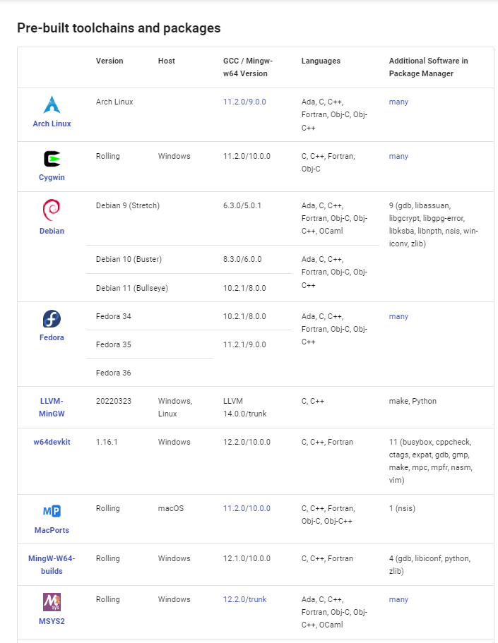
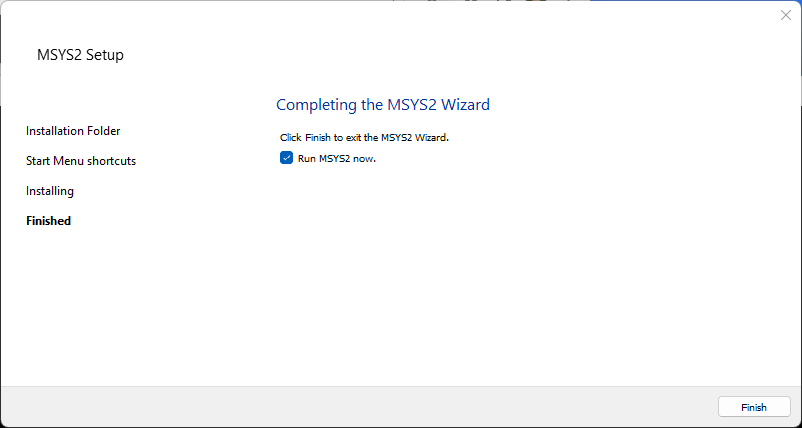

# Development Environment / Machine #

This documentation describes the latest tested development environments.
See also:

* older [MinGW 32-bit installation instructions](machine-32bit.md),
used for initial transition to `gfortran`

The computer and operating system used for development control how other software components are installed.
The target environment is Windows 7 and Linux, with initial focus being Windows given the
needs of the State of Colorado and its contractors.

StateMod code is Fortran and there is a desire to use the free and open source recent `gfortran` compiler,
rather than the previous Lahey 95 compiler.
The 32-bit MinGW `gfortran` development environment was previously implemented to create 32-bit StateMod executables.
Lahey and `gfortran` executables have been created during transition to `gfortran`.
This documentation describes how to install the 64-bit MSYS2 MinGW development environment,
which is used to create 64-bit StateMod executables.

**The initial approach for StateMod is to use a MinGW environment within Windows,
given that this approach has been implemented with success previously.
When more time is available, Cygwin and Linux development environments will also be tested and documented,
to allow more flexibility for developers that prefer or require those environments.**

See the following resources:

* [Binaries available for gfortran](https://gcc.gnu.org/wiki/GFortranBinaries) - access to various `gfortran` distributions
* [mingw-w64](http://mingw-w64.org/doku.php) - MinGW for Windows 64-bit, can also compile 32-bit executables
* [GFortran release notes](https://gcc.gnu.org/wiki/GFortran/News)

The following sections are included in this documentation.
**The choice of development environment by the software developer will drive many other configuration steps.
Again, MinGW is the initial focus.**

*  [Linux](#linux)
*  [Windows](#windows)
	+ [Install MinGW - Native Windows 64-bit](#install-mingw-native-windows-64-bit) - for 64-bit StateMod executables (focus of this documentation)
	+  [Install Cygwin](#install-cygwin) - alternative to MinGW environment (not tested)

-------------------

##  Linux ##

This section will be completed when resources are available for Linux development and testing.

##  Windows ##

The use of `gfortran` somewhat constrains the development environment, especially on Windows,
requiring that either MinGW or Cygwin are used for development,
each of which mimic Linux functionality but will result in Windows-compatible binary StateMod executable.
Using Eclipse/Photran IDE provides some isolation from the command line environment,
but developers will be more effective if they understand command line programs
and some developers may choose to use text editor and command line tools.
The Eclipse/Photran IDE is currently not the focus of development.

MinGW or Cygwin are the recommended compiler environments.
MinGW is the focus as it has been previously used to compile StateMod.

### Install MinGW - Native Windows 64-bit ###

**The following documentation was created on 2021-03-09.
The process may be different if run at a different time, but will hopefully be similar.**

The Minimalist GNU for Windows (MinGW) environment provides a minimal Linux implementation on Windows.
MinGW provides an environment in which the `gcc` and `gfortran` compilers will run.

Various software tools are shipped to run inside a MinGW environment, including Git for Windows,
separate from the MinGW implementation that is used to compile code.
It is OK to install multiple MinGW environments,
as long as the software developer understands why each was installed and does not get confused.
For example, if a Bash shell is used, the title bar usually indicates what environment is being used.
See the following installation instructions:

* [mingw-w64](http://mingw-w64.org/doku.php) - current MinGW tools
* note that the original mingw.org website that was used with initial StateMod `gfortran` work
is not maintained and should be avoided

The documentation below recommends using MSYS2 environment, which includes MinGW.
If MSYS2 has previously been installed, it does not need to be reinstalled.
Look for a `C:\msys64` folder.
If it exists, then MSYS2 was previously installed and can continue to be used for StateMod development.
The software also can be reinstalled to use the latest version, if necessary.

If MSYS2/MinGW needs to be installed, download from the [mingw-w64 Downloads page](http://mingw-w64.org/doku.php/download), as shown below.
This page provides multiple installers for different target environments.



Select the ***Msys2*** for Windows installer, which contains C, C++, and Fortran.
Although other installers are available, Msys2 includes more recent compiler versions than other installers.
First retrieve the installation program from the [msys2.org](https://www.msys2.org/) download page:


Download the installer program, which will save to the `Downloads` folder.
The checksum can be verified using Git Bash `sha256sum` program (if Git for Windows is installed).

Run the downloaded installer program, for example using ***Windows Explorer***,
and follow the instructions on the above web page.
This does not require running as administrator.


Press ***Next*** to start the installation process.


Press ***Next*** to accept the default installation folder.


Press ***Next*** to accept the default ***Start Menu*** shortcuts and start the installation process,
which will show a progress indicator as shown below.


The following will be shown when the installation is complete.



The `C:\msys64` folder will include the MSys2 files, including `C:\msys64\mingw32` and `C:\msys64\mingw64` folders.

Press ***Finish*** to open an MSys2 terminal window, as shown below.


In the terminal window, as per the MSys2 installation instructions, run:

```
$ pacman -Syu

:: Synchronizing package databases...
 mingw32                      925.3 KiB  1182 KiB/s 00:01 [##############################] 100%
 mingw32.sig                  566.0   B  0.00   B/s 00:00 [##############################] 100%
 mingw64                      928.7 KiB  3.49 MiB/s 00:00 [##############################] 100%
 mingw64.sig                  566.0   B  0.00   B/s 00:00 [##############################] 100%
 msys                         301.5 KiB  58.9 MiB/s 00:00 [##############################] 100%
 msys.sig                     566.0   B  0.00   B/s 00:00 [##############################] 100%
:: Starting core system upgrade...
 there is nothing to do
:: Starting full system upgrade...
resolving dependencies...
looking for conflicting packages...

Packages (1) nano-5.6.1-1

Total Download Size:   0.57 MiB
Total Installed Size:  2.68 MiB
Net Upgrade Size:      0.08 MiB

:: Proceed with installation? [Y/n]
:: Retrieving packages...
 nano-5.6.1-1-x86_64          584.9 KiB   898 KiB/s 00:01 [##############################] 100%
(1/1) checking keys in keyring                            [##############################] 100%
(1/1) checking package integrity                          [##############################] 100%
(1/1) loading package files                               [##############################] 100%
(1/1) checking for file conflicts                         [##############################] 100%
(1/1) checking available disk space                       [##############################] 100%
:: Processing package changes...
(1/1) upgrading nano                                      [##############################] 100%
:: Running post-transaction hooks...
(1/1) Updating the info directory file...
```

Open a new MSys2 terminal using ***Start*** menu ***MSYS2 / MSYS***.  Then run:

```
$ pacman -Su

:: Starting core system upgrade...
 there is nothing to do
:: Starting full system upgrade...
 there is nothing to do
```

The environment is now ready to install compiler software including GCC and Fortran.
Run the following command.
This will install many packages requiring several minutes.
Full output is shown below.

```
$ pacman -S --needed base-devel mingw-w64-x86_64-toolchain

warning: file-5.39-2 is up to date -- skipping
warning: gawk-5.1.0-1 is up to date -- skipping
warning: gettext-0.19.8.1-1 is up to date -- skipping
warning: grep-3.0-2 is up to date -- skipping
warning: pacman-5.2.2-12 is up to date -- skipping
warning: perl-5.32.0-2 is up to date -- skipping
warning: sed-4.8-1 is up to date -- skipping
warning: wget-1.21.1-2 is up to date -- skipping
:: There are 48 members in group base-devel:
:: Repository msys
   1) asciidoc  2) autoconf  3) autoconf2.13  4) autogen  5) automake-wrapper  6) automake1.10  7) automake1.11
   8) automake1.12  9) automake1.13  10) automake1.14  11) automake1.15  12) automake1.16  13) automake1.6
   14) automake1.7  15) automake1.8  16) automake1.9  17) bison  18) btyacc  19) diffstat  20) diffutils
   21) dos2unix  22) flex  23) gdb  24) gettext-devel  25) gperf  26) groff  27) help2man  28) intltool  29) libtool
   30) libunrar  31) libunrar-devel  32) m4  33) make  34) man-db  35) pactoys-git  36) patch  37) patchutils
   38) pkgconf  39) pkgfile  40) quilt  41) reflex  42) scons  43) swig  44) texinfo  45) texinfo-tex  46) ttyrec
   47) unrar  48) xmlto

Enter a selection (default=all):
:: There are 19 members in group mingw-w64-x86_64-toolchain:
:: Repository mingw64
   1) mingw-w64-x86_64-binutils  2) mingw-w64-x86_64-crt-git  3) mingw-w64-x86_64-gcc  4) mingw-w64-x86_64-gcc-ada
   5) mingw-w64-x86_64-gcc-fortran  6) mingw-w64-x86_64-gcc-libgfortran  7) mingw-w64-x86_64-gcc-libs
   8) mingw-w64-x86_64-gcc-objc  9) mingw-w64-x86_64-gdb  10) mingw-w64-x86_64-gdb-multiarch
   11) mingw-w64-x86_64-headers-git  12) mingw-w64-x86_64-libgccjit  13) mingw-w64-x86_64-libmangle-git
   14) mingw-w64-x86_64-libwinpthread-git  15) mingw-w64-x86_64-make  16) mingw-w64-x86_64-pkgconf
   17) mingw-w64-x86_64-tools-git  18) mingw-w64-x86_64-winpthreads-git  19) mingw-w64-x86_64-winstorecompat-git

Enter a selection (default=all):
resolving dependencies...
looking for conflicting packages...

Packages (123) docbook-xml-4.5-2  docbook-xsl-1.79.2-1  expat-2.2.10-1  libarchive-3.5.1-1  libatomic_ops-7.6.10-1
               libgc-8.0.4-1  libguile-2.2.7-1  libiconv-devel-1.16-2  libltdl-2.4.6-9  libpcre16-8.44-1
               libpcre2_16-10.36-1  libpcre2_32-10.36-1  libpcre2posix-10.36-1  libpcre32-8.44-1  libpcrecpp-8.44-1
               libpcreposix-8.44-1  libpipeline-1.5.3-2  mingw-w64-x86_64-bzip2-1.0.8-2
               mingw-w64-x86_64-ca-certificates-20200601-2  mingw-w64-x86_64-expat-2.2.10-1
               mingw-w64-x86_64-gettext-0.19.8.1-10  mingw-w64-x86_64-gmp-6.2.1-1  mingw-w64-x86_64-isl-0.23-1
               mingw-w64-x86_64-libffi-3.3-3  mingw-w64-x86_64-libiconv-1.16-2  mingw-w64-x86_64-libsystre-1.0.1-4
               mingw-w64-x86_64-libtasn1-4.16.0-1  mingw-w64-x86_64-libtre-git-r128.6fb7206-2
               mingw-w64-x86_64-mpc-1.2.1-1  mingw-w64-x86_64-mpdecimal-2.5.0-1  mingw-w64-x86_64-mpfr-4.1.0-3
               mingw-w64-x86_64-ncurses-6.2-2  mingw-w64-x86_64-openssl-1.1.1.j-1
               mingw-w64-x86_64-p11-kit-0.23.22-1  mingw-w64-x86_64-python-3.8.8-2
               mingw-w64-x86_64-readline-8.0.004-2  mingw-w64-x86_64-sqlite3-3.34.1-1  mingw-w64-x86_64-tcl-8.6.11-2
               mingw-w64-x86_64-termcap-1.3.1-6  mingw-w64-x86_64-tk-8.6.11.1-1
               mingw-w64-x86_64-windows-default-manifest-6.4-3  mingw-w64-x86_64-xxhash-0.8.0-1
               mingw-w64-x86_64-xz-5.2.5-2  mingw-w64-x86_64-zlib-1.2.11-9  mingw-w64-x86_64-zstd-1.4.8-2
               mpdecimal-2.5.0-1  pcre-8.44-1  pcre2-10.36-1  perl-Locale-Gettext-1.07-7  perl-Module-Build-0.4231-1
               perl-Test-Pod-1.52-1  perl-XML-Parser-2.46-3  perl-YAML-Syck-1.34-1  perl-inc-latest-0.500-1
               python-3.8.7-1  tar-1.33-1  asciidoc-9.1.0-1  autoconf-2.71-1  autoconf2.13-2.13-3  autogen-5.18.16-1
               automake-wrapper-11-1  automake1.10-1.10.3-4  automake1.11-1.11.6-4  automake1.12-1.12.6-4
               automake1.13-1.13.4-5  automake1.14-1.14.1-4  automake1.15-1.15.1-2  automake1.16-1.16.3-1
               automake1.6-1.6.3-3  automake1.7-1.7.9-3  automake1.8-1.8.5-4  automake1.9-1.9.6-3  bison-3.7.4-1
               btyacc-20200910-1  diffstat-1.63-1  diffutils-3.7-1  dos2unix-7.4.2-1  flex-2.6.4-1  gdb-9.2-3
               gettext-devel-0.19.8.1-1  gperf-3.1-2  groff-1.22.4-1  help2man-1.47.16-1  intltool-0.51.0-2
               libtool-2.4.6-9  libunrar-6.0.3-1  libunrar-devel-6.0.3-1  m4-1.4.18-2  make-4.3-1  man-db-2.9.3-1
               mingw-w64-x86_64-binutils-2.36.1-1  mingw-w64-x86_64-crt-git-9.0.0.6128.07922837-1
               mingw-w64-x86_64-gcc-10.2.0-8  mingw-w64-x86_64-gcc-ada-10.2.0-8
               mingw-w64-x86_64-gcc-fortran-10.2.0-8  mingw-w64-x86_64-gcc-libgfortran-10.2.0-8
               mingw-w64-x86_64-gcc-libs-10.2.0-8  mingw-w64-x86_64-gcc-objc-10.2.0-8  mingw-w64-x86_64-gdb-10.1-2
               mingw-w64-x86_64-gdb-multiarch-10.1-2  mingw-w64-x86_64-headers-git-9.0.0.6128.07922837-1
               mingw-w64-x86_64-libgccjit-10.2.0-8  mingw-w64-x86_64-libmangle-git-9.0.0.6128.07922837-1
               mingw-w64-x86_64-libwinpthread-git-9.0.0.6128.07922837-1  mingw-w64-x86_64-make-4.3-1
               mingw-w64-x86_64-pkgconf-1.7.3-6  mingw-w64-x86_64-tools-git-9.0.0.6128.07922837-1
               mingw-w64-x86_64-winpthreads-git-9.0.0.6128.07922837-1
               mingw-w64-x86_64-winstorecompat-git-9.0.0.6128.07922837-1  pactoys-git-r2.07ca37f-1  patch-2.7.6-1
               patchutils-0.4.2-1  pkgconf-1.7.3-2  pkgfile-21-1  quilt-0.66-2  reflex-20200715-1  scons-3.1.2-4
               swig-4.0.2-1  texinfo-6.7-3  texinfo-tex-6.7-3  ttyrec-1.0.8-2  unrar-6.0.3-1  xmlto-0.0.28-2

Total Download Size:    197.19 MiB
Total Installed Size:  1264.31 MiB

:: Proceed with installation? [Y/n]
:: Retrieving packages...
 mingw-w64-x86_64-libiconv-1.16-2-any      744.5 KiB   950 KiB/s 00:01 [######################################] 100%
 mingw-w64-x86_64-zlib-1.2.11-9-any        101.4 KiB  99.0 MiB/s 00:00 [######################################] 100%
 mingw-w64-x86_64-binutils-2.36.1-1-any      7.1 MiB  13.2 MiB/s 00:01 [######################################] 100%
 mingw-w64-x86_64-headers-git-9.0.0.6...     5.2 MiB  12.1 MiB/s 00:00 [######################################] 100%
 mingw-w64-x86_64-crt-git-9.0.0.6128....     3.2 MiB  93.4 MiB/s 00:00 [######################################] 100%
 mingw-w64-x86_64-isl-0.23-1-any           870.6 KiB  85.0 MiB/s 00:00 [######################################] 100%
 mingw-w64-x86_64-gmp-6.2.1-1-any          501.7 KiB  98.0 MiB/s 00:00 [######################################] 100%
 mingw-w64-x86_64-mpfr-4.1.0-3-any         357.1 KiB  69.7 MiB/s 00:00 [######################################] 100%
 mingw-w64-x86_64-mpc-1.2.1-1-any           72.7 KiB  71.0 MiB/s 00:00 [######################################] 100%
 mingw-w64-x86_64-libwinpthread-git-9...    29.1 KiB  0.00   B/s 00:00 [######################################] 100%
 mingw-w64-x86_64-gcc-libs-10.2.0-8-any    756.5 KiB   106 MiB/s 00:00 [######################################] 100%
 mingw-w64-x86_64-windows-default-man...    12.9 KiB  0.00   B/s 00:00 [######################################] 100%
 mingw-w64-x86_64-winpthreads-git-9.0...    39.7 KiB  0.00   B/s 00:00 [######################################] 100%
 mingw-w64-x86_64-zstd-1.4.8-2-any         475.3 KiB  66.3 MiB/s 00:00 [######################################] 100%
 mingw-w64-x86_64-gcc-10.2.0-8-any          27.1 MiB  8.15 MiB/s 00:03 [######################################] 100%
 mingw-w64-x86_64-gcc-ada-10.2.0-8-any      18.8 MiB  19.8 MiB/s 00:01 [######################################] 100%
 mingw-w64-x86_64-gcc-libgfortran-10....   777.7 KiB   127 MiB/s 00:00 [######################################] 100%
 mingw-w64-x86_64-gcc-fortran-10.2.0-...    10.2 MiB  19.3 MiB/s 00:01 [######################################] 100%
 mingw-w64-x86_64-gcc-objc-10.2.0-8-any     11.4 MiB  17.1 MiB/s 00:01 [######################################] 100%
 mingw-w64-x86_64-expat-2.2.10-1-any       140.4 KiB   137 MiB/s 00:00 [######################################] 100%
 mingw-w64-x86_64-gettext-0.19.8.1-10-any    3.4 MiB  12.7 MiB/s 00:00 [######################################] 100%
 mingw-w64-x86_64-libtre-git-r128.6fb...    84.2 KiB  82.2 MiB/s 00:00 [######################################] 100%
 mingw-w64-x86_64-libsystre-1.0.1-4-any     24.0 KiB  23.4 MiB/s 00:00 [######################################] 100%
 mingw-w64-x86_64-ncurses-6.2-2-any       1578.1 KiB  90.7 MiB/s 00:00 [######################################] 100%
 mingw-w64-x86_64-bzip2-1.0.8-2-any         89.1 KiB  43.5 MiB/s 00:00 [######################################] 100%
 mingw-w64-x86_64-libffi-3.3-3-any          40.4 KiB  39.4 MiB/s 00:00 [######################################] 100%
 mingw-w64-x86_64-mpdecimal-2.5.0-1-any    344.4 KiB   336 MiB/s 00:00 [######################################] 100%
 mingw-w64-x86_64-libtasn1-4.16.0-1-any    172.0 KiB  84.0 MiB/s 00:00 [######################################] 100%
 mingw-w64-x86_64-p11-kit-0.23.22-1-any    352.4 KiB  86.0 MiB/s 00:00 [######################################] 100%
 mingw-w64-x86_64-ca-certificates-202...   349.8 KiB  85.4 MiB/s 00:00 [######################################] 100%
 mingw-w64-x86_64-openssl-1.1.1.j-1-any      4.8 MiB  17.5 MiB/s 00:00 [######################################] 100%
 mingw-w64-x86_64-termcap-1.3.1-6-any       28.0 KiB  0.00   B/s 00:00 [######################################] 100%
 mingw-w64-x86_64-readline-8.0.004-2-any   378.8 KiB  74.0 MiB/s 00:00 [######################################] 100%
 mingw-w64-x86_64-tcl-8.6.11-2-any           2.6 MiB  18.4 MiB/s 00:00 [######################################] 100%
 mingw-w64-x86_64-sqlite3-3.34.1-1-any       6.7 MiB  16.8 MiB/s 00:00 [######################################] 100%
 mingw-w64-x86_64-tk-8.6.11.1-1-any       1973.1 KiB   101 MiB/s 00:00 [######################################] 100%
 mingw-w64-x86_64-xz-5.2.5-2-any           354.3 KiB   115 MiB/s 00:00 [######################################] 100%
 mingw-w64-x86_64-python-3.8.8-2-any        17.0 MiB  5.49 MiB/s 00:03 [######################################] 100%
 mingw-w64-x86_64-xxhash-0.8.0-1-any        99.7 KiB  48.7 MiB/s 00:00 [######################################] 100%
 mingw-w64-x86_64-gdb-10.1-2-any             4.1 MiB  10.5 MiB/s 00:00 [######################################] 100%
 mingw-w64-x86_64-gdb-multiarch-10.1-...     6.3 MiB  15.6 MiB/s 00:00 [######################################] 100%
 mingw-w64-x86_64-libgccjit-10.2.0-8-any     9.4 MiB  11.9 MiB/s 00:01 [######################################] 100%
 mingw-w64-x86_64-libmangle-git-9.0.0...    23.0 KiB  0.00   B/s 00:00 [######################################] 100%
 mingw-w64-x86_64-make-4.3-1-any           151.6 KiB   148 MiB/s 00:00 [######################################] 100%
 mingw-w64-x86_64-pkgconf-1.7.3-6-any       76.2 KiB  0.00   B/s 00:00 [######################################] 100%
 mingw-w64-x86_64-tools-git-9.0.0.612...   304.1 KiB  99.0 MiB/s 00:00 [######################################] 100%
 mingw-w64-x86_64-winstorecompat-git-...    21.4 KiB  20.9 MiB/s 00:00 [######################################] 100%
 mpdecimal-2.5.0-1-x86_64                  104.8 KiB   102 MiB/s 00:00 [######################################] 100%
 python-3.8.7-1-x86_64                      16.3 MiB  13.7 MiB/s 00:01 [######################################] 100%
 docbook-xml-4.5-2-any                      81.4 KiB  79.5 MiB/s 00:00 [######################################] 100%
 docbook-xsl-1.79.2-1-any                  740.0 KiB  90.3 MiB/s 00:00 [######################################] 100%
 asciidoc-9.1.0-1-any                      179.6 KiB  87.7 MiB/s 00:00 [######################################] 100%
 m4-1.4.18-2-x86_64                        218.4 KiB  71.1 MiB/s 00:00 [######################################] 100%
 diffutils-3.7-1-x86_64                    342.0 KiB  66.8 MiB/s 00:00 [######################################] 100%
 autoconf-2.71-1-any                       643.7 KiB  89.8 MiB/s 00:00 [######################################] 100%
 autoconf2.13-2.13-3-any                   137.6 KiB   134 MiB/s 00:00 [######################################] 100%
 libatomic_ops-7.6.10-1-any                 25.9 KiB  0.00   B/s 00:00 [######################################] 100%
 libgc-8.0.4-1-x86_64                      188.0 KiB  91.8 MiB/s 00:00 [######################################] 100%
 libltdl-2.4.6-9-x86_64                     46.0 KiB  44.9 MiB/s 00:00 [######################################] 100%
 libguile-2.2.7-1-x86_64                     4.8 MiB  17.0 MiB/s 00:00 [######################################] 100%
 autogen-5.18.16-1-x86_64                  650.0 KiB   106 MiB/s 00:00 [######################################] 100%
 automake1.6-1.6.3-3-any                   256.3 KiB   125 MiB/s 00:00 [######################################] 100%
 automake1.7-1.7.9-3-any                   298.6 KiB  0.00   B/s 00:00 [######################################] 100%
 automake1.8-1.8.5-4-any                   345.0 KiB  84.2 MiB/s 00:00 [######################################] 100%
 automake1.9-1.9.6-3-any                   386.8 KiB   126 MiB/s 00:00 [######################################] 100%
 automake1.10-1.10.3-4-any                 441.6 KiB   108 MiB/s 00:00 [######################################] 100%
 automake1.11-1.11.6-4-any                 492.2 KiB   120 MiB/s 00:00 [######################################] 100%
 automake1.12-1.12.6-4-any                 505.3 KiB  98.7 MiB/s 00:00 [######################################] 100%
 automake1.13-1.13.4-5-any                 503.6 KiB   123 MiB/s 00:00 [######################################] 100%
 automake1.14-1.14.1-4-any                 505.3 KiB  98.7 MiB/s 00:00 [######################################] 100%
 automake1.15-1.15.1-2-any                 515.6 KiB  71.9 MiB/s 00:00 [######################################] 100%
 automake1.16-1.16.3-1-any                 520.6 KiB  84.7 MiB/s 00:00 [######################################] 100%
 automake-wrapper-11-1-any                  18.8 KiB  18.4 MiB/s 00:00 [######################################] 100%
 bison-3.7.4-1-x86_64                      736.8 KiB   103 MiB/s 00:00 [######################################] 100%
 btyacc-20200910-1-x86_64                   69.2 KiB  67.6 MiB/s 00:00 [######################################] 100%
 diffstat-1.63-1-x86_64                     43.4 KiB  42.4 MiB/s 00:00 [######################################] 100%
 dos2unix-7.4.2-1-x86_64                   336.7 KiB   110 MiB/s 00:00 [######################################] 100%
 flex-2.6.4-1-x86_64                       294.6 KiB  71.9 MiB/s 00:00 [######################################] 100%
 expat-2.2.10-1-x86_64                      28.4 KiB  27.7 MiB/s 00:00 [######################################] 100%
 gdb-9.2-3-x86_64                            3.7 MiB  14.1 MiB/s 00:00 [######################################] 100%
 libiconv-devel-1.16-2-x86_64              685.8 KiB  83.7 MiB/s 00:00 [######################################] 100%
 gettext-devel-0.19.8.1-1-x86_64          1332.9 KiB  93.0 MiB/s 00:00 [######################################] 100%
 gperf-3.1-2-x86_64                        102.0 KiB  99.7 MiB/s 00:00 [######################################] 100%
 groff-1.22.4-1-x86_64                    1938.5 KiB  14.1 MiB/s 00:00 [######################################] 100%
 perl-Locale-Gettext-1.07-7-x86_64          13.8 KiB  0.00   B/s 00:00 [######################################] 100%
 help2man-1.47.16-1-x86_64                 170.8 KiB  55.6 MiB/s 00:00 [######################################] 100%
 perl-XML-Parser-2.46-3-x86_64             160.2 KiB  78.2 MiB/s 00:00 [######################################] 100%
 intltool-0.51.0-2-x86_64                   39.4 KiB  38.4 MiB/s 00:00 [######################################] 100%
 tar-1.33-1-x86_64                         814.5 KiB  72.3 MiB/s 00:00 [######################################] 100%
 libtool-2.4.6-9-x86_64                    398.3 KiB  97.2 MiB/s 00:00 [######################################] 100%
 libunrar-6.0.3-1-x86_64                   122.2 KiB   119 MiB/s 00:00 [######################################] 100%
 libunrar-devel-6.0.3-1-x86_64             156.8 KiB  76.6 MiB/s 00:00 [######################################] 100%
 make-4.3-1-x86_64                         456.7 KiB  89.2 MiB/s 00:00 [######################################] 100%
 libpipeline-1.5.3-2-x86_64                 29.7 KiB  0.00   B/s 00:00 [######################################] 100%
 man-db-2.9.3-1-x86_64                    1128.2 KiB   110 MiB/s 00:00 [######################################] 100%
 libarchive-3.5.1-1-x86_64                1047.6 KiB   102 MiB/s 00:00 [######################################] 100%
 libpcre16-8.44-1-x86_64                    96.7 KiB  94.5 MiB/s 00:00 [######################################] 100%
 libpcre32-8.44-1-x86_64                    90.8 KiB  88.7 MiB/s 00:00 [######################################] 100%
 libpcrecpp-8.44-1-x86_64                   29.5 KiB  28.8 MiB/s 00:00 [######################################] 100%
 libpcreposix-8.44-1-x86_64                 22.6 KiB  22.1 MiB/s 00:00 [######################################] 100%
 pcre-8.44-1-x86_64                        589.4 KiB  71.9 MiB/s 00:00 [######################################] 100%
 pkgfile-21-1-x86_64                        43.0 KiB  0.00   B/s 00:00 [######################################] 100%
 pactoys-git-r2.07ca37f-1-x86_64            33.1 KiB  0.00   B/s 00:00 [######################################] 100%
 patch-2.7.6-1-x86_64                      101.6 KiB  99.2 MiB/s 00:00 [######################################] 100%
 libpcre2_16-10.36-1-x86_64                110.6 KiB   108 MiB/s 00:00 [######################################] 100%
 libpcre2_32-10.36-1-x86_64                102.6 KiB   100 MiB/s 00:00 [######################################] 100%
 libpcre2posix-10.36-1-x86_64                6.7 KiB  0.00   B/s 00:00 [######################################] 100%
 pcre2-10.36-1-x86_64                      662.2 KiB  4.79 MiB/s 00:00 [######################################] 100%
 patchutils-0.4.2-1-x86_64                  81.7 KiB  0.00   B/s 00:00 [######################################] 100%
 pkgconf-1.7.3-2-x86_64                     56.0 KiB  54.7 MiB/s 00:00 [######################################] 100%
 quilt-0.66-2-any                          545.3 KiB  88.7 MiB/s 00:00 [######################################] 100%
 reflex-20200715-1-x86_64                  109.2 KiB   107 MiB/s 00:00 [######################################] 100%
 scons-3.1.2-4-any                         809.9 KiB  87.9 MiB/s 00:00 [######################################] 100%
 swig-4.0.2-1-x86_64                      1084.8 KiB   106 MiB/s 00:00 [######################################] 100%
 texinfo-6.7-3-x86_64                     1168.1 KiB  87.7 MiB/s 00:00 [######################################] 100%
 texinfo-tex-6.7-3-x86_64                   27.7 KiB  27.1 MiB/s 00:00 [######################################] 100%
 ttyrec-1.0.8-2-x86_64                      25.9 KiB  25.3 MiB/s 00:00 [######################################] 100%
 unrar-6.0.3-1-x86_64                      130.1 KiB  0.00   B/s 00:00 [######################################] 100%
 perl-YAML-Syck-1.34-1-x86_64               68.3 KiB  66.7 MiB/s 00:00 [######################################] 100%
 perl-inc-latest-0.500-1-any                25.5 KiB  24.9 MiB/s 00:00 [######################################] 100%
 perl-Module-Build-0.4231-1-any            193.4 KiB  62.9 MiB/s 00:00 [######################################] 100%
 perl-Test-Pod-1.52-1-any                   23.8 KiB  0.00   B/s 00:00 [######################################] 100%
 xmlto-0.0.28-2-x86_64                      41.0 KiB  0.00   B/s 00:00 [######################################] 100%
(123/123) checking keys in keyring                                     [######################################] 100%
(123/123) checking package integrity                                   [######################################] 100%
(123/123) loading package files                                        [######################################] 100%
(123/123) checking for file conflicts                                  [######################################] 100%
(123/123) checking available disk space                                [######################################] 100%
:: Processing package changes...
(  1/123) installing mpdecimal                                         [######################################] 100%
(  2/123) installing python                                            [######################################] 100%
(  3/123) installing docbook-xml                                       [######################################] 100%
(  4/123) installing docbook-xsl                                       [######################################] 100%
(  5/123) installing asciidoc                                          [######################################] 100%
(  6/123) installing m4                                                [######################################] 100%
(  7/123) installing diffutils                                         [######################################] 100%
(  8/123) installing autoconf                                          [######################################] 100%
(  9/123) installing autoconf2.13                                      [######################################] 100%
( 10/123) installing libatomic_ops                                     [######################################] 100%
( 11/123) installing libgc                                             [######################################] 100%
( 12/123) installing libltdl                                           [######################################] 100%
( 13/123) installing libguile                                          [######################################] 100%
( 14/123) installing autogen                                           [######################################] 100%
( 15/123) installing automake1.6                                       [######################################] 100%
( 16/123) installing automake1.7                                       [######################################] 100%
( 17/123) installing automake1.8                                       [######################################] 100%
( 18/123) installing automake1.9                                       [######################################] 100%
( 19/123) installing automake1.10                                      [######################################] 100%
( 20/123) installing automake1.11                                      [######################################] 100%
( 21/123) installing automake1.12                                      [######################################] 100%
( 22/123) installing automake1.13                                      [######################################] 100%
( 23/123) installing automake1.14                                      [######################################] 100%
( 24/123) installing automake1.15                                      [######################################] 100%
( 25/123) installing automake1.16                                      [######################################] 100%
( 26/123) installing automake-wrapper                                  [######################################] 100%
( 27/123) installing bison                                             [######################################] 100%
( 28/123) installing btyacc                                            [######################################] 100%
( 29/123) installing diffstat                                          [######################################] 100%
( 30/123) installing dos2unix                                          [######################################] 100%
( 31/123) installing flex                                              [######################################] 100%
( 32/123) installing expat                                             [######################################] 100%
( 33/123) installing gdb                                               [######################################] 100%
( 34/123) installing libiconv-devel                                    [######################################] 100%
( 35/123) installing gettext-devel                                     [######################################] 100%
Optional dependencies for gettext-devel
    cvs: for autopoint tool
( 36/123) installing gperf                                             [######################################] 100%
( 37/123) installing groff                                             [######################################] 100%
( 38/123) installing perl-Locale-Gettext                               [######################################] 100%
( 39/123) installing help2man                                          [######################################] 100%
( 40/123) installing perl-XML-Parser                                   [######################################] 100%
( 41/123) installing intltool                                          [######################################] 100%
( 42/123) installing tar                                               [######################################] 100%
( 43/123) installing libtool                                           [######################################] 100%
( 44/123) installing libunrar                                          [######################################] 100%
( 45/123) installing libunrar-devel                                    [######################################] 100%
( 46/123) installing make                                              [######################################] 100%
( 47/123) installing libpipeline                                       [######################################] 100%
( 48/123) installing man-db                                            [######################################] 100%
it's recommended to create an initial
database running as root:
"/usr/bin/mandb --quiet"
Optional dependencies for man-db
    gzip [installed]
( 49/123) installing libarchive                                        [######################################] 100%
( 50/123) installing libpcre16                                         [######################################] 100%
( 51/123) installing libpcre32                                         [######################################] 100%
( 52/123) installing libpcrecpp                                        [######################################] 100%
( 53/123) installing libpcreposix                                      [######################################] 100%
( 54/123) installing pcre                                              [######################################] 100%
( 55/123) installing pkgfile                                           [######################################] 100%
==> Run 'pkgfile --update' to initialize the database
( 56/123) installing pactoys-git                                       [######################################] 100%
( 57/123) installing patch                                             [######################################] 100%
Optional dependencies for patch
    ed: for patch -e functionality
( 58/123) installing libpcre2_16                                       [######################################] 100%
( 59/123) installing libpcre2_32                                       [######################################] 100%
( 60/123) installing libpcre2posix                                     [######################################] 100%
( 61/123) installing pcre2                                             [######################################] 100%
( 62/123) installing patchutils                                        [######################################] 100%
( 63/123) installing pkgconf                                           [######################################] 100%
( 64/123) installing quilt                                             [######################################] 100%
( 65/123) installing reflex                                            [######################################] 100%
( 66/123) installing scons                                             [######################################] 100%
( 67/123) installing swig                                              [######################################] 100%
( 68/123) installing texinfo                                           [######################################] 100%
( 69/123) installing texinfo-tex                                       [######################################] 100%
( 70/123) installing ttyrec                                            [######################################] 100%
( 71/123) installing unrar                                             [######################################] 100%
( 72/123) installing perl-YAML-Syck                                    [######################################] 100%
( 73/123) installing perl-inc-latest                                   [######################################] 100%
( 74/123) installing perl-Module-Build                                 [######################################] 100%
( 75/123) installing perl-Test-Pod                                     [######################################] 100%
( 76/123) installing xmlto                                             [######################################] 100%
( 77/123) installing mingw-w64-x86_64-libiconv                         [######################################] 100%
( 78/123) installing mingw-w64-x86_64-zlib                             [######################################] 100%
( 79/123) installing mingw-w64-x86_64-binutils                         [######################################] 100%
( 80/123) installing mingw-w64-x86_64-headers-git                      [######################################] 100%
( 81/123) installing mingw-w64-x86_64-crt-git                          [######################################] 100%
( 82/123) installing mingw-w64-x86_64-isl                              [######################################] 100%
( 83/123) installing mingw-w64-x86_64-gmp                              [######################################] 100%
( 84/123) installing mingw-w64-x86_64-mpfr                             [######################################] 100%
( 85/123) installing mingw-w64-x86_64-mpc                              [######################################] 100%
( 86/123) installing mingw-w64-x86_64-libwinpthread-git                [######################################] 100%
( 87/123) installing mingw-w64-x86_64-gcc-libs                         [######################################] 100%
( 88/123) installing mingw-w64-x86_64-windows-default-manifest         [######################################] 100%
( 89/123) installing mingw-w64-x86_64-winpthreads-git                  [######################################] 100%
( 90/123) installing mingw-w64-x86_64-zstd                             [######################################] 100%
( 91/123) installing mingw-w64-x86_64-gcc                              [######################################] 100%
( 92/123) installing mingw-w64-x86_64-gcc-ada                          [######################################] 100%
( 93/123) installing mingw-w64-x86_64-gcc-libgfortran                  [######################################] 100%
( 94/123) installing mingw-w64-x86_64-gcc-fortran                      [######################################] 100%
( 95/123) installing mingw-w64-x86_64-gcc-objc                         [######################################] 100%
( 96/123) installing mingw-w64-x86_64-expat                            [######################################] 100%
( 97/123) installing mingw-w64-x86_64-gettext                          [######################################] 100%
( 98/123) installing mingw-w64-x86_64-libtre-git                       [######################################] 100%
( 99/123) installing mingw-w64-x86_64-libsystre                        [######################################] 100%
(100/123) installing mingw-w64-x86_64-ncurses                          [######################################] 100%
(101/123) installing mingw-w64-x86_64-bzip2                            [######################################] 100%
(102/123) installing mingw-w64-x86_64-libffi                           [######################################] 100%
(103/123) installing mingw-w64-x86_64-mpdecimal                        [######################################] 100%
(104/123) installing mingw-w64-x86_64-libtasn1                         [######################################] 100%
(105/123) installing mingw-w64-x86_64-p11-kit                          [######################################] 100%
(106/123) installing mingw-w64-x86_64-ca-certificates                  [######################################] 100%
(107/123) installing mingw-w64-x86_64-openssl                          [######################################] 100%
(108/123) installing mingw-w64-x86_64-termcap                          [######################################] 100%
(109/123) installing mingw-w64-x86_64-readline                         [######################################] 100%
(110/123) installing mingw-w64-x86_64-tcl                              [######################################] 100%
(111/123) installing mingw-w64-x86_64-sqlite3                          [######################################] 100%
(112/123) installing mingw-w64-x86_64-tk                               [######################################] 100%
(113/123) installing mingw-w64-x86_64-xz                               [######################################] 100%
(114/123) installing mingw-w64-x86_64-python                           [######################################] 100%
(115/123) installing mingw-w64-x86_64-xxhash                           [######################################] 100%
(116/123) installing mingw-w64-x86_64-gdb                              [######################################] 100%
(117/123) installing mingw-w64-x86_64-gdb-multiarch                    [######################################] 100%
(118/123) installing mingw-w64-x86_64-libgccjit                        [######################################] 100%
(119/123) installing mingw-w64-x86_64-libmangle-git                    [######################################] 100%
(120/123) installing mingw-w64-x86_64-make                             [######################################] 100%
(121/123) installing mingw-w64-x86_64-pkgconf                          [######################################] 100%
(122/123) installing mingw-w64-x86_64-tools-git                        [######################################] 100%
(123/123) installing mingw-w64-x86_64-winstorecompat-git               [######################################] 100%
:: Running post-transaction hooks...
(1/1) Updating the info directory file...
```

The above allows opening a MingW window for either 32-bit or 64-bit environment.
For example, use ***MSYS2 64bit / MSYS2 MinGW 64-bit*** to open a terminal window for 64-bit compilers.
The prompt indicates that the environment is for MINGW64, as shown in the following figure.


The environment is now configured, including the `PATH`.
The compiler versions can be confirmed, as follows.

```com
$ gcc --version
gcc.exe (Rev8, Built by MSYS2 project) 10.2.0
Copyright (C) 2020 Free Software Foundation, Inc.
This is free software; see the source for copying conditions.  There is NO
warranty; not even for MERCHANTABILITY or FITNESS FOR A PARTICULAR PURPOSE.

$ gfortran --version
GNU Fortran (Rev8, Built by MSYS2 project) 10.2.0
Copyright (C) 2020 Free Software Foundation, Inc.
This is free software; see the source for copying conditions.  There is NO
warranty; not even for MERCHANTABILITY or FITNESS FOR A PARTICULAR PURPOSE.
```

The home folder is `/home/user` and are separate from normal Windows users files.
Similar to Git Bash, the user's Windows files can be accessed using path `/C/Users/user`.
Modify files in `/home/user` to impact the MinGW environment.

#### Install Useful Software ####

It may be useful to install additional software, for example `vim` text editor and `git` version control software.

```
$ pacman -S vim
$ pacman -S git
```

If Git is installed, it should be configured consistent with Git for Windows (Git Bash),
and other Git utilities that may be used with CDSS development.
Because the `/home/user` folder for MSys2 MinGW is different from other similar installations,
it is necessary to set the Git configuration for the user.
It will also be necessary to configure other user environment settings that a developer may be accustomed to.

###  Install Cygwin ###

This section can be completed if necessary.  The Native Windows MinGW development environment is currently the focus.
Cygwin can be useful in cases where software is not available in Git Bash or Windows.
