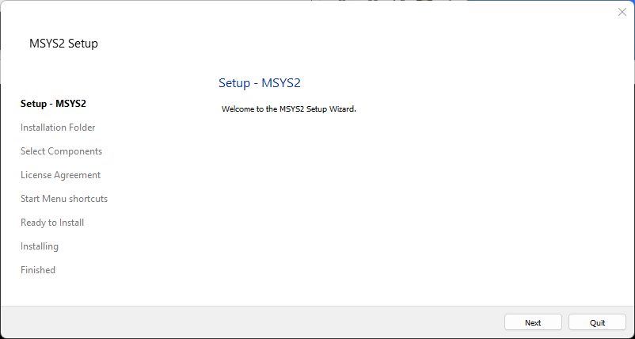

# Development Environment / Machine #

This documentation describes the latest tested development 64-bit environments.

The computer and operating system used for development control how other software components are installed.
The target environment is Windows 10 and Linux, with initial focus being Windows given the
needs of the State of Colorado and its contractors.

StateMod code is Fortran and there is a desire to use a recent version of the free and open source `gfortran` compiler,
rather than the previous Lahey 95 compiler.
The 32-bit MinGW `gfortran` development environment was previously implemented to create 32-bit StateMod executables
and testing showed close agreement with 64-bit executable.
Therefore, the 64-bit executable is the focus.
Lahey and `gfortran` executables have been created during transition to `gfortran`.
This documentation describes how to install the 64-bit MSYS2 MinGW development environment,
which is used to create 64-bit StateMod executables.

**The initial approach for StateMod is to use a MinGW environment within Windows,
given that this approach has previously been implemented with success.
When more time is available, Cygwin and Linux development environments will also be tested and documented,
to allow more flexibility for developers that prefer or require those environments.
StateMod is known to have been compiled and used on Linux.**

See the following resources:

* [Binaries available for gfortran](https://gcc.gnu.org/wiki/GFortranBinaries) - access to various `gfortran` distributions
* [mingw-w64](https://www.mingw-w64.org/) - MinGW for Windows 64-bit, can also compile 32-bit executables
* [GFortran release notes](https://gcc.gnu.org/wiki/GFortran/News) - these release notes may lag the version that is available in MSYS2

The following sections are included in this documentation for various operating systems.
**The choice of development environment by the software developer will drive many other configuration steps.
Windows MinGW is the initial focus.**

*  [Linux](#linux)
*  [Windows](#windows)
    +  [Install MSYS2 64-bit Software](#install-msys2-64-bit-software) - development environment that is the focus of this documentation
    +  [Install 64-bit MinGW Software](#install-64-bit-mingw-software) - needed to compile 64-bit executables
    +  [Install Useful MinGW Software](#install-useful-mingw-software) - useful software development tools
*  [Install Cygwin](#install-cygwin) - alternative to MinGW environment (not tested)

-------------------

##  Linux ##

This section will be completed when resources are available for Linux development and testing.

A Linux environment is known to have been successfully used with StateMod using the standard `gfortran` compiler
and makefile provided with the StateMod source code.

##  Windows ##

The use of `gfortran` constrains the development environment, especially on Windows,
requiring that either MinGW or Cygwin are used for development,
each of which mimic Linux functionality but will result in Windows-compatible binary StateMod executable.
Using Eclipse/Photran IDE provides some isolation from the command line environment,
but developers will be more effective if they understand command line programs
and some developers may choose to use text editor and command line tools rather than Eclipse/Photran.
The Eclipse/Photran IDE is currently not the focus of development
and consequently **this documentation focuses on command line compiling with `make` command.**

MinGW or Cygwin are the recommended compiler environments.
MinGW is the focus as it has been previously used to compile StateMod
and is straightforward to install.

### Install MSYS2 64-bit Software ###

**The following documentation was created on 2022-09-27 (`gcc` 12.2 and `gfortran` 12.2)
using the MSYS2 installer available at the time.
The process may be different if run at a different time, but will hopefully be similar.
MSYS2 developers change the configuration over time.**
The following illustrates the ***Start*** menu for different versions of MSYS2.
It is important to use the correct menu when following the instructions below.

| **MSYS2 Start Menu** | **Comments** |
| -- | -- |
|  | Used with installer containing `gcc` and `gfortran` 12.2. |
|  | Used with installer containing `gcc` and `gfortran` 10.3. |
|  | Used with installer containing `gcc` and `gfortran` 10.2. |

The Minimalist GNU for Windows (MinGW) environment provides a minimal Linux implementation on Windows.
MinGW provides an environment in which the `gcc` and `gfortran` compilers will run.

Various software tools are shipped to run inside a MinGW environment, including Git for Windows,
separate from the MinGW implementation that is used to compile code.
It is OK to install multiple MinGW environments,
as long as the software developer understands why each was installed and does not get confused.
For example, if a Bash shell is used, the title bar usually indicates what environment is being used.

**<p style="text-align: center;">
Title Bar for MinGW Shells
</p>**

| **Window Title Bar Image**&nbsp;&nbsp;&nbsp;&nbsp;&nbsp;&nbsp;&nbsp;&nbsp;&nbsp;&nbsp;&nbsp;&nbsp;&nbsp;&nbsp;&nbsp;&nbsp;&nbsp;&nbsp;&nbsp;&nbsp;&nbsp;&nbsp;&nbsp;&nbsp;&nbsp;&nbsp;&nbsp;&nbsp;&nbsp;&nbsp;&nbsp;&nbsp;&nbsp;&nbsp;&nbsp;&nbsp;&nbsp;&nbsp;&nbsp;&nbsp; | **Description** |
| -- | -- |
|  | Git Bash window title (after installing Git for Windows), does not typically include `gfortran`. |
| <br> | MinGW window title (see installation instructions below), does include `gfortran` if the following instructions are completed.  The title may vary depending on terminal window and MinGW version.  The first example shown displays the current folder in the title and `~` indicates the user's home folder. |

See the following for MinGW installation instructions:

* [mingw-w64](https://www.mingw-w64.org/) - current MinGW tools - **however, see below for more specific instructions that have been tested**
* note that the original `mingw.org` website that was used with initial StateMod `gfortran` work
  is not maintained and should be avoided

The documentation below recommends using MSYS2 environment, which includes MinGW 64-bit and 32-bit compilers.
If MSYS2 has previously been installed, it does not need to be reinstalled.
Look for a `C:\msys64` folder.
If it exists, then MSYS2 was previously installed and can continue to be used for StateMod development.
The software also can be reinstalled to use the latest version, if necessary.

If MSYS2/MinGW needs to be installed, download from the [mingw-w64 Downloads page](https://www.mingw-w64.org/downloads/), as shown below.
This page provides multiple installers for different target environments,
which changes over time.
**However, see the instructions below for the download link - do not use links in the table.**

**<p style="text-align: center;">

</p>**

**<p style="text-align: center;">
Download Page for MinGW Packages (<a href="../machine-images/install-msys2-1.png">see full-size image</a>)
</p>**

The ***MSYS2*** for Windows installer includes C, C++, and Fortran and is used for development below.
Although other installers are available, MSYS2 includes more recent compiler versions than other installers.
Do not use links in the above table.
Instead, retrieve the installation program from the [msys2.org](https://www.msys2.org/) download page shown below.

**<p style="text-align: center;">

</p>**

**<p style="text-align: center;">
Installation Instructions for MSYS2 (<a href="../machine-images/install-msys2-2.png">see full-size image</a>)
</p>**

Download the installer program, which will save to the `Downloads` folder.

The checksum can optionally be verified using Git Bash `sha256sum` program (if Git for Windows is installed)
to ensure that the download file is valid.
Copy the checksum string from the download page into a file named `sum1.txt`.
Then verify the download using the following in Git Bash,
substituting the current installer file, similar to the following:

```
sha256sum msys2-x86_64-20220904.exe | cut -d ' ' -f 1 > sum2.txt
diff sum1.txt sum2.txt
```

The output from the `diff` command should be empty, indicating that the checksums are the same
and consequently the installer contents are as expected.
Run the downloaded installer program, for example using ***Windows Explorer***,
and follow the instructions on the above web page.
**This does not require running as administrator.**

**<p style="text-align: center;">

</p>**

**<p style="text-align: center;">
Initial Setup Step for MSys2 (<a href="../machine-images/install-msys2-3.png">see full-size image</a>)
</p>**

Press ***Next*** to start the installation process.

**<p style="text-align: center;">

</p>**

**<p style="text-align: center;">
Select Installation Folder for MSys2 (<a href="../machine-images/install-msys2-4.png">see full-size image</a>)
</p>**

Press ***Next*** to accept the default installation folder.

**<p style="text-align: center;">

</p>**

**<p style="text-align: center;">
Select Start Menu Folder for MSys2 (<a href="../machine-images/install-msys2-5.png">see full-size image</a>)
</p>**

Press ***Next*** to accept the default ***Start Menu*** shortcuts and start the installation process,
which will show a progress indicator as shown below.

**<p style="text-align: center;">

</p>**

**<p style="text-align: center;">
MSys2 Installation Progress (<a href="../machine-images/install-msys2-6.png">see full-size image</a>)
</p>**

The following will be shown when the installation is complete.

**<p style="text-align: center;">

</p>**

**<p style="text-align: center;">
MSys2 Installation Complete (<a href="../machine-images/install-msys2-7.png">see full-size image</a>)
</p>**

The `C:\msys64` folder will include the MSSYS files, including `C:\msys64\mingw32` and `C:\msys64\mingw64` folders.

Press ***Finish*** to open an MSSYS terminal window, as shown below,
which will be used to install the MinGW 64-bit (and if necessary, 32-bit environments).

**<p style="text-align: center;">

</p>**

**<p style="text-align: center;">
MSYS2 Terminal Window (<a href="../machine-images/install-msys2-8.png">see full-size image</a>)
</p>**

In the terminal window, as per the MSYS2 installation instructions,
run the following to update the package repository database that
allows the `pacman` package installer to retrieve the latest software.
See also the [`pacman`](https://archlinux.org/pacman/pacman.8.html) documentation to explain command line usage.

Accept defaults when installing.  Completing the last step will close the terminal window.

```
$ pacman -Syu
:: Synchronizing package databases...
 mingw32              1165.5 KiB   908 KiB/s 00:01 [#####################] 100%
 mingw32.sig           566.0   B  0.00   B/s 00:00 [#####################] 100%
 mingw64              1170.9 KiB  2033 KiB/s 00:01 [#####################] 100%
 mingw64.sig           566.0   B  0.00   B/s 00:00 [#####################] 100%
 ucrt64               1392.7 KiB  1864 KiB/s 00:01 [#####################] 100%
 ucrt64.sig            566.0   B  0.00   B/s 00:00 [#####################] 100%
 msys                  353.7 KiB  1183 KiB/s 00:00 [#####################] 100%
 msys.sig              566.0   B  0.00   B/s 00:00 [#####################] 100%
:: Starting core system upgrade...
warning: terminate other MSYS2 programs before proceeding
resolving dependencies...
looking for conflicting packages...

Packages (6) bash-5.1.008-1  filesystem-2021.04-4  mintty-1~3.5.0-1
             msys2-runtime-3.2.0-6  pacman-5.2.2-23  pacman-mirrors-20210423-2

Total Download Size:   11.54 MiB
Total Installed Size:  55.34 MiB
Net Upgrade Size:       0.00 MiB

:: Proceed with installation? [Y/n]
:: Retrieving packages...
 bash-5.1.008-1-x...     2.2 MiB  1372 KiB/s 00:02 [#####################] 100%
 filesystem-2021....    86.3 KiB  14.0 MiB/s 00:00 [#####################] 100%
 mintty-1~3.5.0-1...   790.1 KiB  1737 KiB/s 00:00 [#####################] 100%
 msys2-runtime-3....     3.1 MiB  1529 KiB/s 00:02 [#####################] 100%
 pacman-mirrors-2...     3.7 KiB  0.00   B/s 00:00 [#####################] 100%
 pacman-5.2.2-23-...     5.4 MiB   633 KiB/s 00:09 [#####################] 100%
(6/6) checking keys in keyring                     [#####################] 100%
(6/6) checking package integrity                   [#####################] 100%
(6/6) loading package files                        [#####################] 100%
(6/6) checking for file conflicts                  [#####################] 100%
(6/6) checking available disk space                [#####################] 100%
:: Processing package changes...
(1/6) upgrading bash                               [#####################] 100%
(2/6) upgrading filesystem                         [#####################] 100%
(3/6) upgrading mintty                             [#####################] 100%
(4/6) upgrading msys2-runtime                      [#####################] 100%
(5/6) upgrading pacman-mirrors                     [#####################] 100%
warning: /etc/pacman.d/mirrorlist.mingw64 installed as /etc/pacman.d/mirrorlist.mingw64.pacnew
warning: /etc/pacman.d/mirrorlist.ucrt64 installed as /etc/pacman.d/mirrorlist.ucrt64.pacnew
(6/6) upgrading pacman                             [#####################] 100%
:: To complete this update all MSYS2 processes including this terminal will be closed. Confirm to proceed [Y/n]

```

Multiple versions of the MSYS2 environment are provided, as configured with different ***Start*** menu selections.
See the [MSYS2 Environment](https://www.msys2.org/docs/environments/)
documentation for a description.
Based on experimentation, the MSYS2 MINGW64 environment is the only version that provides `gcc` and `gfortran`
compilers after the following installation is completed.

**Note that executables created by linking files compiled with different libraries,
such as MSVCRT and UCRT64 libraries, cannot be mixed.
Be consistent when compiling software.**

**Note also that different versions of installers show "64" (for 64-bit) differently in menus.
Newer installers default to 64-bit so "64" does not seem to be shown as often.**

Open a new MSYS2 terminal using ***Start*** menu ***MSYS2 / MSYS2 MINGW64***.
Then run the following to update the environment to current software
(note that this is not yet installing the compiler):

```
$ pacman -Su

:: Starting core system upgrade...
 there is nothing to do
:: Starting full system upgrade...
 there is nothing to do
```


```
$ pacman -Su
:: Starting core system upgrade...
 there is nothing to do
:: Starting full system upgrade...
resolving dependencies...
looking for conflicting packages...

Packages (7) curl-7.85.0-2  less-608-1  libcurl-7.85.0-2  libexpat-2.4.9-1  libffi-3.4.3-1
             libksba-1.6.1-1  libnghttp2-1.50.0-1

Total Download Size:   1.51 MiB
Total Installed Size:  2.41 MiB
Net Upgrade Size:      0.03 MiB

:: Proceed with installation? [Y/n]
:: Retrieving packages...
 libnghttp2-1.50.0-1-x86_64       65.4 KiB  66.0 KiB/s 00:01 [###############################] 100%
 libksba-1.6.1-1-x86_64          126.1 KiB   125 KiB/s 00:01 [###############################] 100%
 less-608-1-x86_64               114.8 KiB   114 KiB/s 00:01 [###############################] 100%
 libcurl-7.85.0-2-x86_64         254.2 KiB   221 KiB/s 00:01 [###############################] 100%
 libffi-3.4.3-1-x86_64            30.8 KiB   158 KiB/s 00:00 [###############################] 100%
 curl-7.85.0-2-x86_64            896.9 KiB   388 KiB/s 00:02 [###############################] 100%
 libexpat-2.4.9-1-x86_64          62.5 KiB  49.6 KiB/s 00:01 [###############################] 100%
 Total (7/7)                    1550.6 KiB   569 KiB/s 00:03 [###############################] 100%
(7/7) checking keys in keyring                               [###############################] 100%
(7/7) checking package integrity                             [###############################] 100%
(7/7) loading package files                                  [###############################] 100%
(7/7) checking for file conflicts                            [###############################] 100%
(7/7) checking available disk space                          [###############################] 100%
:: Processing package changes...
(1/7) upgrading libnghttp2                                   [###############################] 100%
(2/7) upgrading libffi                                       [###############################] 100%
(3/7) upgrading less                                         [###############################] 100%
(4/7) upgrading libcurl                                      [###############################] 100%
(5/7) upgrading curl                                         [###############################] 100%
(6/7) upgrading libexpat                                     [###############################] 100%
(7/7) upgrading libksba                                      [###############################] 100%
:: Running post-transaction hooks...
(1/1) Updating the info directory file...
```

**If the above results in errors**, follow the instructions to run additional commands.
For example, the second step may need to be run if `pacman -Su` results in errors:

```
$ pacman -Sy
:: Synchronizing package databases...
 mingw32 is up to date
 mingw64 is up to date
 ucrt64 is up to date
 clang64                      961.3 KiB   808 KiB/s 00:01 [#######] 100%
 clang64.sig                  566.0   B  0.00   B/s 00:00 [#######] 100%
 msys is up to date

$ pacman -Sy
...additional output follows...
```

### Install 64-bit MinGW Software ###

The environment is now ready to install 64-bit compiler software including GCC (`gcc`) and Fortran (`gfortran`).
If not already open, open a new MSYS2 terminal using ***Start*** menu ***MSYS2 / MSYS2 MINGW64***
and `cd` to the folder that includes the downloaded installer,
for example:

```
cd /c/Users/someuser/Downloads
```

Run the following command.  The `x86_64` indicates 64-bit installer.
This will install many packages that may require several minutes.
Full output is shown below.
Running 64-bit compiler tools after completing the following installation step requires
opening a 64-bit ***MSYS2 / MSYS2 MINGW64*** terminal.

```
$ pacman -S --needed base-devel mingw-w64-x86_64-toolchain
:: There are 19 members in group mingw-w64-x86_64-toolchain:
:: Repository mingw64
   1) mingw-w64-x86_64-binutils  2) mingw-w64-x86_64-crt-git  3) mingw-w64-x86_64-gcc
   4) mingw-w64-x86_64-gcc-ada  5) mingw-w64-x86_64-gcc-fortran
   6) mingw-w64-x86_64-gcc-libgfortran  7) mingw-w64-x86_64-gcc-libs  8) mingw-w64-x86_64-gcc-objc
   9) mingw-w64-x86_64-gdb  10) mingw-w64-x86_64-gdb-multiarch  11) mingw-w64-x86_64-headers-git
   12) mingw-w64-x86_64-libgccjit  13) mingw-w64-x86_64-libmangle-git
   14) mingw-w64-x86_64-libwinpthread-git  15) mingw-w64-x86_64-make  16) mingw-w64-x86_64-pkgconf
   17) mingw-w64-x86_64-tools-git  18) mingw-w64-x86_64-winpthreads-git
   19) mingw-w64-x86_64-winstorecompat-git

Enter a selection (default=all):
resolving dependencies...
looking for conflicting packages...

Packages (63) binutils-2.37-5  bison-3.8.2-3  diffstat-1.64-1  diffutils-3.8-3  dos2unix-7.4.3-1
              flex-2.6.4-2  gperf-3.1-4  groff-1.22.4-3  m4-1.4.19-2  make-4.3-3
              mingw-w64-x86_64-bzip2-1.0.8-2  mingw-w64-x86_64-ca-certificates-20211016-3
              mingw-w64-x86_64-expat-2.4.9-1  mingw-w64-x86_64-gettext-0.21-3
              mingw-w64-x86_64-gmp-6.2.1-3  mingw-w64-x86_64-isl-0.25-1
              mingw-w64-x86_64-libffi-3.4.3-1  mingw-w64-x86_64-libiconv-1.17-1
              mingw-w64-x86_64-libsystre-1.0.1-4  mingw-w64-x86_64-libtasn1-4.19.0-1
              mingw-w64-x86_64-libtre-git-r128.6fb7206-2  mingw-w64-x86_64-mpc-1.2.1-1
              mingw-w64-x86_64-mpdecimal-2.5.1-1  mingw-w64-x86_64-mpfr-4.1.0.p13-1
              mingw-w64-x86_64-ncurses-6.3-5  mingw-w64-x86_64-openssl-1.1.1.q-1
              mingw-w64-x86_64-p11-kit-0.24.1-3  mingw-w64-x86_64-python-3.10.7-2
              mingw-w64-x86_64-readline-8.1.002-2  mingw-w64-x86_64-sqlite3-3.39.2-1
              mingw-w64-x86_64-tcl-8.6.11-5  mingw-w64-x86_64-termcap-1.3.1-6
              mingw-w64-x86_64-tk-8.6.11.1-2  mingw-w64-x86_64-tzdata-2022b-1
              mingw-w64-x86_64-windows-default-manifest-6.4-4  mingw-w64-x86_64-xxhash-0.8.1-2
              mingw-w64-x86_64-xz-5.2.6-1  mingw-w64-x86_64-zlib-1.2.12-1
              mingw-w64-x86_64-zstd-1.5.2-2  patch-2.7.6-1  pkgconf-1.8.0-1  texinfo-6.8-4
              texinfo-tex-6.8-4  base-devel-2022.01-2  mingw-w64-x86_64-binutils-2.39-2
              mingw-w64-x86_64-crt-git-10.0.0.r72.g1dd2a4993-1  mingw-w64-x86_64-gcc-12.2.0-1
              mingw-w64-x86_64-gcc-ada-12.2.0-1  mingw-w64-x86_64-gcc-fortran-12.2.0-1
              mingw-w64-x86_64-gcc-libgfortran-12.2.0-1  mingw-w64-x86_64-gcc-libs-12.2.0-1
              mingw-w64-x86_64-gcc-objc-12.2.0-1  mingw-w64-x86_64-gdb-12.1-3
              mingw-w64-x86_64-gdb-multiarch-12.1-3
              mingw-w64-x86_64-headers-git-10.0.0.r72.g1dd2a4993-1
              mingw-w64-x86_64-libgccjit-12.2.0-1
              mingw-w64-x86_64-libmangle-git-10.0.0.r72.g1dd2a4993-1
              mingw-w64-x86_64-libwinpthread-git-10.0.0.r72.g1dd2a4993-1
              mingw-w64-x86_64-make-4.3-1  mingw-w64-x86_64-pkgconf-1.8.0-2
              mingw-w64-x86_64-tools-git-10.0.0.r72.g1dd2a4993-1
              mingw-w64-x86_64-winpthreads-git-10.0.0.r72.g1dd2a4993-1
              mingw-w64-x86_64-winstorecompat-git-10.0.0.r72.g1dd2a4993-1

Total Download Size:    161.78 MiB
Total Installed Size:  1053.01 MiB

:: Proceed with installation? [Y/n]
:: Retrieving packages...
 mingw-w64-x86_64-gcc-fortr...    11.1 MiB  3.53 MiB/s 00:03 [###############################] 100%
 mingw-w64-x86_64-gcc-ada-1...    20.3 MiB  5.04 MiB/s 00:04 [###############################] 100%
 mingw-w64-x86_64-libgccjit...    10.3 MiB  5.90 MiB/s 00:02 [###############################] 100%
 mingw-w64-x86_64-gcc-objc-...    12.9 MiB  2.48 MiB/s 00:05 [###############################] 100%
 mingw-w64-x86_64-python-3....    18.4 MiB  3.52 MiB/s 00:05 [###############################] 100%
 mingw-w64-x86_64-gdb-multi...     6.5 MiB  5.52 MiB/s 00:01 [###############################] 100%
 mingw-w64-x86_64-binutils-...     5.9 MiB  7.37 MiB/s 00:01 [###############################] 100%
 mingw-w64-x86_64-openssl-1...     4.8 MiB  7.36 MiB/s 00:01 [###############################] 100%
 mingw-w64-x86_64-headers-g...     5.6 MiB  7.43 MiB/s 00:01 [###############################] 100%
 mingw-w64-x86_64-gdb-12.1-...     4.3 MiB  9.10 MiB/s 00:00 [###############################] 100%
 mingw-w64-x86_64-gettext-0...     3.1 MiB  7.33 MiB/s 00:00 [###############################] 100%
 mingw-w64-x86_64-crt-git-1...     3.3 MiB  6.62 MiB/s 00:00 [###############################] 100%
 mingw-w64-x86_64-tcl-8.6.1...     2.6 MiB  7.63 MiB/s 00:00 [###############################] 100%
 groff-1.22.4-3-x86_64          2023.3 KiB  5.95 MiB/s 00:00 [###############################] 100%
 mingw-w64-x86_64-ncurses-6...  1757.8 KiB  4.39 MiB/s 00:00 [###############################] 100%
 mingw-w64-x86_64-sqlite3-3...  1433.3 KiB  4.71 MiB/s 00:00 [###############################] 100%
 mingw-w64-x86_64-isl-0.25-...  1396.6 KiB  3.59 MiB/s 00:00 [###############################] 100%
 texinfo-6.8-4-x86_64           1186.2 KiB  3.37 MiB/s 00:00 [###############################] 100%
 mingw-w64-x86_64-gcc-libgf...   854.7 KiB  2.31 MiB/s 00:00 [###############################] 100%
 bison-3.8.2-3-x86_64            770.0 KiB  2026 KiB/s 00:00 [###############################] 100%
 mingw-w64-x86_64-libiconv-...   720.2 KiB  2017 KiB/s 00:00 [###############################] 100%
 mingw-w64-x86_64-gmp-6.2.1...   558.6 KiB  1762 KiB/s 00:00 [###############################] 100%
 mingw-w64-x86_64-gcc-libs-...   876.2 KiB   445 KiB/s 00:02 [###############################] 100%
 mingw-w64-x86_64-zstd-1.5....   494.9 KiB  1719 KiB/s 00:00 [###############################] 100%
 binutils-2.37-5-x86_64            5.0 MiB  1096 KiB/s 00:05 [###############################] 100%
 mingw-w64-x86_64-tk-8.6.11...  1972.9 KiB   583 KiB/s 00:03 [###############################] 100%
 mingw-w64-x86_64-xz-5.2.6-...   427.7 KiB  1651 KiB/s 00:00 [###############################] 100%
 make-4.3-3-x86_64               466.2 KiB   961 KiB/s 00:00 [###############################] 100%
 dos2unix-7.4.3-1-x86_64         369.6 KiB   503 KiB/s 00:01 [###############################] 100%
 mingw-w64-x86_64-readline-...   387.2 KiB   505 KiB/s 00:01 [###############################] 100%
 diffutils-3.8-3-x86_64          362.2 KiB   464 KiB/s 00:01 [###############################] 100%
 mingw-w64-x86_64-mpfr-4.1....   356.9 KiB  1214 KiB/s 00:00 [###############################] 100%
 mingw-w64-x86_64-p11-kit-0...   345.2 KiB  1158 KiB/s 00:00 [###############################] 100%
 mingw-w64-x86_64-ca-certif...   330.7 KiB   778 KiB/s 00:00 [###############################] 100%
 mingw-w64-x86_64-tools-git...   310.3 KiB  1373 KiB/s 00:00 [###############################] 100%
 mingw-w64-x86_64-mpdecimal...   321.9 KiB  1175 KiB/s 00:00 [###############################] 100%
 flex-2.6.4-2-x86_64             302.6 KiB  1058 KiB/s 00:00 [###############################] 100%
 m4-1.4.19-2-x86_64              238.1 KiB   996 KiB/s 00:00 [###############################] 100%
 mingw-w64-x86_64-gcc-12.2....    28.3 MiB  2.44 MiB/s 00:12 [###############################] 100%
 mingw-w64-x86_64-tzdata-20...   230.4 KiB   904 KiB/s 00:00 [###############################] 100%
 mingw-w64-x86_64-libtasn1-...   189.7 KiB   791 KiB/s 00:00 [###############################] 100%
 mingw-w64-x86_64-expat-2.4...   153.5 KiB   734 KiB/s 00:00 [###############################] 100%
 mingw-w64-x86_64-make-4.3-...   151.6 KiB   634 KiB/s 00:00 [###############################] 100%
 mingw-w64-x86_64-xxhash-0....   106.1 KiB   474 KiB/s 00:00 [###############################] 100%
 mingw-w64-x86_64-zlib-1.2....   102.3 KiB   457 KiB/s 00:00 [###############################] 100%
 patch-2.7.6-1-x86_64            101.6 KiB   491 KiB/s 00:00 [###############################] 100%
 gperf-3.1-4-x86_64              101.4 KiB   490 KiB/s 00:00 [###############################] 100%
 mingw-w64-x86_64-bzip2-1.0...    89.1 KiB   349 KiB/s 00:00 [###############################] 100%
 mingw-w64-x86_64-pkgconf-1...    79.1 KiB   355 KiB/s 00:00 [###############################] 100%
 mingw-w64-x86_64-libtre-gi...    84.2 KiB   311 KiB/s 00:00 [###############################] 100%
 mingw-w64-x86_64-mpc-1.2.1...    72.7 KiB   211 KiB/s 00:00 [###############################] 100%
 pkgconf-1.8.0-1-x86_64           58.4 KiB   177 KiB/s 00:00 [###############################] 100%
 diffstat-1.64-1-x86_64           29.3 KiB   142 KiB/s 00:00 [###############################] 100%
 mingw-w64-x86_64-libffi-3....    42.1 KiB   181 KiB/s 00:00 [###############################] 100%
 mingw-w64-x86_64-winpthrea...    39.1 KiB   176 KiB/s 00:00 [###############################] 100%
 mingw-w64-x86_64-libwinpth...    28.1 KiB   109 KiB/s 00:00 [###############################] 100%
 mingw-w64-x86_64-termcap-1...    28.0 KiB   135 KiB/s 00:00 [###############################] 100%
 texinfo-tex-6.8-4-x86_64         26.4 KiB   127 KiB/s 00:00 [###############################] 100%
 mingw-w64-x86_64-libsystre...    24.0 KiB   107 KiB/s 00:00 [###############################] 100%
 mingw-w64-x86_64-libmangle...    22.1 KiB  57.6 KiB/s 00:00 [###############################] 100%
 mingw-w64-x86_64-windows-d...     3.1 KiB  16.2 KiB/s 00:00 [###############################] 100%
 base-devel-2022.01-2-any          2.4 KiB  13.0 KiB/s 00:00 [###############################] 100%
 mingw-w64-x86_64-winstorec...    21.0 KiB  24.1 KiB/s 00:01 [###############################] 100%
 Total (63/63)                   161.8 MiB  11.0 MiB/s 00:15 [###############################] 100%
(63/63) checking keys in keyring                             [###############################] 100%
(63/63) checking package integrity                           [###############################] 100%
(63/63) loading package files                                [###############################] 100%
(63/63) checking for file conflicts                          [###############################] 100%
(63/63) checking available disk space                        [###############################] 100%
:: Processing package changes...
( 1/63) installing binutils                                  [###############################] 100%
( 2/63) installing m4                                        [###############################] 100%
( 3/63) installing bison                                     [###############################] 100%
( 4/63) installing diffstat                                  [###############################] 100%
( 5/63) installing diffutils                                 [###############################] 100%
( 6/63) installing dos2unix                                  [###############################] 100%
( 7/63) installing flex                                      [###############################] 100%
( 8/63) installing gperf                                     [###############################] 100%
( 9/63) installing groff                                     [###############################] 100%
(10/63) installing texinfo                                   [###############################] 100%
(11/63) installing texinfo-tex                               [###############################] 100%
(12/63) installing make                                      [###############################] 100%
(13/63) installing patch                                     [###############################] 100%
Optional dependencies for patch
    ed: for patch -e functionality
(14/63) installing pkgconf                                   [###############################] 100%
(15/63) installing base-devel                                [###############################] 100%
(16/63) installing mingw-w64-x86_64-libiconv                 [###############################] 100%
(17/63) installing mingw-w64-x86_64-zlib                     [###############################] 100%
(18/63) installing mingw-w64-x86_64-binutils                 [###############################] 100%
(19/63) installing mingw-w64-x86_64-headers-git              [###############################] 100%
(20/63) installing mingw-w64-x86_64-crt-git                  [###############################] 100%
(21/63) installing mingw-w64-x86_64-gmp                      [###############################] 100%
(22/63) installing mingw-w64-x86_64-isl                      [###############################] 100%
(23/63) installing mingw-w64-x86_64-mpfr                     [###############################] 100%
(24/63) installing mingw-w64-x86_64-mpc                      [###############################] 100%
(25/63) installing mingw-w64-x86_64-libwinpthread-git        [###############################] 100%
(26/63) installing mingw-w64-x86_64-gcc-libs                 [###############################] 100%
(27/63) installing mingw-w64-x86_64-windows-default-manifest [###############################] 100%
(28/63) installing mingw-w64-x86_64-winpthreads-git          [###############################] 100%
(29/63) installing mingw-w64-x86_64-zstd                     [###############################] 100%
(30/63) installing mingw-w64-x86_64-gcc                      [###############################] 100%
(31/63) installing mingw-w64-x86_64-gcc-ada                  [###############################] 100%
(32/63) installing mingw-w64-x86_64-gcc-libgfortran          [###############################] 100%
(33/63) installing mingw-w64-x86_64-gcc-fortran              [###############################] 100%
(34/63) installing mingw-w64-x86_64-gcc-objc                 [###############################] 100%
(35/63) installing mingw-w64-x86_64-expat                    [###############################] 100%
(36/63) installing mingw-w64-x86_64-gettext                  [###############################] 100%
(37/63) installing mingw-w64-x86_64-libtre-git               [###############################] 100%
(38/63) installing mingw-w64-x86_64-libsystre                [###############################] 100%
(39/63) installing mingw-w64-x86_64-ncurses                  [###############################] 100%
(40/63) installing mingw-w64-x86_64-bzip2                    [###############################] 100%
(41/63) installing mingw-w64-x86_64-libffi                   [###############################] 100%
(42/63) installing mingw-w64-x86_64-mpdecimal                [###############################] 100%
(43/63) installing mingw-w64-x86_64-libtasn1                 [###############################] 100%
(44/63) installing mingw-w64-x86_64-p11-kit                  [###############################] 100%
(45/63) installing mingw-w64-x86_64-ca-certificates          [###############################] 100%
(46/63) installing mingw-w64-x86_64-openssl                  [###############################] 100%
(47/63) installing mingw-w64-x86_64-termcap                  [###############################] 100%
(48/63) installing mingw-w64-x86_64-readline                 [###############################] 100%
(49/63) installing mingw-w64-x86_64-tcl                      [###############################] 100%
(50/63) installing mingw-w64-x86_64-sqlite3                  [###############################] 100%
(51/63) installing mingw-w64-x86_64-tk                       [###############################] 100%
(52/63) installing mingw-w64-x86_64-xz                       [###############################] 100%
(53/63) installing mingw-w64-x86_64-tzdata                   [###############################] 100%
(54/63) installing mingw-w64-x86_64-python                   [###############################] 100%
(55/63) installing mingw-w64-x86_64-xxhash                   [###############################] 100%
(56/63) installing mingw-w64-x86_64-gdb                      [###############################] 100%
Optional dependencies for mingw-w64-x86_64-gdb
    mingw-w64-x86_64-python-pygments: for syntax highlighting
(57/63) installing mingw-w64-x86_64-gdb-multiarch            [###############################] 100%
Optional dependencies for mingw-w64-x86_64-gdb-multiarch
    mingw-w64-x86_64-python-pygments: for syntax highlighting
(58/63) installing mingw-w64-x86_64-libgccjit                [###############################] 100%
(59/63) installing mingw-w64-x86_64-libmangle-git            [###############################] 100%
(60/63) installing mingw-w64-x86_64-make                     [###############################] 100%
(61/63) installing mingw-w64-x86_64-pkgconf                  [###############################] 100%
(62/63) installing mingw-w64-x86_64-tools-git                [###############################] 100%
(63/63) installing mingw-w64-x86_64-winstorecompat-git       [###############################] 100%
:: Running post-transaction hooks...
(1/1) Updating the info directory file...
```

Use the ***Start*** menu ***MSYS2 / MSYS2 MINGW64*** to open a new terminal window for 64-bit compilers.
This may be necessary because there may have been changes to the environment necessary to use the compilers.
The default prompt indicates that the environment is for MINGW64, as shown in the following figure.

**<p style="text-align: center;">

</p>**

**<p style="text-align: center;">
MinGW 64-bit Terminal Window (<a href="../machine-images/install-msys2-9.png">see full-size image</a>)
</p>**

The environment is now configured, including the `PATH`.
The compiler versions can be confirmed, as follows.

```com
$ gcc --version
gcc.exe (Rev1, Built by MSYS2 project) 12.2.0
Copyright (C) 2022 Free Software Foundation, Inc.
This is free software; see the source for copying conditions.  There is NO
warranty; not even for MERCHANTABILITY or FITNESS FOR A PARTICULAR PURPOSE.

$ gfortran --version
GNU Fortran (Rev1, Built by MSYS2 project) 12.2.0
Copyright (C) 2022 Free Software Foundation, Inc.
This is free software; see the source for copying conditions.  There is NO
warranty; not even for MERCHANTABILITY or FITNESS FOR A PARTICULAR PURPOSE.
```

The home folder is `/home/user` within the MinGW environment
and user files are separate from normal Windows users files.
Similar to Git Bash, the user's Windows files can be accessed using path `/C/Users/user`.
Modify files in `/home/user` to impact only the MinGW environment.

A useful utility is `cygpath`.
For example, use the following to print the Windows equivalent folder for MinGW folder:

```
$ cygpath -w /home/steve
C:\msys64\home\steve
```

### Install Useful MinGW Software ###

It may be useful to install additional software, for example `vim` text editor and `git` version control software.

```
$ pacman -S vim
$ pacman -S git
```

Similar to other Linux distributions, software is distributed in packages and can
be installed with `pacman -S package-name`.
See the [MSYS2 Packages](https://packages.msys2.org/package/) page for a list of available packages
(the search tool does not seem to match substrings and does not match some known packages such as used in the instructions above).
The following are useful packages.

**<p style="text-align: center;">
Optional Software Packages to Install
</p>**

| **MSYS2 Package** | **Description** |
| -- | -- |
| [`git`](https://packages.msys2.org/package/git) | Git version control. If Git is installed, it should be configured consistent with Git for Windows (Git Bash), and other Git utilities that may be used with CDSS development. Because the `/home/user` folder for MSys2 MinGW is different from other similar installations, it is necessary to set the Git configuration for the user. It will also be necessary to configure other user environment settings that a developer may be accustomed to. |
| [`vim`](https://packages.msys2.org/package/vim) | Vim editor - optionally configure with `.vimrc`. |

##  Install Cygwin ##

This section can be completed if necessary.

Cygwin can be useful in cases where software is not available in Git Bash or Windows.
The Cygwin environment is similar to Linux and should work if `gfortran` is installed.
