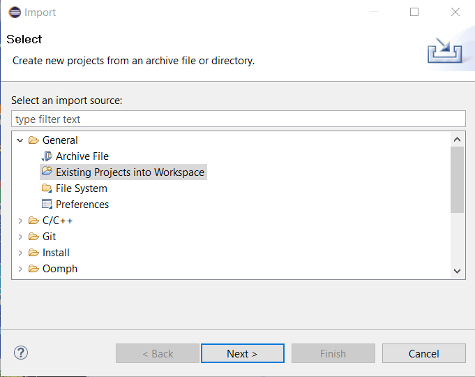
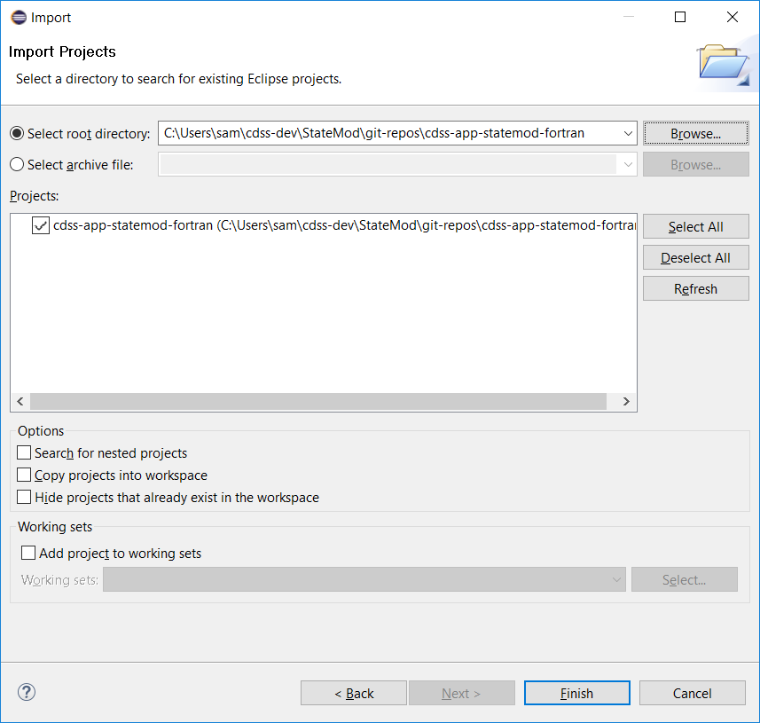
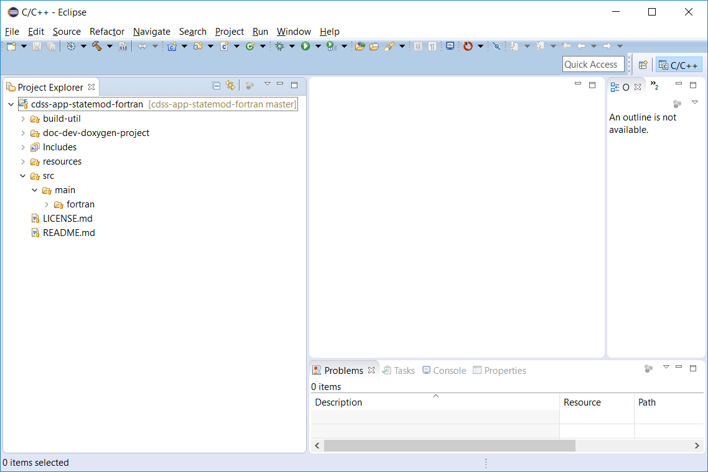

# New Developer Setup / Overview #

This documentation is for software developers that are members of the core StateMod team and others who
have an interest in contributing to the StateMod software project.
It is recommended that the StateMod development environment should follow these setup instructions, which are
consistent with the [Development Environment](../dev-env/overview.md) and [Initial Project Setup](../project-init/overview.md) documentation.
The [standard development folder structure](../project-init/overview.md#development-folder-structure) should be followed to minimize potential for issues,
especially given the number of components and setup steps.
This documentation is consistent with the recommended development environment.

This documentation and development environment are also consistent with the StateCU software.
Configuring the development environment for StateMod will support compiling StateCU.

The intent of this documentation is to completely document setup steps and allow new developers to comment on this documentation
so that it can be improved for other developers. The following steps need to occur to set up a new developer's environment.
Links to other documentation are included to provide more information and **see details below** is used to indicate that
specific instructions are included below.
After reading instructions for a step, use "back" to return to this outline so that setup instructions can be followed in the proper sequence.
**Bold comments** indicate which steps are required and which are optional.

The following sections are available in this page:

* [Minimal Development Environment Setup (for command line compiling)](#minimal-development-environment-setup-for-command-line-compiling)
* [Full Eclipse Development Environment Setup (for interactive development environment)](#full-eclipse-development-environment-setup-for-interactive-development-environment)
* Supporting Information (used in the above sections):
    + [Create Folder for Development Files](#create-folder-for-development-files)
    + [Clone Git Repositories](#clone-git-repositories)
    + [Create Eclipse Workspace Folder](#create-eclipse-workspace-folder)
    + [Import the Existing Eclipse StateMod Project from the Git Repository Folder](#import-the-existing-eclipse-statemod-project-from-the-git-repository-folder)

-----------------

## Minimal Development Environment Setup (for command line compiling)

A minimal development environment can be configured to develop and compile StateMod using
a text editor and command line compiler.

1. [Create folder for development files](#create-folder-for-development-files) - where development will occur - **required - see details below**
2. Development Environment software install part 1 (version control)
    * [Development Environment / Git](../dev-env/git.md) - install Git software so the repositories can be cloned - **required if not already installed**
3. [Clone Git Repositories](#clone-git-repositories) - clone the repositories to get access to all files - **required - see details below**
4. Development Environment software install part 2 (documentation tools) - **optional, install if will view and edit documentation within development environment**
    * [Development Environment / Python and pip](../dev-env/python.md) - install Python, which is needed by MkDocs
    * [Development Environment / MkDocs](../dev-env/mkdocs.md) - install MkDocs to view/edit full documentation locally.
      See [Development Tasks / Documenting](../dev-tasks/documenting.md#developer-documentation-using-mkdocs)
      for instructions on viewing documentation.
5. Development Environment software install part 3 (Fortran development tools)
    * [Development Environment / Machine](../dev-env/machine.md) - configure machine for development - **required - to provide core environment**
    * [Development Environment / gfortran](../dev-env/gfortran.md) - install `gfortran` Fortran compiler - **required**
    * [Development Environment / Text Editor](../dev-env/text-editor.md) - install text editor of choice - **required, if not already done**
    * [Development Environment / Doxygen](../dev-env/doxygen.md) - install Doxygen to auto-generate code API documentation -
      **optional, install to auto-generate code API documentation and graphs from code and code comments**
    * [Development Environment / KDiff3](../dev-env/kdiff3.md) - install software to facilitate comparing files -
      **optional - highly useful and can be used with Git**
6. [Next Steps - Development Tasks](../dev-tasks/compiling.md) - compile software

## Full Eclipse Development Environment Setup (for interactive development environment) ##

Optionally, a full development environment can be configured to develop and compile StateMod using
the Eclipse integrated development environment.

1. [Create folder for development files](#create-folder-for-development-files) - where development will occur - **required - see details below**
2. Development Environment software install part 1 (version control)
    * [Development Environment / Git](../dev-env/git.md) - install Git software so the repositories can be cloned,
    **required (if not already installed)**
3. [Clone Git Repositories](#clone-git-repositories) - clone the repositories to get access to all files - **required - see details below**
4. Development Environment software install part 2 (documentation tools) - **optional, install if will view and edit documentation within development environment**
    * [Development Environment / Python and pip](../dev-env/python.md) - install Python, which is needed by MkDocs
    * [Development Environment / MkDocs](../dev-env/mkdocs.md) - install MkDocs to view/edit full documentation locally.
      See [Development Tasks / Documenting](../dev-tasks/documenting.md#developer-documentation-using-mkdocs)
      for instructions on viewing documentation.
5. Development Environment software install part 3 (Fortran development tools)
    * [Development Environment / Machine](../dev-env/machine.md) - configure machine for development - **required - to provide core environment**
    * [Development Environment / Java 8](../dev-env/java8.md) - make sure Java 8 is available on system - **required to use Eclipse/Photran IDE**
    * [Development Environment / gfortran](../dev-env/gfortran.md) - install `gfortran` Fortran compiler, **required**
    * [Development Environment / Eclipse and Photran](../dev-env/eclipse.md) - install Eclipse for use as IDE,
      **optional, not needed for command-line compile, install if Eclipse/Photran IDE is used**
    * [Development Environment / Doxygen](../dev-env/doxygen.md) - install Doxygen to auto-generate code API documentation,
      **optional, install to auto-generate code API documentation and graphs from code and code comments**
    * [Development Environment / pytest](../dev-env/pytest.md) - install to facilitate automated testing,
      **optional, being evaluated**
    * [Development Environment / KDiff3](../dev-env/kdiff3.md) - install software to facilitate comparing files,
      **optional, highly useful and can be used with Git**
6. Eclipse Workspace Setup (interactive development environment),
    **optional, not needed for command-line compile, install if Eclipse/Photran IDE is used**
    * [Create Eclipse Workspace Folder](#create-eclipse-workspace-folder) - simple manual step - **see details below**
    * [Import the Existing Eclipse StateMod Project from the Git Repository Folder](#import-the-existing-eclipse-statemod-project-from-the-git-repository-folder) - import
      from Git repository working files - **see details below**
7. [Next Steps - Development Tasks](#next-steps-development-tasks) - compile software

-------------

## Create Folder for Development Files ##

Create a development home folder consistent with the [initial project setup](../project-init/home-folder.md) - this
is an umbrella folder for all StateMod development files,
including software tools that are installed locally (as appropriate).
It is assumed that development will occur within a developer's home folder on the computer in order to provide separation from the
work of other developers on the computer.
Tools such as Git rely on a unique identity for developers in order to properly track edits to files
and working in a shared space can be problematic.
After the folder is created, additional instructions describe how to install development files into the folder.

###  Linux ###

Do the following using a terminal window. Note that the syntax `~` indicates the home folder and is equivalent to the `$HOME` environment
variable location.

```bash
$ cd
$ mkdir cdss-dev
$ cd ~/cdss-dev/
$ mkdir StateMod
```

###  Windows ###

Do the following in a Windows command shell, Git CMD, or perform the equivalent actions in file explorer, or Git Bash.

```com
> C:
> cd \Users\userName
> mkdir cdss-dev
> cd cdss-dev
> mkdir StateMod
```

*Press back in the browser to return to the outline.*

## Clone Git Repositories ##

The [cdss-app-statemod-fortran Git repository hosted on GitHub](https://github.com/OpenCDSS/cdss-app-statemod-fortran)
contains the StateMod code and Git repository configuration files.
This is referred to to as the main StateMod repository.

If using Eclipse/Photran, the repository will be imported into the Eclipse/Photran workspace as a Fortran project
in a later step, which allows the files to be managed in Git but also be accessed from Eclipse.

If prompted, specify the GitHub account credentials.
The repository will include the Fortran StateMod project.

The files resulting from the following steps should match the [Development Folder Structure](../project-init/overview.md#development-folder-structure).


###  Clone the repository files (Linux) ###

```bash
$ cd ~/cdss-dev/StateMod
$ mkdir git-repos
$ cd git-repos
$ git clone https://github.com/OpenCDSS/cdss-app-statemod-fortran.git

# Output...

Cloning into 'cdss-app-statemod-fortran'...
remote: Enumerating objects: 282, done.
remote: Counting objects: 100% (282/282), done.
remote: Compressing objects: 100% (264/264), done.
remote: Total 1237 (delta 48), reused 27 (delta 14), pack-reused 955
Receiving objects: 100% (1237/1237), 5.75 MiB | 6.29 MiB/s, done.
Resolving deltas: 100% (482/482), done.
```

Once the main repository has been cloned, the `git-clone-all-statemod.sh` helper script will clone remaining repositories
including documentation and tests.

```bash
$ cd ~/cdss-dev/StateMod/git-repos/cdss-app-statecu-fortran/build-util
$ ./git-clone-all-statemod

# Output...

operatingSystem=mingw (used to check for Cygwin and filemode compatibility)

Clone all repositories for the product to set up a new developer environment.
The following is from /c/Users/sam/cdss-dev/StateMod/git-repos/cdss-app-statemod-fortran/build-util/product-repo-list.txt

--------------------------------------------------------------------------------
# Repositories that comprise StateMod
# - assumes that local folder name will match the repository name
cdss-app-statemod-fortran
cdss-app-statemod-fortran-doc-dev
cdss-app-statemod-fortran-doc-user
cdss-app-statemod-fortran-test
--------------------------------------------------------------------------------

All repositories that don't already exist will be cloned to /c/Users/sam/cdss-dev/StateMod/git-repos.
Repositories will be cloned using root URL https://github.com/OpenCDSS
You may be prompted to enter credentials.
Continue [y/n]?: y
================================================================================
Cloning repository:  cdss-app-statemod-fortran
Repository folder:  /c/Users/sam/cdss-dev/StateMod/git-repos/cdss-app-statemod-fortran
Repository Url:  https://github.com/OpenCDSS/cdss-app-statemod-fortran
Repo folder already exists so skipping:  /c/Users/sam/cdss-dev/StateMod/git-repos/cdss-app-statemod-fortran
================================================================================
Cloning repository:  cdss-app-statemod-fortran-doc-dev
Repository folder:  /c/Users/sam/cdss-dev/StateMod/git-repos/cdss-app-statemod-fortran-doc-dev
Repository Url:  https://github.com/OpenCDSS/cdss-app-statemod-fortran-doc-dev
Cloning into 'cdss-app-statemod-fortran-doc-dev'...
remote: Enumerating objects: 214, done.
remote: Total 214 (delta 0), reused 0 (delta 0), pack-reused 214
Receiving objects: 100% (214/214), 4.70 MiB | 5.25 MiB/s, done.
Resolving deltas: 100% (32/32), done.
================================================================================
Cloning repository:  cdss-app-statemod-fortran-doc-user
Repository folder:  /c/Users/sam/cdss-dev/StateMod/git-repos/cdss-app-statemod-fortran-doc-user
Repository Url:  https://github.com/OpenCDSS/cdss-app-statemod-fortran-doc-user
Cloning into 'cdss-app-statemod-fortran-doc-user'...
remote: Enumerating objects: 199, done.
remote: Total 199 (delta 0), reused 0 (delta 0), pack-reused 199
Receiving objects: 100% (199/199), 17.45 MiB | 5.09 MiB/s, done.
Resolving deltas: 100% (50/50), done.
================================================================================
Cloning repository:  cdss-app-statemod-fortran-test
Repository folder:  /c/Users/sam/cdss-dev/StateMod/git-repos/cdss-app-statemod-fortran-test
Repository Url:  https://github.com/OpenCDSS/cdss-app-statemod-fortran-test
Cloning into 'cdss-app-statemod-fortran-test'...
remote: Enumerating objects: 3, done.
remote: Total 3 (delta 0), reused 0 (delta 0), pack-reused 3
Unpacking objects: 100% (3/3), done.
================================================================================

After cloning, /c/Users/sam/cdss-dev/StateMod/git-repos contains:
cdss-app-statemod-fortran
cdss-app-statemod-fortran-doc-dev
cdss-app-statemod-fortran-doc-user
cdss-app-statemod-fortran-test
```

###  Clone the repository files (Windows) ###

Use the Linux instructions if using Git Bash.  The following will work if using Git Cmd.

```com
> C:
> cd \Users\user\cdss-dev\StateMod
> mkdir git-repos
> cd git-repos
> git clone https://github.com/OpenCDSS/cdss-app-statemod-fortran.git
```

*Press back in the browser to return to the outline.*

## Create Eclipse Workspace Folder ##

This step is the same as the [Initial Project Setup](../project-init/eclipse-workspace.md) so follow those instructions with the following input:

*  Linux:  the workspace folder is `~/cdss-dev/StateMod/eclipse-workspace`
*  Windows: the workspace folder is `C:\Users\user\cdss-dev\StateMod\eclipse-workspace`

Start Eclipse by running the [Eclipse run script](../project-init/eclipse-run-script.md) as shown below.
This script can be used any time to run Eclipse for this project.
If it is necessary to modify this script,
[see recommendations for a developer-specific run script](../project-init/eclipse-run-script.md#developer-specific-run-script).

Open the workspace in Eclipse in preparation of adding the code project from the Git repository in the next step.

###  Linux ###

```bash
$ cd ~/cdss-dev/StateMod/git-repos/cdss-app-statemod-fortran/build-util/eclipse
$ ./run-eclipse-statemod.sh
```

###  Windows ###

```bash
> C:
> cd \Users\user\cdss-dev\StateMod\git-repos\cdss-app-statemod-fortran\build-util\eclipse
> .\run-eclipse-statemod-mingw.bat
```

*Press back in the browser to return to the outline.*

## Import the Existing Eclipse StateMod Project from the Git Repository Folder ##

The [Initial Project Setup](../project-init/overview.md) process performed by the software team leads
did extensive work to set up the Eclipse project 
and these files were saved to the Git repository as an Eclipse/Photran Fortran project.

New developers need to import the project into the empty workspace as follows.

Use ***File / Import*** and then follow the sequence below.



The first step allows browsing to an existing project (the user name will be different).



Press ***Finish*** in the initial import dialog.

The resulting Eclipse workspace is shown as below.
Note that Eclipse recognizes the associated Git repository indicated by the repository name/branch next to the Eclipse project.



## Next Steps - Development Tasks ##

At this point it should be possible to [compile and run StateMod](../dev-tasks/compiling.md) in Eclipse or on the command line.
See also:

* [Deployed Environment / Overview](../deployed-env/overview.md) - for an overview of the deployed software
* [Software Design / Overview](../software-design/overview.md) - to understand software structure and logic
* [Development Tasks / Overview](../dev-tasks/overview.md) - common development tasks
