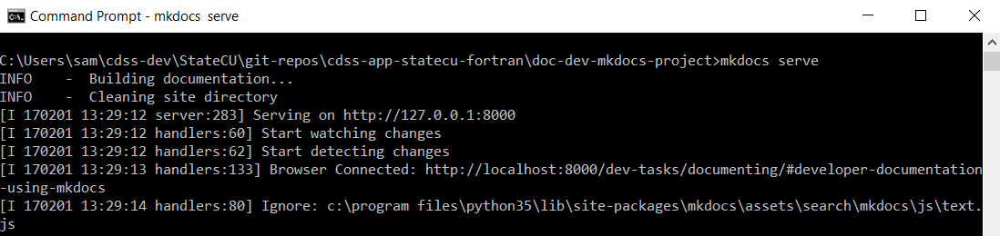

# Development Tasks / Documenting #

Documenting software for developers and users is one of the most important software developer tasks,
in particular for open source projects that rely on collaboration to ensure a sustainable project.
Without documentation, software can be confusing to understand and code may be rewritten when it does not need to be.

This documentation includes the following documentation:

* [Developer Documentation Using MkDocs](#developer-documentation-using-mkdocs)
* [User Documentation Using MkDocs](#user-documentation-using-mkdocs)
* [Fortran Code API Documentation Using Doxygen](#fortran-code-api-documentation-using-doxygen)
* [Fortran Code Internal Documentation Using Comments](#fortran-code-internal-documentation-using-comments)

---------------

## Developer Documentation Using MkDocs ##

This developer documentation uses MkDocs and should be updated appropriately to keep the documentation current.
See the [Initial Project Setup / Documentation, Develper (MkDocs)](../project-init/doc-dev.md)
for background on how the documentation is configured.
If using the standard development files structure,
the developer documentation is located in `~/cdss-dev/StateMod/git-repos/cdss-app-statemod-fortran-doc-dev/`.
See the following resources for information on MkDocs and Markdown:

* [MkDocs - Writing your docs](http://www.mkdocs.org/user-guide/writing-your-docs/)
* [Markdown on Wikipedia](https://en.wikipedia.org/wiki/Markdown)
* [commonmark.org Markdown reference](http://commonmark.org/help/)

### Run MkDocs Server to View Documentation ###

MkDocs runs a local Python web server that allows the browser to view the documentation.
To start the server, change to the folder where the documentation configuration file exists and start the web server,
for example for developer documentation:

```
$ cd /C/Users/userName/cdss-dev/StateMod/git-repos/cdss-app-statemod-fortran-doc-dev/build-util
$ ./run-mkdocs-serve-8001.sh
```

The following indicates that the server is running.  If an error is shown, it is usually because the
`mkdocs.yml` file lists a file that does not yet exist or the file has a syntax problem such as mismatched quotes.
If a problem occurs, fix the problem and if necessary restart the server.



Then view the documentation in a web browser using the address `http://localhost:8000`.
The MkDocs server will generally auto-detect changes to files and the browser will refresh.
When auto-refresh does not happen, manually refresh to see changes.

Stop the server with `Ctrl-C` in the command shell window.

### Publish the documentation ###

Run the `build-util/copy-to-co-dnr-gcp.sh` script to publish the documentation
to the State of Colorado's Google Cloud Platform website.
The documentation will be installed into a folder corresponding to the software version.

This script also provides the option to publish to a `latest` folder.
This is useful because other documentation that links to StateMod documentation can
use the generic `latest` link rather than requiring updates to link to a specific version.

## User Documentation Using MkDocs ##

The user documentation for StateMod originally used Microsoft Word and was distributed as PDF.
The documentation has been converted to MkDocs.
User documentation is saved in the separate [cdss-app-statemod-fortran-doc-user repository](https://github.com/OpenCDSS/cdss-app-statemod-fortran-doc-user).
A MkDocs wrapper document has been created to add navigation and provide access to legacy documentation.

## Fortran Code API Documentation Using Doxygen ##

The StateMod subroutines, functions, and modules should be documented using Doxygen-style comments.
See the following resources:

* [Doxygen - Comment blocks in Fortran](http://www.stack.nl/~dimitri/doxygen/manual/docblocks.html#fortranblocks)
* [NASA Modeling Guru:  Using Doxygen with Fortran soruce code](https://modelingguru.nasa.gov/docs/DOC-1811)

Refer to the [Initial Project Setup / Documentation, API (Doxygen)](../project-init/doc-doxygen.md) documentation for how to run Doxygen.

Doxygen output can be copied to the State of Colorado's Google Cloud Platform storage site for public access using the
`doc-dev-doxygen-project/copy-to-co-dnr-gcp.sh` script.

## Fortran Code Internal Documentation Using Comments ##

The Fortran code files that comprise the StateMod software should be documented with in-line comments
using Fortran conventions to facilitate understanding of variables, data structures, modules, functions,
subroutines, etc.
