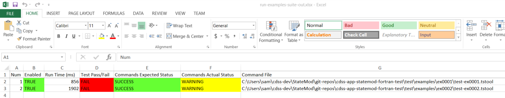

# Development Tasks / Testing #

Automating software testing is an important software development task because it helps ensure that software performs as intended.
It is particular important to ensure that a change in one part of the code does not break another part of the code,
and that changes in the computer environment don't break the software.

This documentation contains the following sections:

* [Introduction](#introduction)
* [Test StateMod by Running Reference Datasets](#test-statemod-by-running-reference-datasets)
* [Automated Functional Testing Using TSTool](#automated-functional-testing-using-tstool)
	+ [Running TSTool for Testing](#running-tstool-for-testing)
	+ [Legacy Tests](#legacy-tests)
	+ [Define a Test From a Legacy Test](#define-a-test-from-a-legacy-test)
	+ [Define a New Test](#define-a-new-test)
	+ [Creating a Test Suite](#creating-a-test-suite)
	+ [Running  a Test Suite](#running-a-test-suite)
	+ [Additional Testing Considerations](#additional-testing-considerations)
* [Test Code Using Unit Tests](#test-code-using-unit-tests)

----------

## Introduction

Automated testing of StateMod software has not been formalized into a software framework in the past.
This documentation describes the current state of testing.
The [`cdss-app-statemod-fortran-test`](https://github.com/OpenCDSS/cdss-app-statemod-fortran-test)
repository contains StateMod tests.

Testing generally involves two approaches:

1. Create small stand-alone tests that test specific software features,
such as a operating rule or model option,
to verify specific computational code.
A number of these tests are included in the StateMod test repository and can be enhanced
similar to TSTool software tests.
2. Run full datasets using different StateMod executable versions and compare the results.
This helps identify the impacts of a change in one version compared to a baseline version.
The baseline version is typically the latest published release
that it has been sufficiently tested and verified.
This approach is the focus of current automated testing.

The following sections provide more details about testing.

## Test StateMod by Running Reference Datasets ##

The current approach to testing StateMod is to run entire datasets using different StateMod versions
and compare the results to ensure that differences are small or are otherwise explainable.
This approach is described in the
[`cdss-app-statemod-fortran-test` `README`](https://github.com/OpenCDSS/cdss-app-statemod-fortran-test).

## Automated Functional Testing Using TSTool ##

TSTool software can be used to implement automated tests of specific functionality.
These smaller tests are self-contained and provide confirmation that specific software features are working.
Running many such tests on controlled test data in a test suite provides confirmation that all software features
are working as intended.

### Running TSTool for Testing

The [`cdss-app-statemod-fortran-test`](https://github.com/OpenCDSS/cdss-app-statemod-fortran-test)
described in the previous section includes tests for full datasets.
The `scripts/statemod-test.bash` script that is used to test datasets can also be used
to run TSTool for functional tests.

```
cd scripts
./statemod-test.bash
```

The interactive menu provides a `runtstool` menu item to run TSTool,
which prompts for the StateMod executable to use for testing.
A StateMod executable can be selected from the dataset tests or
executables in the StateMod development folder.
The executable path is set as the `StateModExecutable` TSTool property,
which can be used with all command files.
This allows all the tests to be run for any executable.

The following documentation explains how to define and run functional tests.
TSTool can be used with existing tests and it is recommended
to trying running tests as this documentation is read.

### Legacy Tests

The StateMod development effort that has occurred over many years has
resulted in many small examples
that have been used for testing and as examples for documentation.
However, these tests are not automated, and many tests have not been maintained.

The legacy examples are being leveraged to form the basis of new functional tests.
Examples will be migrated to this repository as resources allow.
The legacy `Ex1` example is used for illustration below and other tests are similar.

### Define a Test from a Legacy Test

The legacy tests can be used to define a new test.
For example, the `Ex1` example was converted to `ex0001` test as follows.
Note that placeholder folders have been created in the repository tests but the folders have not been populated.

1. General:
    1. Note that legacy example files often have inconsistencies in filenames such as upper and lower case.
    The following `ex0001` example generally uses lowercase for filenames.
    Inconsistencies in legacy examples should be cleaned up as the files are moved into this testing repository.
    2. Be aware of using different filename patterns and impacts on `.gitignore`.
    It is desirable to avoid accidentally committing dynamic files (especially large files)
    to the repository, and `.gitignore` is used to constrain files that are committed.
    The repository's main `.gitignore` file may need to be updated to ensure that dynamic files are ignored.
    Be aware of files that are staged to commit to the repository and do not just blindly commit
    files without reviewing their names.
    3. This process is generally consistent with the
    [TSTool Quality Control](https://opencdss.state.co.us/tstool/latest/doc-user/quality-control/quality-control/)
    documentation.
2. Create a repository folder for the test's files:
    1. For example: `test/examples/ex0001/`
    2. The folder name starts with `ex` to indicate an example.
    3. Use a folder name with 4 digits padded with zeros to allow sorting.
    4. If a legacy test uses a different name (for example `TEST` instead of `EX`),
    a similar approach can be taken.
    5. **Do not copy all the legacy files into the new folder.
    There is typically a need for review and cleanup so only copy the minimum number of files to implement the test,
    as discussed below.**
3. Create a `README.md` file:
    1. This file will be readable on the repository web page.
    2. The legacy example typically includes a README file that can be incorporated.
    3. For example, see:  [`ex0001/README.md`](https://github.com/OpenCDSS/cdss-app-statemod-fortran-test/blob/master/test/examples/ex0001/README.md)
    4. Also update [the list of tests](https://github.com/OpenCDSS/cdss-app-statemod-fortran-test/blob/master/test/examples/README.md)
    to track which legacy tests have been implemented in this repository.
4. Copy the response file:
    1. For example, copy `EX1.RSP` to `ex0001.rsp`.
    2. If necessary, run the
    [`SmNewRsp`](https://github.com/OpenCDSS/cdss-app-statemod-fortran/tree/master/src/util/SmNewRsp/Source)
    utility to convert the response file to new format.
    It is OK to keep a copy of the old file such as `ex0001.rsp.old` to ensure that comparisons can occur.
    The `SmNewRsp` program can be compiled in the development files.
    The current response file format uses data file descriptors such as `Control` whereas
    the older format required files to be listed in a specific order and is prone to errors.
    3. If necessary, edit the response file and perform additional cleanup,
    such as inserting an appropriate comment at the top rather than the default `SmNewRsp` header
    and removing whitespace at the end of lines that make it difficult to view the file.
5. Create a TSTool command file to run the test:
    1. Run TSTool from the `scripts/statemod-test.bash` script and pick a StateMod executable.
    2. Can copy and modify a TSTool command file from another test as a starting point.
    3. Name the file consistent with the example, for example see:
    [`test-ex0001.tstool`](https://github.com/OpenCDSS/cdss-app-statemod-fortran-test/blob/master/test/examples/ex0001/test-ex0001.tstool)
    4. Modify and run the TSTool command file repeatedly until the test is complete.
    The following steps describe additional steps to complete the test.
6. Implement tests in the TSTool command file for standard StateMod run modes:
    1. StateMod's main run modes include `-check`, `-base`, `-sim`, and `-report`.
    2. For example, see the `GO*.BAT` batch files that are often included in legacy tests.
    For example, `GOC.BAT` typically runs the `-check` mode on a dataset.
    It is recommended to **not** copy these batch files into the testing repository because they do not
    provide the level of functionality needed to do full automated testing,
    may have errors, and often reference folders and files that are not portable.
    3. Use the TSTool
    [`RunProgram`](https://opencdss.state.co.us/tstool/latest/doc-user/command-ref/RunProgram/RunProgram/)
    command as in the above `test-ex0001.tstool` example to run the StateMod executable that was configured for TSTool.
    Use full paths to the executable (`${StateModExecutable}`) and response file (using `${WorkingDir}/ex0001.rsp`)
    so that there is no confusion about their location.
    4. Implement commands to save results to the `expected-results/` folder,
    which allows the tests to be run in the future and compare to expected results.
    It is recommended to create folders for each run mode's expected results,
    as in the `ex0001` example in order to keep files organized.
    For example use `expected-results/base` to save base flow expected results,
    `expected-results/sim` to save simulation expected results,
    and `expected-results/report` to save report expected results.
    **Don't forget this because it allows other people to run the tests without recreating the expected results.**
    TSTool commands are typically included in a test command file to save/copy expected results.
    Once verified, the commands are commented out until expected results need to be updated.
    **It may also be appropriate to copy the legacy results to the current `expected-results` folder.
    For example, save the version 15.00.01 binary output files from simulation,
    which should in many cases be correct for basic model functionality.  This provides a cross-check.**
    5. Based on the run mode, implement appropriate results comparisons:
        * For `-check`, use TSTool's
        [`CheckFile`](https://opencdss.state.co.us/tstool/latest/doc-user/command-ref/CheckFile/CheckFile/)
        command to check for file patterns indicating a problem.
        * For `-base`, use TSTool's
        [`CompareFiles`](https://opencdss.state.co.us/tstool/latest/doc-user/command-ref/CompareFiles/CompareFiles/)
        command to compare the output baseflow time series files.
        * For `-sim`, use TSTool's
        [`CompareTimeSeries`](https://opencdss.state.co.us/tstool/latest/doc-user/command-ref/CompareTimeSeries/CompareTimeSeries/)
        command to compare binary file output time series using an appropriate tolerance.
        * For `-report`, use TSTool's
        [`CompareFiles`](https://opencdss.state.co.us/tstool/latest/doc-user/command-ref/CompareFiles/CompareFiles/)
        command to compare text files.
        It may be necessary to implement multiple report comparisons depending on the complexity of the test.
7. Run the TSTool command file repeatedly and resolve any issues.
For example, start by copying all the input files referenced in the response file but if any are forgotten,
it should be obvious.
Refer to the startup log file (`statem.log`) and response file for the test (e.g., `ex0001.log`) to help resolve issues.

### Define a New Test

The easiest way to define a new test is often to copy a similar test's files and modify as appropriate.
See the previous section for an explanation of test details.
Care should be taken to not clutter up test folders with unused files,
which confuse other software testers.

### Creating a Test Suite

It is typical to create a test suite to run all the tests.
Otherwise, running each test individually requires a lot of time and is prone to overlooking issues.
Running the tests in a suite streamlines testing and should be done as part of the software release checklist.

To create a test suite that reflects current tests,
run TSTool via the `statemod-test.bash` script and run the
`test/examples-suite/create/create-examples-suite.tstool` command file.
This will create the command file discussed in the next section.

### Running a Test Suite

To run the test suite created in the previous step, use TSTool to run the
`test/examples-suite/run/run-examples-suite.tstool` command file.
The command status for each command and the output files for the suites contain information about
whether tests passed or failed.

The following is an example of the text file resport:

```
# File generated by...
# program:      TSTool 14.0.0.dev3 (2021-09-09)
# user:         sam
# date:         Mon Sep 13 00:22:10 America/Denver 2021
# host:         RoaringFork
# directory:    C:\Users\sam\cdss-dev\StateMod\git-repos\cdss-app-statemod-fortran-test\test\examples-suite\run
# command line: TSTool
#  --home C:/CDSS/TSTool-14.0.0.dev3
# #             C:/Users/sam/cdss-dev/StateMod/git-repos/cdss-app-statemod-fortran-test/test/examples/0-readme/readme.tstool
# #             StateModExecutable==C:/Users/sam/cdss-dev/StateMod/git-repos/cdss-app-statemod-fortran/src/main/fortran/statemod-17.0.3-gfortran-win-64bit.exe
#
# Command file regression test report from StartRegressionTestResultsReport() and RunCommands()
#
# Explanation of columns:
#
# Num: count of the tests
# Enabled: TRUE if test enabled or FALSE if "#@enabled false" in command file
# Run Time: run time in milliseconds - use table output to see this column
# Test Pass/Fail:
#    The test status below may be PASS or FAIL (or blank if disabled).
#    A test will pass if the command file actual status matches the expected status.
#    Disabled tests are not run and do not count as PASS or FAIL.
#    Search for *FAIL* to find failed tests.
# Commands Expected Status:
#    Default is assumed to be SUCCESS.
#    "#@expectedStatus Warning|Failure" comment in command file overrides default.
# Commands Actual Status:
#    The most severe status (Success|Warning|Failure) for each command file.
#
#    |       |Test  |Commands  |Commands   |
#    |       |Pass/ |Expected  |Actual     |
# Num|Enabled|Fail  |Status    |Status     |Command File
#----+-------+------+----------+-----------+---------------------------------------------------------------------------------------------
    1|TRUE   |*FAIL*|SUCCESS   |WARNING    |C:\Users\sam\cdss-dev\StateMod\git-repos\cdss-app-statemod-fortran-test\test\examples\ex0001\test-ex0001.tstool
    2|TRUE   |*FAIL*|SUCCESS   |WARNING    |C:\Users\sam\cdss-dev\StateMod\git-repos\cdss-app-statemod-fortran-test\test\examples\ex0002\test-ex0002.tstool
#----+-------+------+----------+-----------+---------------------------------------------------------------------------------------------
FAIL count     =     2, 100.000%
PASS count     =     0,   0.000%
Disabled count =     0,   0.000%
#--------------------------------
Total          =     2
```

**<p style="text-align: center;">
Example Test Suite Results Text File
</p>**

The following illustrates the Excel file report:

**<p style="text-align: center;">

</p>**

**<p style="text-align: center;">
Example Test Suite Results Excel File (<a href="../testing-images/excel-test-results.png">see also the full-size image</a>)
</p>**

### Additional Testing Considerations

Automated tests are prone to breaking for various reasons,
including bugs in the software, software changes that impact results and output formats,
and other unforeseen issues.
Automated tests must be maintained and updated over time.
The following considerations may impact tests:

* The legacy example names are not descriptive.
In the future it may be desirable to name folders (and perhaps) test files for specific operating rules or other features.
* Expected results are saved from a previous software version and
may need to be updated periodically.
TSTool command files typically contain commands to save expected results
and these commands can be uncommented and commented as necessary to update expected results.
* If it is desired that tests work with old and new software,
it may be necessary to run an old repository commit for tests,
for example using a repository tag to check out an old version.
* Multiple expected results can be saved,
for example for each major software version, and only the appropriate test run.
This can use TSTool's [`@require`](https://opencdss.state.co.us/tstool/latest/doc-user/command-ref/Comment/Comment/)
feature, although more enhancements may be needed.
* Verification of expected results may require additional work,
such a creating an Excel file to duplicate calculations, use TSTool, etc.
Artifacts from such work can be saved in the test's folder
(perhaps the `expected-results` folder) to review as needed.

## Test Code Using Unit Tests ##

Unit tests are compiled code the test an atomic unit of code.
Unit tests are a tool for software developers that require access to the develop environment,
unlike functional tests, that could be run by users without the full developer environment.

There does not seem to be extensive unit test frameworks for Fortran.  See:

* [A look at FORTRAN unit test frameworks](https://www.software.ac.uk/blog/2016-09-28-look-fortran-unit-test-frameworks)

Unit tests could be implemented in the future, especially if StateCU is ported to another language that provides a unit test framework.
