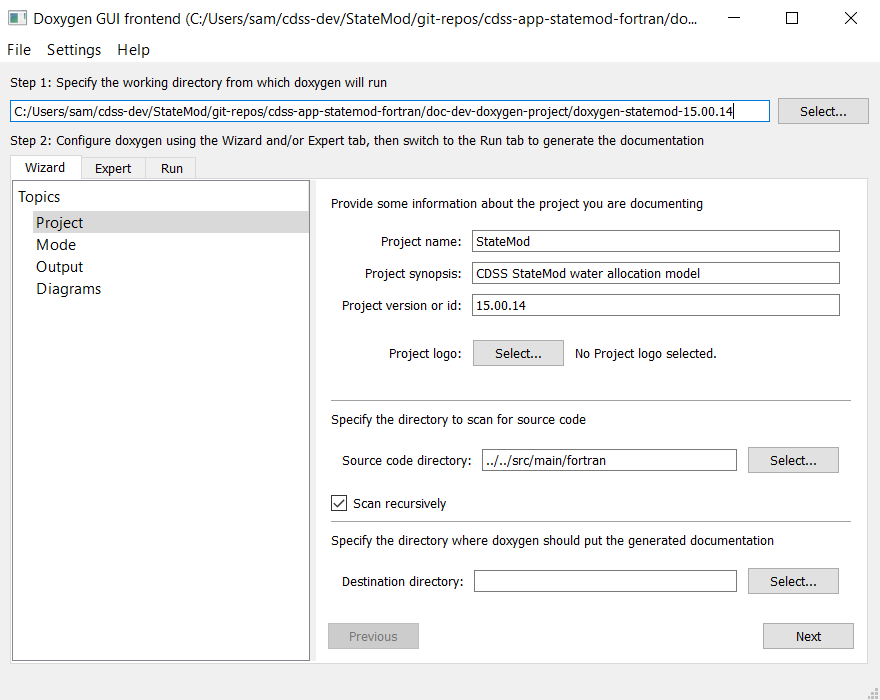
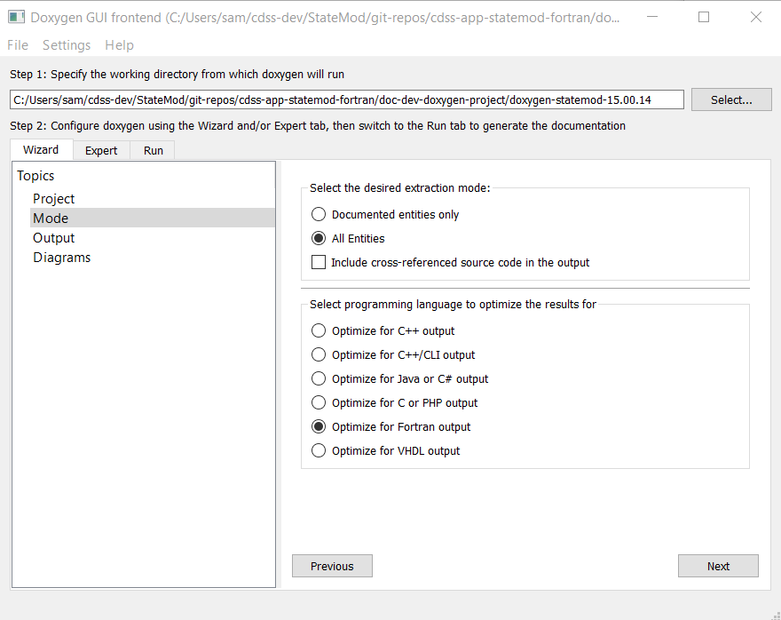
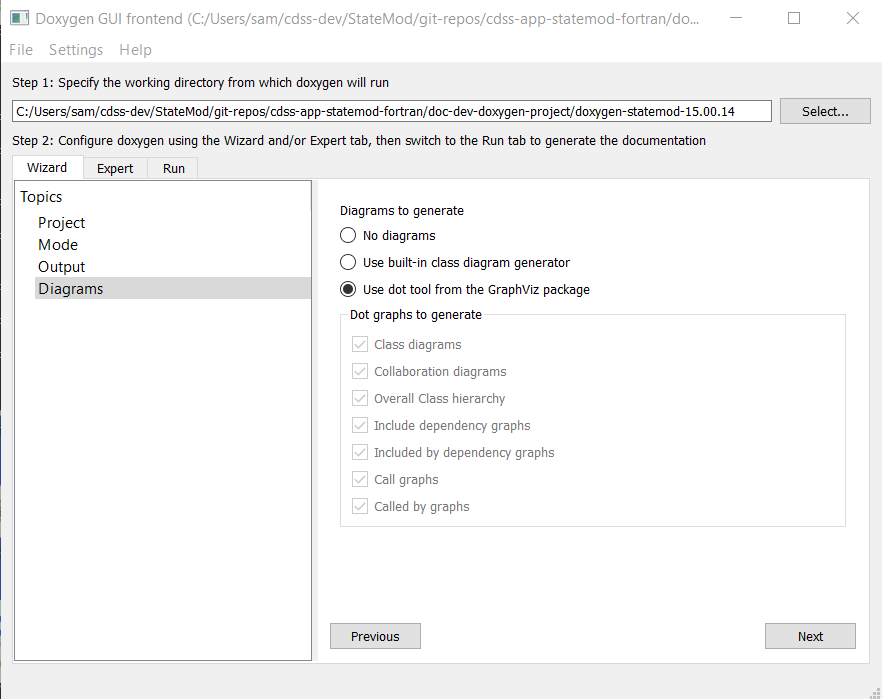
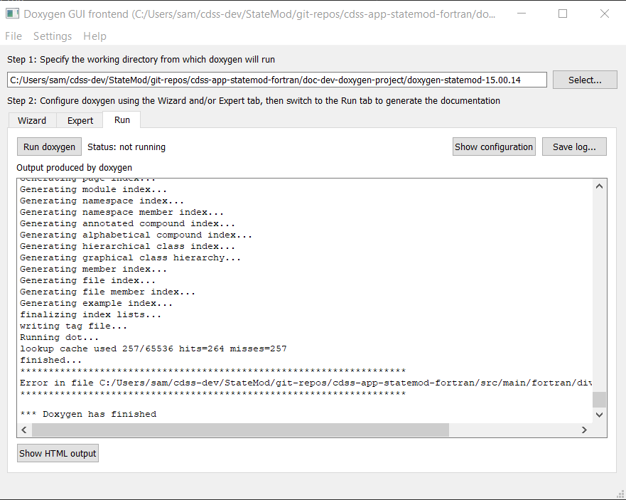

# Initial Project Setup / Documentation, API (Doxygen) #

Doxygen software processes code comments to create subroutine/function API documentation that is useful for developers.
Doxygen can also be used to create graphs showing how code modules are connected.
The output of Doxygen is not intended to be saved in the repository but can be generated from code
and published to help developers understand the code design.

This documentation includes the following sections:

* [Prerequisites](#prerequisites)
* [Create Doxygen Project](#create-doxygen-project)
* [Review Doxygen Project File](#review-doxygen-project-file)
* [Run Doxygen](#run-doxygen)
* [Create .gitignore File](#create-gitignore-file)
* [Automate Doxygen](#automate-doxygen)

-----------------

## Prerequisites ##

Configuring a Doxygen project requires that the [Doxygen software was previously installed](../dev-env/doxygen/),
including the GraphViz software.

## Create Doxygen Project ##

Run the Doxywizard interactively from the ***Start*** menu.  Fill out the project settings as shown below.

* Working directory: `doc-dev-doxygen-project` - in the repository
* Project name: `StateMod` - will be shown in HTML output
* Project synopsis: `CDSS water allocation model` - will be shown in HTML output
* Project version or id: `15` - corresponds to StateMod version - will be shown in output (change version as code is updated)
* Source code directory: `src/main/fortran` in repository
* Destination directory: `doc-dev-doxygen-project/output` - use `.gitignore` to ignore in repository








The ***Expert*** tab appears to be a direct way to set various properties.  Ignore for now.

Save the settings using ***File / Save*** menu and save to the `doc-dev-doxygen-project` folder as `Doxyfile` default name.

## Review Doxygen Project File ##

The `Doxyfile` is a long file with many settings.  See the following information that explains important settings for Fortran:

* [Callgraph for Fortran with Doxygen](http://www.softeng-support.ac.uk/documents/2013/06/05/fortran-callgraph-doxygen.html)

The following settings are important:

```text
OPTIMIZE_FOR_FORTRAN = YES
EXTRACT_ALL = YES
EXTRACT_PRIVATE = YES
EXTRACT_STATIC = YES
HAVE_DOT = YES (see section for GraphViz install)
CALL_GRAPH = YES
CALLER_GRAPH = YES
DOT_PATH = "C:\Program Files (x86)\Graphviz2.38\bin\dot.exe"

```

If the file is edited and saved, reselect in the Doxywizard software using ***File / Open recent*** and then rerun Doxygen.

## Run Doxygen ##

Try running by using the ***Run doxygen*** button under the ***Run*** tab.



The HTML output can be viewed as `doc-dev-doxygen-project/output/index.html`.
If the output is complete (for example no graphs shown) and/or errors are shown in the wizard, check the configuration file
as discussed in the previous section and follow instructions in the error message, such as
deleting the `output` folder and rerunning.  An example of output is shown below.


## Create .gitignore File ##

A `.gitignore` file is created in the `doc-dev-doxygen-project` folder to ignore the `output` folder.


## Automate Doxygen

After initial configuration, the Doxygen configuration was updated to automate processing
so that the output is version-specific.
The original `doc-dev-doxygen-project/Doxyfile` was copied to
`doc-dev-doxygen-project/Doxyfile-template` and was modified to include the following placeholder property:

* `ProgramVersion` - indicates software version (e.g., `15.00.14`, extracted from `src/main/fortran/statem.for` file).

This property is updated by the `build-util/run-doxygen.sh` script to update the `Doxyfile-template`
to `Doxyfile` and then run Doxygen, producing version-specific output.
