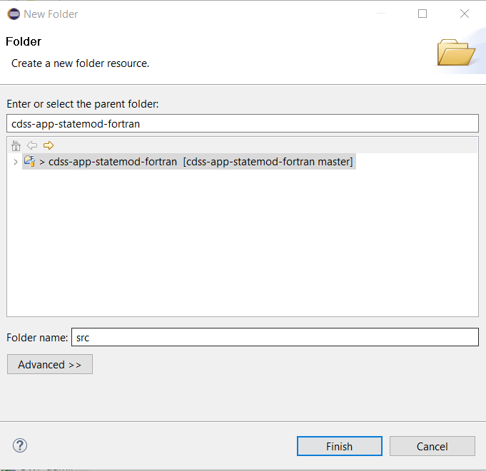

# Initial Project Setup / Eclipse Folder Structure #

Versions of the legacy StateMod code were maintained in separate folders.
This facilitates basic use but is not consistent with a more formal development environment needed for OpenCDSS
and multiple collaborators.
Legacy files have also become polluted with temporary files, backups, and tests that do not need to be
committed to the repository.
To facilitate use in Eclipse, it is necessary to restructure the files in a consistent folder structure.
Helpful information is:

* [Development folder structure](overview#development-folder-structure) - development folder structure for StateMod files

This documentation includes the following sections:

* [Create Development Folder Structure](#create-development-folder-structure)
* [Makefile](#makefile)
* [Add Standard Git Repository Files](#add-standard-git-repository-files) 
* [Next Steps](#next-steps)

--------------------

## Create Development Folder Structure ##

The initial repository folder structure in Eclipse is as shown below.
Eclipse displays files that are relevant to the Eclipse view and therefore does not show all files.

The corresponding files on the file system are as shown below:

The flat structure of the legacy files are reorganized into the new [development folder structure](overview#development-folder-structure)
as follows.

First, right click on the project in ***Project Explorer*** and then use ***New / Folder*** to create a `src` folder
for the source code.  The `src` folder will be present in the repository folder (but note that `git status` does not list empty folders).

Create additional folders under `src` to match the development files structure.
Eclipse can be used to create folders as illustrated above, or use the command-line or suitable File Explorer.
Files will be added to this structure in a later step.

The final result is as follows.  Note that the `Includes` folder is a virtual folder added by Eclipse that points
to the MinGW include files in the MinGW installation location, but does not exist in the Git repository files.

## Makefile ##

The legacy files use makefiles that have been created over time for various compilers and
were used on the command line.
The default `gfortran` build command is `make` which relies on a default makefile name of `makefile`.
Consequently, as code versions are migrated into the repository in later steps,
the general `makefile` name is used and should be updated to work with Linux and Windows.
This supports actions later in the documentation.

## Add Standard Git Repository Files ##

A Git repository generally includes several standard files at the top level to configure the repository.
The legacy repository and code versions did not include these files so they have been added, as described below.

### `README.md` ###

The initial README file from GitHub repository initialization had default contents.
The legacy code did not contain a README.
The `README.md` file was initialized with Markdown text explaining the repository.

### `.gitignore` ###

The `.gitignore` file is used to globally ignore certain files, such as products of compiling code,
which should not be saved to the repository because they are transitory files that can be recreated.

Note that a `.gitignore` file can be created in any repository folder to provide more fine-grained control
over ignored files.

A `.gitignore` file (or a README) can also be created to ensure that an empty folder is not deleted
(Git will not commit empty folders).
If used for this purpose and no other files in the folder are committed to the repository,
add `!.gitignore` text to the `.gitignore` file to ensure that the file itself is not ignored.

### `.gitattributes` ###

The `.gitattributes` file indicates repository properties.
This is a Git feature that allows settings to travel with the repository rather than relying on
individual software developer environment configurations, which often differ.
In particular, the `* text=auto` notation is used to control how end-of-line characters are handled
(LF in the repository and native line endings for the operating system).

See the GitHub article [Dealing with line endings](https://help.github.com/articles/dealing-with-line-endings/).

### `LICENSE.md` ###

The license file indicates the software license.  GPL v3 is used for OpenCDSS software.

## Next Steps

The next steps are to add versions of StateMod to the repository and consequently software project to
reflect recent history of the software.
