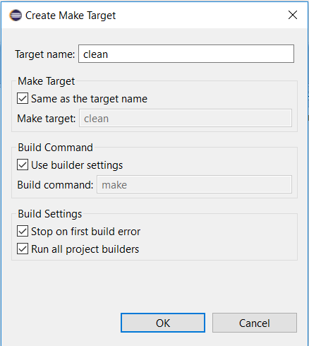
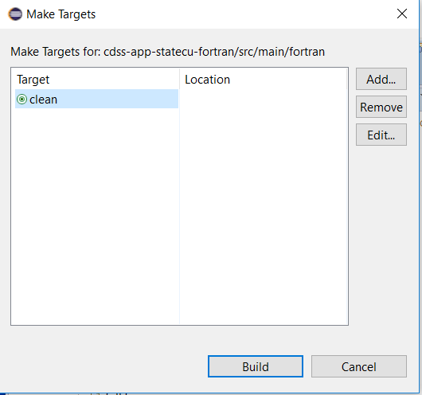

# Initial Project Setup / Eclipse Make Targets #

**Eclipse is currently not used for development.
This decumentation was created while investigating using Eclipse.**

**TODO smalers 2017-10-24 need to confirm - content was copied from StateCU**

Eclipse uses a makefile to build the software.  A makefile is text file that includes dependencies and rules to ensure that changes to a file
are properly dealt with by recompiling downstream files.  See the following useful information:

* [GNU make](https://www.gnu.org/software/make/manual/make.html) - GNU make manual

This documentation includes the following sections:

* [Makefile Changes](#makefile-changes) - description of changes to makefile for initial project setup
* [Define Eclipse Make Targets](#define-eclipse-make-targets) - define make targets to work within Eclipse

## Makefile Changes ##

The initial makefile included in the legacy code files assumed a certain build environment that is different from the current environment.
The following changes to the makefile were made to get it to work within the current folder structure,
and are needed for the make targets described below to be functional.

* modified the `clean` and `veryclean` targets to work with the current folder structure

**TODO smalers 2017-01-02 need to modify makefile more to make it more robust.**

## Define Eclipse Make Targets ##

A "make target" provides a way for developers to interactively select a makefile target from within the Eclipse environment.
It is assumed that the makefile is named `makefile`, which will allow it to run with the default build tool configuration.
This can be changed but is cleaner if defaults are used.

To define a make target, right-click anywhere within project files in the ***Project Explorer*** and select the ***Make Targets / Create...*** menu,
as shown in the following example:

The target can then be run by right-clicking in the project files area in the ***Project Explorer*** and select ***Make Targets / Build***.
Then select (highlight) one or more targets to run and press the ***Build*** button.

The make targets are stored in the `.cproject` file in the Eclipse project, which is stored in the Git repository.
Consequently, the make targets are shared between developers.
This is one reason to save Eclipse project files in the Git repository.

Make targets for the following were defined in the initial project setup:

* `all` - makes all the object files and `statemod.exe` executable
* `clean` - removes all compiled files except `statemod.exe`
* `statemod` - compiles the StateMod executable, essentially the same as `all`
* `veryclean` - removes all compiled files including executables
