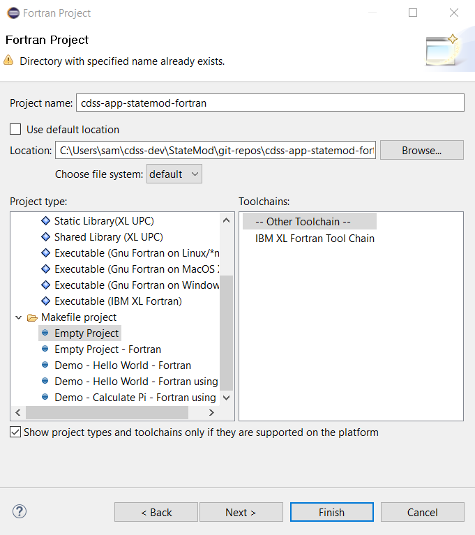
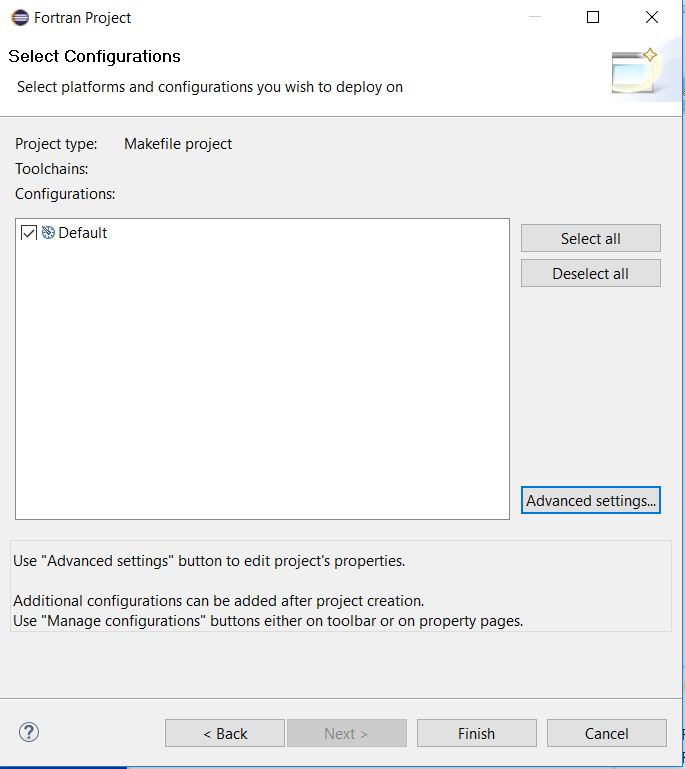
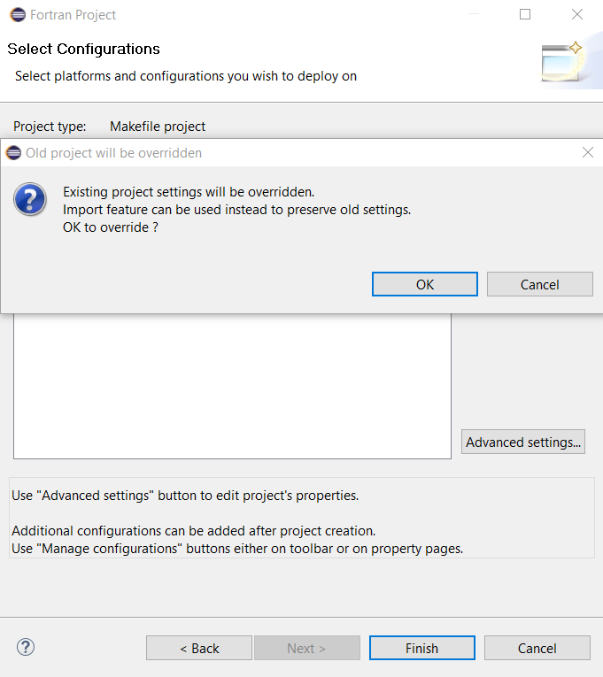
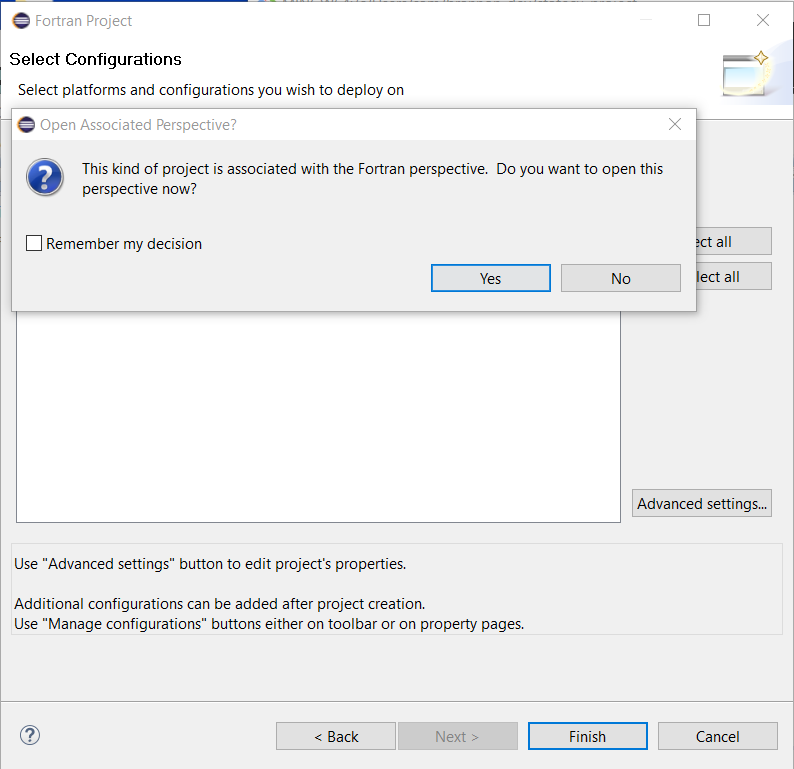
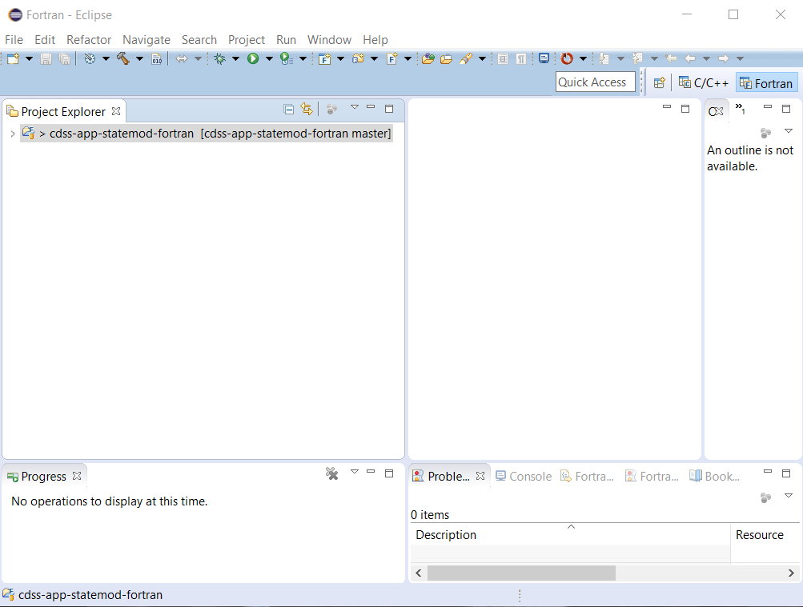
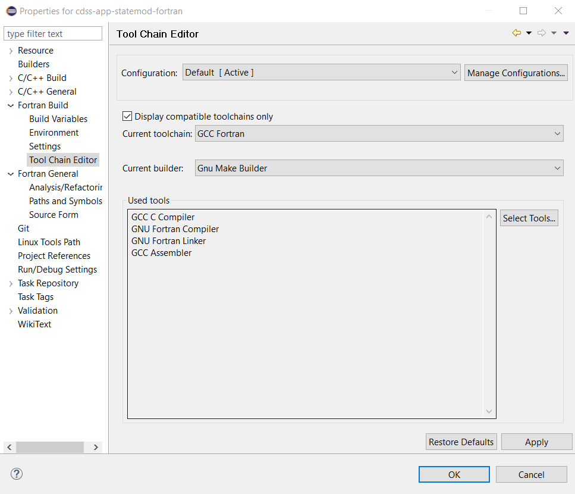
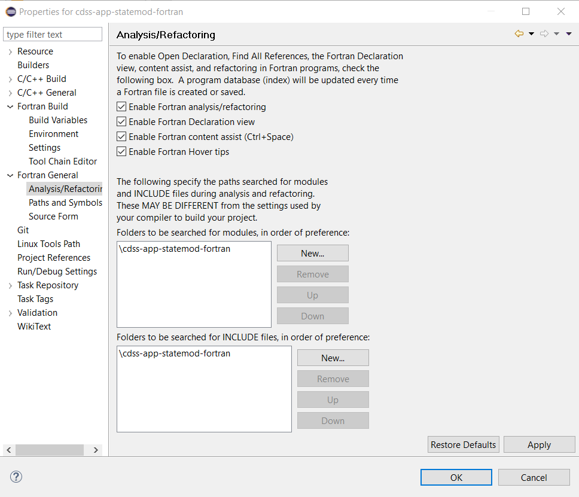

# Initial Project Setup / Eclipse StateMod Project #

The Eclipse workspace is a container for one or more Eclipse projects.
Each project in a workspace can have multiple characteristics, for example the programming language, whether managed in a repository, etc.
Eclipse responds to the characteristics of each project (when a project is selected in Eclipse) by displaying appropriate software features.

The initial StateMod workspace will only contain a single Eclipse project, focusing on the StateMod code and related documentation and tests.
Multiple projects may be used in cases where software or other files are separated into separate projects, for example shared libraries,
large test systems, and documentation-only projects.

It is convenient to have one-to-one correspondence between project and Git repository and to make sure each project focuses on one language
so that a single Eclipse package is used (for StateMod, the Eclipse package that supports Fortran development).
For StateMod the name of the Eclipse project and the Git repository will be the same.
The following resources are useful:

* [Eclipse Mars Fortran Development User Guide](http://help.eclipse.org/mars/index.jsp?topic=%2Forg.eclipse.photran.doc.user%2Fhtml%2Fbasic%2FStartingNewProject.html) -
these instructions provide background but are not followed in detail here

This documentation contains the following sections:

* [Prerequisites](#prerequisites)
* [Import Git Repository as Project](#import-git-repository-as-project)
* [Eclipse Project Properties](#eclipse-project-properties)

----------------

## Prerequisites ##

The important prerequisites for this step are:

* [GitHub Git Repository](github/) should have been set up because it will be imported as a project
*  Windows:
	+ [MinGW](../dev-env/machine/) should have been set up to provide compilers and `make` program

## Import Git Repository as Project ##

The empty StateMod Git repository can be used to initialize the Eclipse project, as described below.

First use ***File / New / Other...*** and select ***Fortran / Fortran Project*** as shown below.


Press ***Next >***.  The following dialog will be shown to configure the dialog.
Because a custom makefile will be used to compile the software, select ***Makefile Project / Empty Project*** as shown below
(this was learned through experience).  Selecting ***Empty Project*** or ***Empty Project - Fortran*** both result in the
same toolchains being shown on the right.
Make sure to uncheck the ***Use default location*** because if checked the project files will be located
in the Eclipse workspace folder - instead the Eclipse project files are co-located with the Git repository files.



Note the warning at the top of the dialog:  ***Directory with specified name already exists***.
This is OK because Eclipse will not overwrite the files in the directory.
Press ***Next >***



It does not appear that any additional settings are required.  Press ***Finish***.



The above warning may (or may not) be shown (may be due to recreating the project several times during initialization).
If shown, press ***OK*** since this is a new project and Eclipse project files have not previously been created within the repository files.



The above warning is asking what Eclipse should display next and the suggested Fortran perspective is appropriate.
Press ***Yes***.  The following ***Project Explorer*** view will be shown.
For the image below the project files have been expanded.



Note that Eclipse automatically detects that the files are a Git repository
(yellow barrel decorators on files and repository name with branch indicated with ***[cdss-app-statemod-fortran master]***
next to the project name in ***Project Explorer***).
Because the initial repository is empty, no source files are shown directly under the
project root folder.

At this point, Eclipse will have created two hidden files in the repository:

* `.cproject` - Eclipse C project file, also used for Fortran
* `.project` - standard Eclipse project file

The files are detected by Git, for example, from Git Bash:

```text
$ cd ~/cdss-dev/StateMod/git-repos/cdss-app-statemod-fortran
$ git status

On branch master
Untracked files:
  (use "git add <file>..." to include in what will be committed)

          .cproject
          .project

nothing added to commit but untracked files present (use "git add" to track)
```

Including the above files in the repository facilitates project setup for new developers.
However, the files may be ignored from the repository in the future,
in which case each new environment setup will require setting up the Eclipse project.

## Eclipse Project Properties ##

Eclipse must be made aware of where `gfortran`, `make`, etc. are located.
Project properties are one way to do this.

###  Linux ##

This section will be completed when resources are available for Linux development and testing.

###  Windows ##

It appears that Eclipse/Photran is relatively intelligent in this regard, assuming that the MingGW software is in the `PATH`,
as configured by the setup batch file.
For example, selecting the `cdss-app-statemod-fortran` project in the Eclipse ***Project Explorer*** and then right-clicking
and selecting ***Properties*** shows the following:


Change the selections to the following.
It may be necessary to uncheck the ***Display compatible toolchains only*** to see a list of choices.



From experience, it is desirable to enable the ***Analysis/Refactoring*** features as shown below.


